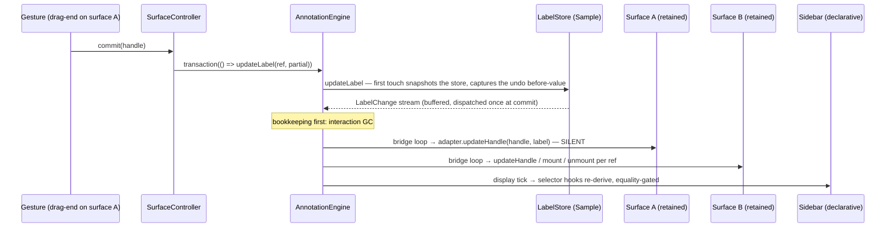
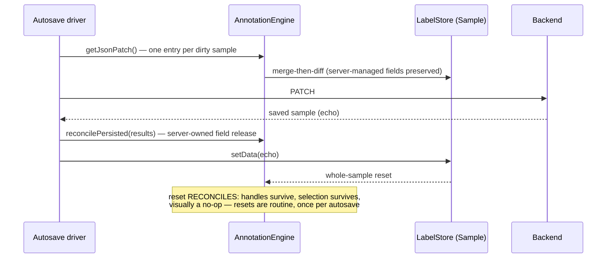
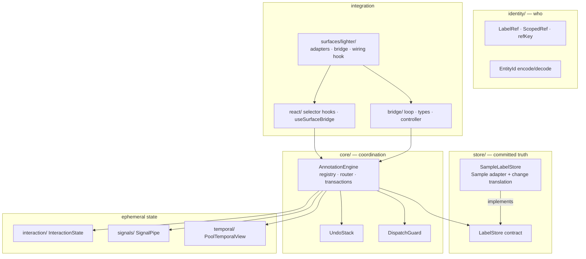

# Annotation Engine

One canonical annotation state. Every surface — 2D canvas, 3D scene, sidebar,
timeline, an agent, a script — is a **projection** of that state and a
**writer** of edits back into it, never a peer that syncs with another surface.
That single rule turns N×N surface-sync into N adapters and makes the whole
dataflow acyclic.

## The four ideas

**1. The engine is a hub; surfaces are spokes.** The engine federates one or
more [`LabelStore`](store/types.ts)s (committed truth —
[`SampleLabelStore`](store/sampleLabelStore.ts) adapts the `Sample` model; a
frame-indexed `FrameStore` arrives with video) and routes by
[`LabelRef`](identity/ref.ts). Surfaces never observe each other — they observe
the engine, and they write into the engine. Identity, change merging,
transactions, undo, selection, reconcile, and persistence aggregation are all
engine-owned; a surface brings only its native rendering and its gesture
vocabulary.

**2. Identity is a full tuple, minted once.** A `LabelRef` is
`(sample, path, instanceId, frame?)`. `instanceId` is a client-minted ObjectId,
equal to the document `_id`, **stable from the moment a draft is born** — there
is no mint→evict→re-add cycle anywhere in the system. The guarantee is
_client-minted, stable from birth_, not a mint site: surfaces whose drafts are
born with durable ids (Lighter) just commit them; surfaces without one ask the
engine to mint (`controller.create`). Caveat that justifies the full tuple:
`instanceId` alone is a **linkage** key — a `fo.Instance` spans group slices,
so the same instanceId can exist on several samples. Linkage may aggregate
hover/highlight across slices; it must never address an edit, delete, or
resolve.

**3. Subscribers are sinks.** The keystone invariant: nothing that observes a
change channel may write back into the engine from inside that notification.
Writers are gestures, agents, server reconciles — things that are _not_
subscribers. This is what makes the graph acyclic, so there are no echo guards,
no settle-on-equality loops, and no "did I cause this?" bookkeeping. Two
mechanisms enforce it:

-   every surface has a **silent apply** path (Lighter's `applyLabel` vs. its
    event-emitting `updateLabel`; a React re-render is silent by nature), and
-   a shared [`DispatchGuard`](core/dispatchGuard.ts) throws in dev when any
    guarded write happens during any dispatch (label changes, display ticks,
    interaction notifications — one guard spans all three).

**4. Two integration shapes, one write-half.** _Retained-mode_ surfaces
(long-lived imperative objects that must be told to change: Lighter, looker-3d)
ship a [`SurfaceBridge`](bridge/types.ts) plus a
[`LabelKindAdapter`](bridge/types.ts) per kind, and the engine derives their
entire read-half loop. _Declarative_ surfaces (React UIs: the sidebar) use
[selector hooks](react/hooks.ts) and re-derive — no bridge, no handles, no
mirror store. Both shapes write through the same ref-addressed
[`SurfaceActions`](bridge/surfaceController.ts); the bridge controller merely
adds handle-bound conveniences (`commit`/`create`/`selectHandle`).

## How an edit reaches every surface

A gesture finishes on one surface; everything else converges without that
surface knowing who is listening.



The bridge loop ([`bridgeLoop.ts`](bridge/bridgeLoop.ts)) is the engine-derived
read-half: per change it resolves the handle and dispatches the adapter —
`update`/per-ref `reset` → re-read + `updateHandle` (or `mount` if absent);
`delete` → `unmount`; **whole-sample `reset` → reconcile, never rebuild**
(survivors keep their handles via silent re-apply; gone refs unmount; new refs
mount). Initial registration emits a whole-sample reset to the registering
bridge only, so first-mount hydration is the same code path. Every branch
filters to `bridge.sample` — under federation an unscoped loop would
ghost-mount foreign labels (absent handle means _create_, not _skip_) and
corrupt instance-linked twins.

Mounts may be **gated**: a kind that needs async work before a faithful handle
exists (detection `mask_path` decode) returns `undefined` from `mount`, and the
bridge inserts the handle itself when the source resolves — deduping in-flight
gates, discarding a resolve whose ref no longer reads back, and reporting the
late insert via `onDeferredMount` so current interaction state still applies.
No partially-hydrated handle ever mounts.

## How an edit becomes saved

The engine aggregates persistence per dirty sample; the persistence driver
(autosave) owns scheduling, retries, and error UI.



Failure leaves state intact: the transient stays, `isDirty()` stays true, the
next tick retries idempotently. Confirmed-destructive ops (deletes) opt into
await-and-rollback by replaying their own undo entry (`rollbackEntry`).

## Transactions and undo

`engine.transaction(fn)` is the only write boundary — bare mutators are
implicit one-op transactions. It provides, per top-level call:

-   **atomicity** — a lazy `snapshot()` of each store on first touch; a throw
    restores every touched store and discards the buffered change stream, so
    subscribers never observe an abort;
-   **one coalesced dispatch** — changes buffer during the transaction and
    dispatch once, in order, at commit (nested calls join the outermost);
-   **one undo unit** — value-based inverses (`{ref, before, after}` per
    touched ref, captured lazily on first touch). Value-based means undo
    _survives persistence_: undoing an autosaved edit is just a new, ordinary
    transaction writing the before-values. `transaction(fn, { undoKey })`
    merges consecutive units (slider drags, streaming batches) into a single
    undo step.

Undo replays are non-recording transactions writing known values through
`replaceLabel` (exact value, not merge — merge would resurrect fields the
restored value lacks). Never recorded: reconciles, hydration, presence, replays
themselves; selection is off-stack entirely. A whole-sample reset clears
history (it refers to entities the reset replaced).

## Interaction state

[`InteractionState`](interaction/interactionState.ts) is engine-owned,
queryable, ephemeral — never persisted, never dirty, never on the undo stack.
**Active** is a set with an engine-owned **anchor** (`anchor ∈ active`; the
sidebar form follows the anchor); **hover** is a set aggregated across
surfaces. It is GC'd against the semantic change stream as engine bookkeeping
that runs _before_ subscriber dispatch: a delete prunes the ref and promotes
the anchor; a whole-sample reset prunes read-through (a ref that still resolves
after the batch survives — so delete+recreate in one transaction, or a data
refresh that keeps ids, never destroys selection). Presence `exit` prunes hover
only — scrubbing never deselects.

Retained surfaces receive interaction silently (`applySelected` /
`applyHovered` / `applyAnchor`, diffed per handle by the loop, re-applied on
every mount path); declarative surfaces select from it with `useInteraction`.

## Temporal view and signals

`engine.temporal` separates the **pool** (every entity, frame-agnostic) from
**presence** (pool × clock). The change stream stays purely semantic — the
playhead moving is projection, not an edit. Bridges declare a posture:
`frame-locked` (the engine merges presence `enter`/`exit`/`refresh` into the
mount/unmount/update loop) or `pool` (semantic changes only — a timeline draws
track rows that outlive the playhead). With no frame store registered,
[`PoolTemporalView`](temporal/poolTemporalView.ts) makes presence ≡ pool and
the whole apparatus inert by absence. `FrameStore`/`Clock` land with video.

The [signal pipe](signals/signalPipe.ts) is the high-frequency channel for
surface-owned transient state (mid-drag geometry, cursors): a pure firehose
keyed by [`EntityId`](identity/entityId.ts) — no retention, no
replay-on-subscribe. Anything with a queryable current value belongs in
interaction state instead. Observers render from signals; the shared guard
forbids them writing back.

## The layers



---

## User guide: adding an annotation surface

Start by answering one question: **can your surface re-render from state?**

-   It re-derives its UI from props/state on every update (React, anything
    virtual-DOM-shaped) → it is a **declarative surface**. No bridge. Skip to
    [Declarative surfaces](#declarative-surfaces).
-   It holds long-lived imperative objects that must be _told_ to change (a
    canvas scene graph, three.js objects, an imperative timeline) → it is a
    **retained-mode surface**. You ship a bridge + adapters.

Either way you never subscribe to another surface, never keep a second label
store, and never write from inside a change notification.

### Retained-mode surfaces

You provide two things; the engine derives everything else (hydration, change
reconciliation, presence merge, silent interaction application).

**A `LabelKindAdapter` per label kind you render** — pure translation between
committed labels and your native handle type:

```ts
const detectionAdapter: LabelKindAdapter<MyHandle, MyDescriptor> = {
  // engine → surface, CREATE. Pure: build a construction spec, no insertion.
  // Stamp id = ref.instanceId — this is what makes resolveHandle work.
  buildHandle: (ref, label) => ({ kind: "detection", id: ref.instanceId, ... }),

  // engine → surface, UPDATE. Imperative and SILENT: absorb the committed
  // label without emitting any of your surface's edit events.
  updateHandle: (handle, label) => handle.applySilently(label),

  // surface → engine: extract the persistable partial. No _id — the ref
  // owns identity. Return null to veto (e.g. degenerate geometry).
  toLabel: (handle) => ({ bounding_box: handle.bounds, ... }),
};
```

**A `SurfaceBridge`** — kind-agnostic plumbing, closing over your scene:

```ts
const bridge: SurfaceBridge<MyHandle, MyDescriptor> = {
    surface: "my-surface",
    sample, // REQUIRED: the one sample you project
    resolveHandle: (ref) => scene.get(ref.instanceId), // inverse of refOf
    refOf: (handle) => ({ path: handle.field, instanceId: handle.id }),
    mount: (descriptor) => scene.insert(descriptor), // may gate: see below
    unmount: (handle) => scene.remove(handle.id),
    clear: () => scene.removeAll(), // lifecycle teardown only
    applySelected: (handle, on) => handle.setSelected(on), // SILENT visuals
    applyHovered: (handle, on) => handle.setHovered(on), // (optional trio)
};
```

**Wire it** with `useSurfaceBridge` — it registers the bridge (the read-half
starts immediately; initial hydration is a reconcile against an empty ledger)
and returns the controller. Your surface code carries _only_ gesture
vocabulary:

```ts
const surface = useSurfaceBridge({ engine, bridge, adapters });

on("my-drag-end", (e) => surface.commit(scene.get(e.id))); // edit = upsert
on("my-select", (e) => surface.selectHandle(scene.get(e.id)));
on("my-hover", (e) => surface.hoverHandle(scene.get(e.id), true));
// drafts born with a durable id: commit IS the create. Otherwise:
on("my-draw-done", (e) => {
    const ref = surface.create(draft); // engine mints the instanceId
    if (ref) draft.adoptId(ref.instanceId); // re-id in place — no evict/re-add
});
```

The contract, in rules:

-   **`updateHandle` and the `apply*` methods must be silent.** If your
    handle's absorb path emits the same event your write-half listens to, you
    have built a loop; the dev guard will throw when the echo tries to write.
-   **`resolveHandle` and `refOf` are inverses.** Any handle→ref quirk lives in
    `refOf`. `buildHandle` stamping `id = instanceId` is what keeps them
    consistent.
-   **`mount` may gate on async sources.** Return `undefined`, insert when the
    source resolves, and: dedupe in-flight gates by id, re-read the label at
    resolve time and discard if it no longer resolves, then report the insert
    via `bridge.onDeferredMount` (the loop assigned it) so interaction state
    applies. See
    [`surfaces/lighter/lighterBridge.ts`](surfaces/lighter/lighterBridge.ts)
    for the reference implementation (mask_path decode).
-   **Don't filter changes yourself.** The loop already scopes every branch to
    `bridge.sample`. One scene = one bridge; a grid of scenes is N bridges.
-   **Transient gesture state is yours.** Mid-drag geometry, draw drafts,
    marquee state never enter the engine. If another surface needs to _watch_ a
    drag live, publish it on the
    [signal pipe](#signals-watching-another-surfaces-transient-state).
-   **Temporal posture:** declare `temporal: "pool"` if your surface shows
    entities beyond the current frame (timelines); the default `frame-locked`
    renders the present subset and the engine folds presence into your loop.

The reference integration is [`surfaces/lighter/`](surfaces/lighter) — four
kind adapters, the gated bridge, and a wiring hook that is nothing but event
routing.

### Declarative surfaces

No bridge, no handles, no adapters, no atom mirror. Read with selectors, write
with the shared actions:

```tsx
const Sidebar = ({ engine, sample }: Props) => {
    // reads: equality-checked selectors over read-only projections
    const entries = useEngineSelector(engine, (e) =>
        e.listLabels({ sample, path: "ground_truth" })
    );
    const anchor = useInteraction(engine, (i) => i.getAnchor());
    const form = useEngineSelector(engine, (e) =>
        anchor ? e.getLabel(anchor) : undefined
    );

    // writes: the shared ref-addressed write-half
    const actions = useSurfaceActions(engine, "sidebar");

    return (
        <>
            {entries.map((label) => (
                <Row
                    key={label._id}
                    onClick={() =>
                        actions.setActive([
                            { path: "ground_truth", instanceId: label._id },
                        ])
                    }
                    onHover={(on) =>
                        actions.setHovered(
                            { path: "ground_truth", instanceId: label._id },
                            on
                        )
                    }
                />
            ))}
            <Form
                value={form}
                onCommit={(partial) =>
                    anchor && actions.updateLabel(anchor, partial)
                }
            />
        </>
    );
};
```

Rules:

-   **Select, don't snapshot.** The selector re-runs per version bump and your
    component re-renders only when the selected value changes (pass an `equals`
    for derived arrays/objects). Don't copy engine state into local state/atoms
    — that recreates the mirror the engine exists to delete.
-   **The type system is on your side**: selectors receive read-only
    projections (`EngineReads`/`InteractionReads`/`TemporalReads`), so a
    selector physically cannot write back.
-   **Compound gestures use `actions.transaction`** — one atomic unit, one
    change dispatch, one undo step. Streaming writers: one transaction per
    batch, a shared `undoKey` across the stream.
-   **Unset is an explicit `null` write**, not a field delete
    (`actions.updateLabel(ref, { attr: null })`) — merge semantics are the
    store's contract.
-   **Selection/hover live in interaction state**, not in your component state,
    or other surfaces won't see them.

### Signals: watching another surface's transient state

Both shapes share one more channel. The [signal pipe](signals/signalPipe.ts)
exists for state that stays surface-owned (mid-drag geometry, draw cursors) but
that another surface wants to _watch live_ — e.g. a panel previewing a drag's
bounds before the gesture commits. The publisher is the surface that owns the
gesture; observers render and nothing else:

```ts
// publisher — the surface that owns the gesture; topics are free-form strings,
// keys are full-identity EntityIds
const key = encodeEntityId(dataset, { sample, path, instanceId });
onDragMove((e) => engine.publishSignal("drag-geometry", key, e.bounds));

// observer — subscribe to one entity, or "*" for every key on the topic
useEffect(
    () =>
        engine.subscribeSignal<Bounds>("drag-geometry", key, (bounds) =>
            setPreview(bounds)
        ),
    [engine, key]
);
```

Rules:

-   **A signal is not an edit.** Publishing touches nothing: no change
    dispatch, no dirty flag, no undo entry, no bridge loop. Commit the
    gesture's result as an ordinary label write when it ends.
-   **Pure firehose.** No retention, no replay-on-subscribe — a late subscriber
    sees only future events. If a value needs a queryable "current" answer, it
    belongs in interaction state (or a label), not on the pipe.
-   **Observers are sinks.** The shared dev guard throws if a signal handler
    writes back into the engine — the same acyclicity rule as every other
    channel.

### Rules that apply to everyone

| Do                                                                         | Don't                                                           |
| -------------------------------------------------------------------------- | --------------------------------------------------------------- |
| Write through `SurfaceActions`/controller inside gestures                  | Write from inside any subscriber/selector (dev guard throws)    |
| Re-read via `getLabel` when notified — payloads are invalidation, not data | Cache labels in a second store and try to keep it synced        |
| One `transaction` per user-visible step, `undoKey` to coalesce             | Wrap an `await` inside a transaction (they are synchronous)     |
| Let interaction GC own pruning on delete/reset                             | Manually deselect on delete (you'll fight the anchor promotion) |
| Mint identity once (engine `create`, or durable-from-birth drafts)         | Re-id by evict + re-add (kills handle identity and selection)   |

---

## Reference

### Directory map

```
engine/
├── identity/     # LabelRef tuple identity + EntityId string boundary
├── store/        # LabelStore contract + SampleLabelStore (Sample adapter)
├── core/         # AnnotationEngine, transactions, UndoStack, DispatchGuard
├── interaction/  # InteractionState (active/anchor/hover + GC)
├── signals/      # SignalPipe (transient firehose)
├── temporal/     # TemporalView contract + PoolTemporalView (non-temporal)
├── bridge/       # SurfaceBridge/adapter types, read-half loop, controller
├── react/        # useEngineSelector/useInteraction/useTemporal/useSurfaceActions,
│                 # useSurfaceBridge (registration + controller)
├── surfaces/
│   └── lighter/  # reference retained-mode integration (adapters, gated bridge, wiring)
└── testing/      # shared fixtures (schema, store/engine factories)
```

### Development

```bash
# tests (root vitest)
cd app && ./node_modules/.bin/vitest run --no-coverage packages/annotation

# lint
cd app/packages/annotation && npx eslint src/engine
```

Engine core is pure TS (React only under `react/` and the surface wiring
hooks). State management follows the package rules: no exported atoms, DI-style
hooks with the binding agent supplying the engine, module state private behind
read/write functions.
