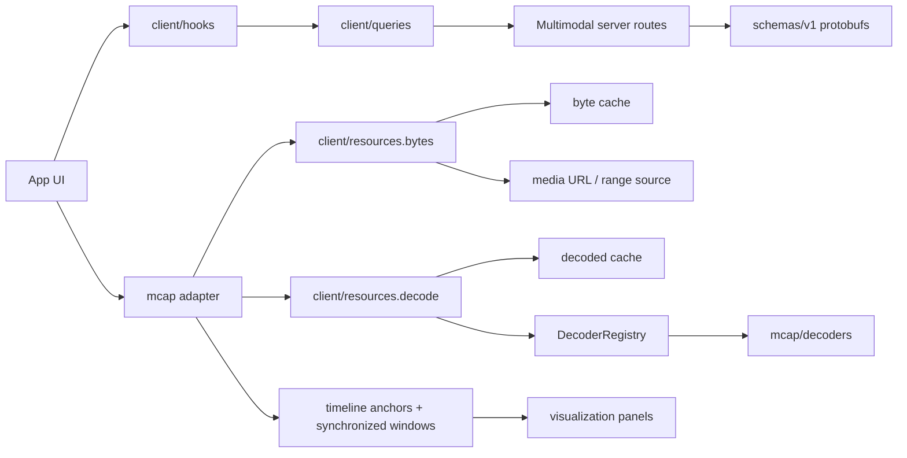

# `@fiftyone/multimodal`

App-side package for multimodal data loading, decoding, and visualization.

The package has two kinds of code:

-   Source-agnostic infrastructure: server queries, byte reads, decode
    plumbing, caches, decoder contracts, and visualization panels.
-   Source-specific adapters: format code that maps a concrete container, such
    as MCAP, onto the generic infrastructure.

## Major Pieces

| Location               | Role                                                                                                   |
| ---------------------- | ------------------------------------------------------------------------------------------------------ |
| `src/client`           | Source-agnostic app client. Fetches server artifacts and exposes resource clients.                     |
| `src/client/hooks`     | React hooks for source-agnostic server artifacts such as scene inventory and playback plans.           |
| `src/client/queries`   | Protobuf route clients for small server-provided artifacts.                                            |
| `src/client/resources` | Byte-range reads, decode execution, and cache contracts.                                               |
| `src/decoders`         | Generic `Decoder`, `DecoderRegistry`, payload descriptors, and decoded output types.                   |
| `src/visualization`    | Panels that render decoded visual artifacts, such as images and point clouds.                          |
| `src/schemas/v1`       | Generated protobuf contracts and versioned schema exports.                                             |
| `src/mcap`             | MCAP adapter: indexed reads, sync/window selection, MCAP decoders, decompression, and worker playback. |
| `src/inject`           | Side-effect entrypoint for registering multimodal app integrations.                                    |

## How It Fits

## Boundaries

-   `client` stays source-agnostic. It should not know about MCAP topics,
    channels, schemas, chunks, or sync rules.
-   `mcap` owns MCAP-specific behavior and composes generic byte/decode clients
    into playback-ready APIs.
-   `decoders` describes payload decoding, not transport or container reads.
-   `visualization` consumes decoded visual artifacts. It should not know how
    the bytes were fetched or which container they came from.
-   `schemas/v1` is the shared contract surface for generated protobuf types.

## MCAP Adapter

The MCAP adapter is the first concrete source adapter. It:

-   reads MCAP data through the generic byte resource client,
-   uses `@mcap/core` plus local LZ4/zstd decompression helpers,
-   maps MCAP channel/schema metadata to generic payload descriptors,
-   registers MCAP-owned Foxglove decoders,
-   selects timeline anchors and synchronized playback windows, and
-   exposes a worker-backed resource client for playback workloads.

## Adding New Code

-   Add source-agnostic server fetches under `src/client/queries` and hooks
    under `src/client/hooks`.
-   Add generic resource/cache/decode contracts under `src/client/resources`.
-   Add payload decoders near the adapter that owns their payload format.
-   Add a new source format as its own adapter directory, similar to
    `src/mcap`.
-   Add visual renderers under `src/visualization/panels`.
