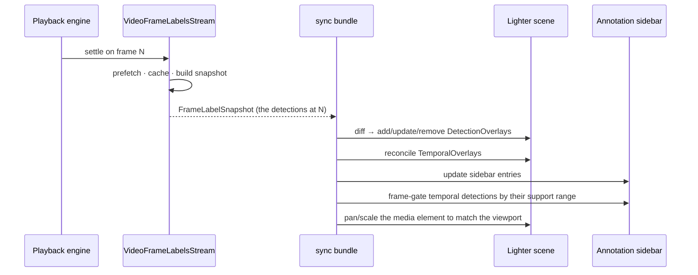
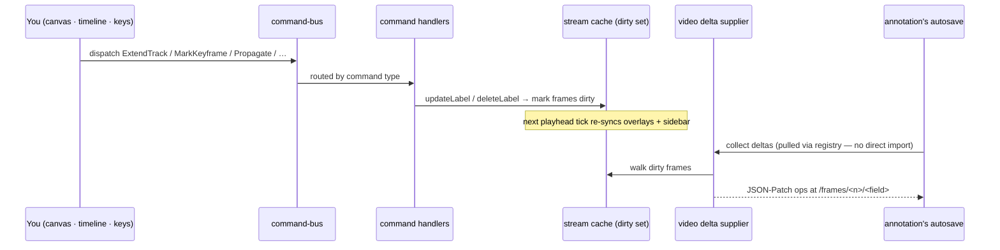
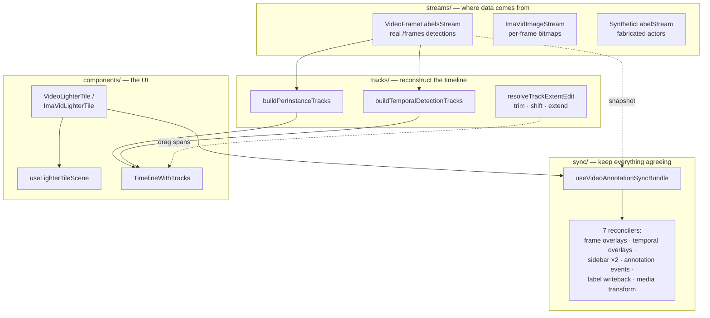
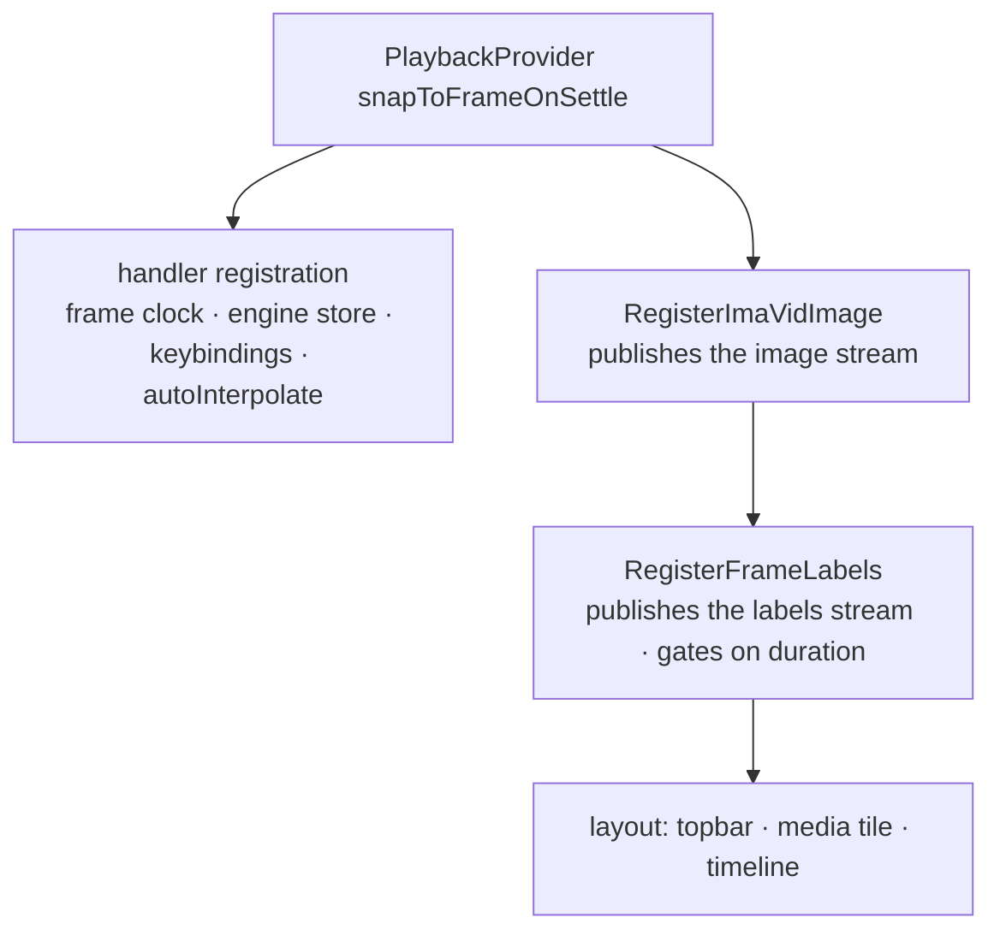
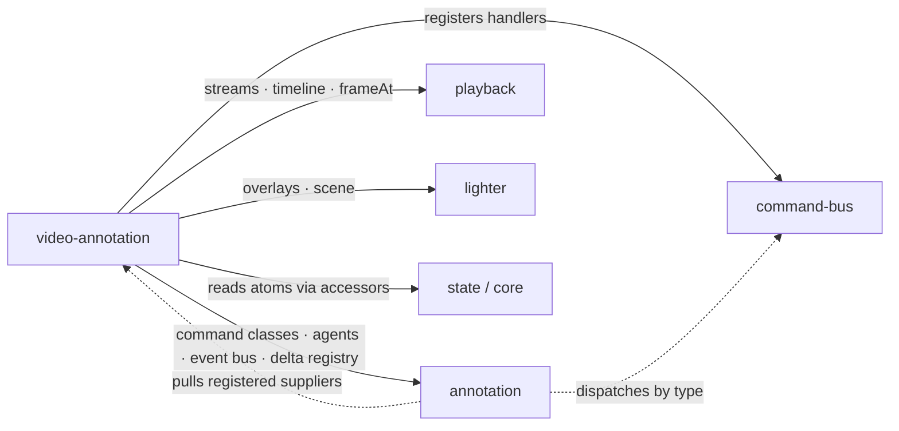

# @fiftyone/video-annotation

Annotate video one frame at a time — draw a box, mark a keyframe, let SAM2 fill
the gaps in between.

That decoupling is the core idea the package is built on. Three ideas make it
work; understand them and the rest is detail.

## The three ideas

**1. The renderer never sees the video.** [`@fiftyone/lighter`](../lighter) is
an overlay engine for _still images_. So we don't show it the video at all. We
hand it a single non-drawing overlay —
[`ExternalCanonicalMedia`](src/media/ExternalCanonicalMedia.ts) — whose only
job is to answer _"where on screen is the frame, and how big?"_ The actual
pixels come from a real `<video>` element (or a `<canvas>` we paint per-frame
bitmaps onto) sitting _behind_ Lighter's overlay layer. A sync hook locks that
element's pan/zoom transform to Lighter's viewport, so boxes and frame move as
one. The browser draws the picture; Lighter draws the boxes; the image renderer
never has to know about video. The annotation toolset — selection, drag, color,
the sidebar — works the same as it does for images.

**2. Everything is a function of the playhead.** There is no imperative "now
load frame 47." A [playback engine](../playback) owns a clock; the surface
_reacts_ to it. On every settle, the active **stream** emits a snapshot of what
exists at that frame, and a bundle of **sync hooks** diffs that snapshot into
Lighter overlays and the sidebar. Move the playhead, everything downstream
recomputes.

**3. Tracks are ephemeral; frames are the truth.** On disk there are no
"tracks" — just detections living on individual frames, tagged with an id. A
track is something we _reconstruct_: group detections by id across the clip,
infer presence intervals, and draw a timeline row. Keyframes mark the frames a
human actually touched; **propagation** (linear interpolation or SAM2 tracking)
fills everything between them. Edit a box and you've edited _one frame's_
detection — which is exactly what autosave persists.

## Two video backends, one set of machinery

The same overlay + timeline stack runs on two completely different media
sources, chosen by a `?tile=` URL switch:

|        | `?tile=video` (native)                              | `?tile=imavid` _(default)_                                                                           |
| ------ | --------------------------------------------------- | ---------------------------------------------------------------------------------------------------- |
| Pixels | a single `<video>` element                          | one materialized image **per frame** (`to_frames(sample_frames=True)`), decoded off-main in a worker |
| Clock  | the element's `requestVideoFrameCallback` mediaTime | the image stream's frame index                                                                       |
| Why    | cheap, streams from one URL                         | **frame-exact** — no codec seek fuzz, the right pixels for the right frame                           |

There's also a third, `?labels=synthetic`, that fabricates oscillating actors
with zero real labels — a way to exercise the whole render path in tests
without a dataset behind it.

## How a frame becomes pixels-and-boxes



The "sync bundle" is
[`useVideoAnnotationSyncBundle`](src/hooks/useVideoAnnotationSyncBundle.ts) —
it calls the seven [`sync/`](src/sync) hooks in a fixed order so overlays,
sidebar, and media all agree about frame N before the next tick. Each tile
mounts it once.

## How an edit becomes saved

The loop above runs _downstream_. Editing runs it in reverse: a gesture becomes
a **command**, a handler mutates the per-frame cache, and the cache's dirty set
is what autosave drains.



In that last exchange, `annotation` _aggregates_ the video deltas without ever
importing this package. See
[the broader picture](#fitting-into-the-annotation-ecosystem).

## The layers

Internally the package is a pipeline — server-backed **streams** feed **sync**
reconcilers and **track** builders, which feed the **components**.



A handful of supporting modules round it out: [`propagation/`](src/propagation)
(can a SAM2/linear run start, and where — then apply the result),
[`overlayAdapters/`](src/overlayAdapters) (raw label ↔ Lighter overlay props),
and [`state/accessors.ts`](src/state/accessors.ts) (the _one_ place foreign
recoil/jotai atoms are read). Persistence is no longer a video concern — the
engine aggregates every registered store's `getJsonPatch()`.

## How it's wired together

`VideoAnnotationSurface` reads its two URL switches once, then nests registrars
so each provider sees the one below it. The handler registrars sit _inside_
`PlaybackProvider` specifically so they can read the current time.



> Two subtleties worth knowing before you touch this: the image stream _is_ the
> timeline's duration source, so `RegisterImaVidImage` has to mount
> **outside** > `RegisterFrameLabels` (which swaps its wrapper when duration
> flips ready and would otherwise remount everything nested in it). And there's
> deliberately no `TilingProvider` — it spins up an isolated jotai store that
> would shadow the modal-scoped atoms the sidebar writes to.

## Fitting into the annotation ecosystem

This package depends on `@fiftyone/annotation`, but `annotation` does not
depend back — the package graph is acyclic. The dependencies are real; control
inverts through three registries, so every edge points one way.



The two dotted edges are the inversion: `annotation` dispatches commands _by
type_ (without knowing who handles them) and _pulls_ registered delta suppliers
(without knowing who registered them). A third registry does the same for
propagation agents. In each case this package registers, and `annotation`
calls.

| Seam            | What crosses it                                                                                                      | Inverted via                                                          |
| --------------- | -------------------------------------------------------------------------------------------------------------------- | --------------------------------------------------------------------- |
| **Commands**    | `MarkKeyframe`, `Create/Edit/DeleteTemporalDetection`, `Extend/Trim/Delete/Shift/UpdateTrackAttributes`, `Propagate` | `command-bus` — register handlers, bus routes by type                 |
| **Autosave**    | per-frame JSON-Patch deltas                                                                                          | `annotation`'s delta-supplier registry pulls our supplier             |
| **Propagation** | SAM2 / linear inference results                                                                                      | `annotation`'s agent registry, looked up by id                        |
| **Playback**    | `Track[]`, playhead time, stream registration                                                                        | streams extend `PlaybackStreamBase`; tracks feed `TimelineWithTracks` |
| **Lighter**     | `DetectionOverlay` / `TemporalOverlay` add·update·remove                                                             | scene owned by `useLighterTileScene`                                  |
| **State**       | color/dataset/view/slice/sampleId/paths (read-only)                                                                  | every read goes through `state/accessors.ts`                          |

---

## Reference

### Public API (`index.ts`)

| Symbol                                                                                                | Purpose                                             |
| ----------------------------------------------------------------------------------------------------- | --------------------------------------------------- |
| `VideoAnnotationSurface`                                                                              | Composition root — the component consumers mount.   |
| `VideoFrameLabelsStream`, `ImaVidImageStream`, `SyntheticLabelStream`                                 | Playback streams (`PlaybackStreamBase` subclasses). |
| `useFrameLabelsStream`, `useImaVidImageStream` / `usePublishImaVidImageStream`                        | Published-stream-handle hooks.                      |
| `buildTemporalDetectionTracks`, `resolveTrackExtentEdit`                                              | Track builders / drag resolution.                   |
| `useTemporalOverlaySync`, `syncTemporalOverlays`                                                      | Temporal-detection ↔ overlay sync.                  |
| `useRegisterVideoAnnotationCommandHandlers` / `…EventHandlers` / `…Keybindings`, `useAutoInterpolate` | Behavior registrars.                                |
| `PropagationStatusItem`, `useVideoAnnotationStatus`, `resolvePropagationTarget`                       | Propagation / status UI.                            |

### Directory map

```
src/
├── components/      # React UI: surface, tiles, timeline, top bar, toolbar, status
├── streams/         # PlaybackStreamBase data sources + published handles + worker
├── sync/            # per-tick reconcilers (snapshot ↔ overlays ↔ sidebar)
├── tracks/          # timeline-row builders + drag/extent resolution
├── hooks/           # scene/sync orchestration + command/keybinding registrars
├── state/           # foreign-atom accessors + status slot
├── media/           # ExternalCanonicalMedia (non-drawing canonical overlay)
├── propagation/     # propagation target resolution + result application
├── persistence/     # delta supplier (autosave seam)
├── overlayAdapters/ # raw label ↔ Lighter overlay-prop adapters
└── utils/           # stream/tile id constants + modal-sample accessors
```

| Directory          | Key modules                                                                                                                                                                                                                                                                                                                               | Role                                                                                        |
| ------------------ | ----------------------------------------------------------------------------------------------------------------------------------------------------------------------------------------------------------------------------------------------------------------------------------------------------------------------------------------- | ------------------------------------------------------------------------------------------- |
| `components/`      | `VideoAnnotationSurface`, `VideoLighterTile`, `ImaVidLighterTile`, `FrameLabels`, `SyntheticLabels`, `RegisterImaVidImage`, `VideoAnnotationTopBar`, `VideoAnnotationToolbar`, `PropagationStatusItem`                                                                                                                                    | Composition root, media tiles, timeline, chrome.                                            |
| `streams/`         | `VideoFrameLabelsStream`, `ImaVidImageStream`, `SyntheticLabelStream`, `frameLabelsStream`, `imaVidImageStreamHandle`, `createStreamHandle`, `fetchedRanges`, `framesWorker`                                                                                                                                                              | Server-backed playback streams + the published-handle factory + off-main decode.            |
| `sync/`            | `useFrameOverlaySync`, `useTemporalOverlaySync`, `useSyncSidebarFromSnapshot`, `useSyncSidebarFromTemporalOverlays`, `useSyncLighterAnnotation`, `useSyncLighterLabelStream`, `useSyncMediaTransform`                                                                                                                                     | Reconcile stream snapshot ↔ Lighter overlays ↔ sidebar each tick.                           |
| `tracks/`          | `frameTracks`, `temporalDetectionTracks`, `syntheticTracks`, `trackExtentEdit`, `linkedTracks`                                                                                                                                                                                                                                            | Build `Track[]` timeline rows; resolve trim/shift/extend drags; link rows ↔ overlays.       |
| `hooks/`           | `useLighterTileScene`, `useVideoAnnotationSyncBundle`, `useWarmupThenSeek`, `useLinkedOverlayState`, `useTemporalOverlayVersion`, `useAutoInterpolate`, `useRegisterVideoAnnotationKeybindings`, `useVideoAnnotationActions`, `useVideoSurfaceActions`, `useVideoPropagate`, `useSyncAnnotationVideoStore`, `useSyncAnnotationFrameClock` | Scene lifecycle, sync orchestration, behavior registrars, engine-write surface actions.     |
| `state/`           | `accessors`, `videoAnnotationStatus`                                                                                                                                                                                                                                                                                                      | Read foreign recoil/jotai atoms; drive the top-bar status slot.                             |
| `media/`           | `ExternalCanonicalMedia`                                                                                                                                                                                                                                                                                                                  | Intrinsic + letterbox bounds for media Lighter doesn't paint.                               |
| `propagation/`     | `propagationTarget`, `useApplyPropagationResult`                                                                                                                                                                                                                                                                                          | Resolve a propagation run; write SAM2/linear results through the engine.                    |
| `overlayAdapters/` | `detection`, `index`, `types`                                                                                                                                                                                                                                                                                                             | Typed label ↔ overlay-prop registry (`detection` wired); `VideoDetectionLabel` bridge type. |
| `utils/`           | `ids`, `modalSample`                                                                                                                                                                                                                                                                                                                      | Stream/tile id constants; `getModalSampleFrameRate`.                                        |

### Development

```bash
# tests (root vitest)
cd app && ./node_modules/.bin/vitest run --no-coverage packages/video-annotation

# lint (eslint v9, package-local)
cd app/packages/video-annotation && node_modules/.bin/eslint src index.ts

# package type-check — pulls the whole import graph, so filter to va files
cd app && node_modules/.bin/tsc --noEmit -p packages/video-annotation/tsconfig.json \
  2>&1 | grep "packages/video-annotation"
```

State is managed with **jotai**; foreign atoms are read only through
`state/accessors.ts`, and module atoms stay private behind read/write hooks
rather than being exported.
