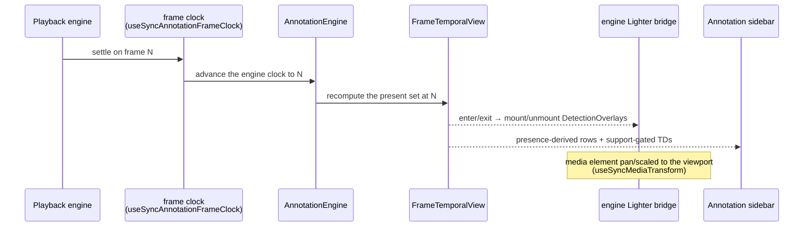
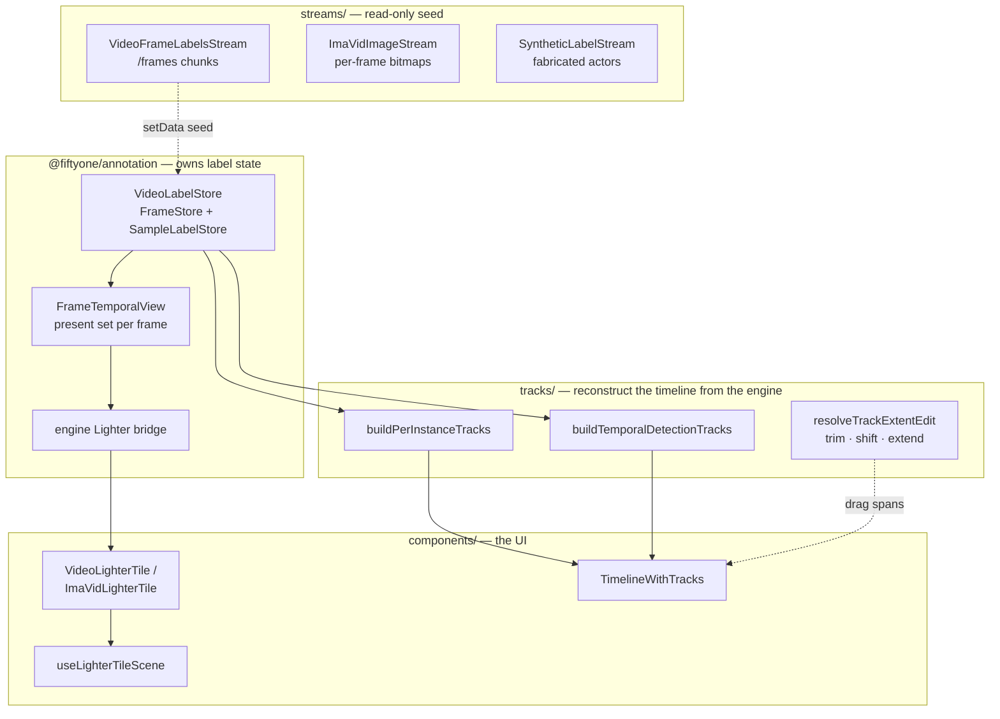
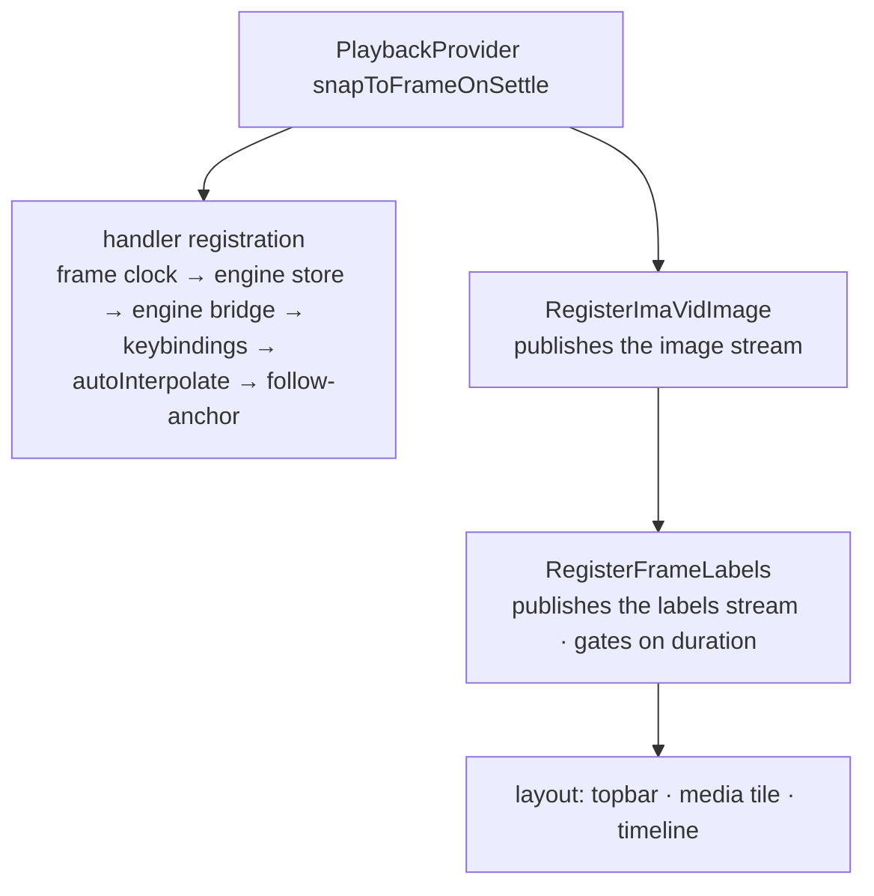
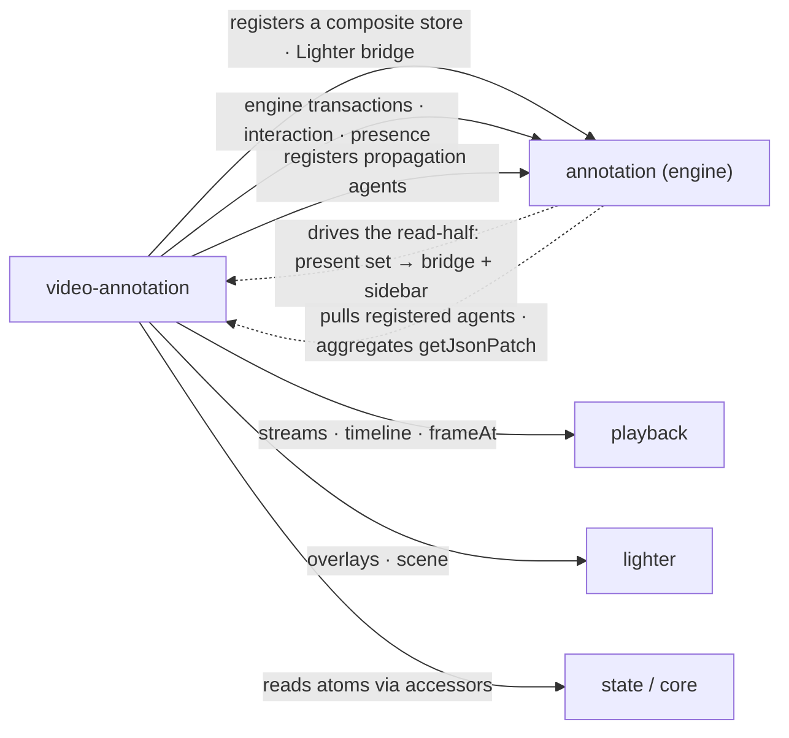

# @fiftyone/video-annotation

Annotate video one frame at a time — draw a box, mark a keyframe, let SAM2 fill
the gaps in between.

The package is a thin, video-specific **surface** over the shared annotation
engine. It owns gestures, the media tiles, the streams, and the timeline; the
[`@fiftyone/annotation`](../annotation) **engine** owns label state — identity,
transactions, undo, selection, presence, and persistence. Three ideas make the
surface work; understand them and the rest is detail.

## The three ideas

**1. The renderer never sees the video.** [`@fiftyone/lighter`](../lighter) is
an overlay engine for _still images_. So we don't show it the video at all. We
hand it a single non-drawing overlay —
[`ExternalCanonicalMedia`](src/media/ExternalCanonicalMedia.ts) — whose only
job is to answer _"where on screen is the frame, and how big?"_ The actual
pixels come from a real `<video>` element (or a `<canvas>` we paint per-frame
bitmaps onto) sitting _behind_ Lighter's overlay layer. A sync hook locks that
element's pan/zoom transform to Lighter's viewport, so boxes and frame move as
one. The browser draws the picture; Lighter draws the boxes; the image renderer
never has to know about video. The annotation toolset — selection, drag, color,
the sidebar — works the same as it does for images.

**2. Everything is a function of the playhead — through the engine.** There is
no imperative "now load frame 47." A [playback engine](../playback) owns a
clock; a single seam
([`useSyncAnnotationFrameClock`](src/hooks/useSyncAnnotationFrameClock.ts))
feeds the playhead's frame to the annotation engine, which holds every label.
The engine's **`FrameTemporalView`** recomputes which labels are _present_ at
that frame; its **Lighter bridge** mounts/unmounts the frame's overlays on the
canvas, and the sidebar derives its rows from the same presence (temporal
detections are gated by their `support` range). Move the playhead, the present
set recomputes, everything downstream follows. The `/frames` stream is no
longer a per-tick snapshot source — it is a read-only **seed**: it loads chunks
and hydrates the engine's frame store, and the engine is the source of truth
thereafter.

**3. Tracks are ephemeral; frames are the truth.** On disk there are no
"tracks" — just detections living on individual frames, tagged with an id. A
track is something we _reconstruct_: walk the engine's labels, group them by
`instanceId` across the clip, infer presence intervals, and draw a timeline row
(the row id _is_ the instanceId). Keyframes mark the frames a human actually
touched; **propagation** (linear interpolation or SAM2 tracking) fills
everything between them. Edit a box and you've edited _one frame's_ detection —
which is exactly what the engine persists.

## Two video backends, one set of machinery

The same overlay + timeline stack runs on two completely different media
sources, chosen by a `?tile=` URL switch:

|        | `?tile=video` (native)                              | `?tile=imavid` _(default)_                                                                           |
| ------ | --------------------------------------------------- | ---------------------------------------------------------------------------------------------------- |
| Pixels | a single `<video>` element                          | one materialized image **per frame** (`to_frames(sample_frames=True)`), decoded off-main in a worker |
| Clock  | the element's `requestVideoFrameCallback` mediaTime | the image stream's frame index                                                                       |
| Why    | cheap, streams from one URL                         | **frame-exact** — no codec seek fuzz, the right pixels for the right frame                           |

There's also a third, `?labels=synthetic`, that fabricates oscillating actors
with zero real labels — a way to exercise the whole render path in tests
without a dataset behind it.

## How a frame becomes pixels-and-boxes

The read-half is entirely engine-driven: the playhead advances the engine's
clock, the temporal view recomputes presence, and the engine reconciles the
canvas and sidebar.



Two video-owned reconcilers ride alongside the engine bridge:
temporal-detection chips are sourced from the engine and synced onto the canvas
([`useTemporalOverlaySync`](src/sync/useTemporalOverlaySync.ts)), and the media
element tracks the viewport
([`useSyncMediaTransform`](src/sync/useSyncMediaTransform.ts)).
[`useVideoAnnotationSyncBundle`](src/hooks/useVideoAnnotationSyncBundle.ts)
mounts those plus the draw-mode event bridge; each tile mounts it once.

## How an edit becomes saved

The loop above runs _downstream_. Editing writes _through the engine_: a
gesture or timeline op becomes an engine **transaction**, the engine mutates
the registered store's working set, and a central autosave drains every dirty
sample via `engine.getJsonPatch()`.

```mermaid
sequenceDiagram
    participant U as You<br/>(canvas · timeline · keys · sidebar)
    participant SA as useVideoSurfaceActions
    participant EN as AnnotationEngine
    participant ST as VideoLabelStore<br/>(FrameStore + SampleLabelStore)
    participant AS as annotation autosave

    U->>SA: markKeyframe / extendTrack / editTemporalDetection / …
    SA->>EN: engine.transaction(create/update/deleteLabel @ ref)
    EN->>ST: per-frame write (ref carries frame);<br/>TDs → SampleLabelStore (no frame)
    Note over EN: identity · undo · selection are engine-owned
    AS->>EN: engine.getJsonPatch() per dirty sample
    EN-->>AS: JSON-Patch ops at /frames/<n>/<field>
```

Canvas draws and drags don't go through `useVideoSurfaceActions` — the engine
Lighter bridge commits those gestures straight to the engine. The sidebar edit
panels write the engine directly too. In every case `annotation` aggregates the
persistence without importing this package. See
[the broader picture](#fitting-into-the-annotation-ecosystem).

## The layers

Server-backed **streams** _seed_ the engine; the engine projects state onto the
canvas and feeds the **track** builders, which feed the **components**.



A handful of supporting modules round it out:
[`useVideoSurfaceActions`](src/hooks/useVideoSurfaceActions.ts) (timeline /
keyframe / TD edits as engine transactions),
[`state/useVideoInteraction.ts`](src/state/useVideoInteraction.ts) (timeline
select/hover through engine interaction, and the playhead-follows-anchor hook),
[`propagation/`](src/propagation) (can a SAM2/linear run start, and where —
then write the result through the engine),
[`overlayAdapters/`](src/overlayAdapters) (raw label ↔ Lighter overlay props),
and [`state/accessors.ts`](src/state/accessors.ts) (the _one_ place foreign
recoil/jotai atoms are read). Persistence is no longer a video concern — the
engine aggregates every registered store's `getJsonPatch()`.

## How it's wired together

`VideoAnnotationSurface` reads its two URL switches once, then nests registrars
so each provider sees the one below it. The handler registrars sit _inside_
`PlaybackProvider` specifically so they can read the current time — and in a
fixed order: the frame clock and the engine store must exist before the engine
Lighter bridge reconciles against them (otherwise the bridge binds to the
degenerate pool view over an unseeded store).



> Two subtleties worth knowing before you touch this: the image stream _is_ the
> timeline's duration source, so `RegisterImaVidImage` has to mount
> **outside** > `RegisterFrameLabels` (which swaps its wrapper when duration
> flips ready and would otherwise remount everything nested in it). And there's
> deliberately no `TilingProvider` — it spins up an isolated jotai store that
> would shadow the modal-scoped atoms the sidebar writes to.

## Fitting into the annotation ecosystem

This package depends on `@fiftyone/annotation`, but `annotation` does not
depend back — the package graph is acyclic. The surface _registers_ a store, a
Lighter bridge, and propagation agents with the engine; the engine then drives
the read-half and pulls those registrations. Every edge points one way.



The dotted edges are the inversion: once the surface registers its store and
bridge, `annotation` owns the read-half (presence → canvas + sidebar), pulls
registered propagation agents by id, and aggregates persistence across every
registered store — all without knowing who registered them. There is no longer
a command-bus or a per-package delta supplier; both were retired when the
engine took ownership of writes and persistence.

| Seam                | What crosses it                                                                                         | Mechanism                                                                      |
| ------------------- | ------------------------------------------------------------------------------------------------------- | ------------------------------------------------------------------------------ |
| **Engine store**    | composite `VideoLabelStore` (`FrameStore` + `SampleLabelStore`), seeded from `/frames`                  | `engine.registerStore` (`useSyncAnnotationVideoStore`)                         |
| **Frame clock**     | the playhead's current frame                                                                            | `useSyncAnnotationFrameClock` drives the engine clock                          |
| **Canvas**          | `DetectionOverlay` add·update·remove + gesture commits                                                  | engine Lighter bridge (`useVideoLighterEngineBridge`)                          |
| **Selection/hover** | active / hovered `instanceId`s                                                                          | engine interaction (`useVideoInteraction`; sidebar + canvas read the same)     |
| **Sidebar**         | present frame labels + in-support temporal detections                                                   | engine temporal presence (`FrameTemporalView` → sidebar `useEntries`)          |
| **Edits**           | `MarkKeyframe`, `Extend/Trim/Shift/Delete/UpdateTrackAttributes`, `Create/Edit/DeleteTemporalDetection` | engine transactions (`useVideoSurfaceActions`)                                 |
| **Autosave**        | per-sample JSON-Patch deltas                                                                            | central `engine.getJsonPatch()` — no video-specific supplier                   |
| **Propagation**     | SAM2 / linear inference results                                                                         | `annotation`'s agent registry, looked up by id; results written via the engine |
| **Playback**        | `Track[]`, playhead time, stream registration                                                           | streams extend `PlaybackStreamBase`; tracks feed `TimelineWithTracks`          |
| **Lighter**         | scene lifecycle                                                                                         | scene owned by `useLighterTileScene`                                           |
| **State**           | color/dataset/view/slice/sampleId/paths (read-only)                                                     | every read goes through `state/accessors.ts`                                   |

---

## Reference

### Public API (`index.ts`)

| Symbol                                                                          | Purpose                                             |
| ------------------------------------------------------------------------------- | --------------------------------------------------- |
| `VideoAnnotationSurface`                                                        | Composition root — the component consumers mount.   |
| `VideoFrameLabelsStream`, `ImaVidImageStream`, `SyntheticLabelStream`           | Playback streams (`PlaybackStreamBase` subclasses). |
| `useFrameLabelsStream`, `useImaVidImageStream` / `usePublishImaVidImageStream`  | Published-stream-handle hooks.                      |
| `buildTemporalDetectionTracks`, `resolveTrackExtentEdit`                        | Track builders / drag resolution.                   |
| `useTemporalOverlaySync`, `syncTemporalOverlays`                                | Engine-sourced temporal-detection ↔ overlay sync.   |
| `useRegisterVideoAnnotationKeybindings`, `useAutoInterpolate`                   | Behavior registrars.                                |
| `PropagationStatusItem`, `useVideoAnnotationStatus`, `resolvePropagationTarget` | Propagation / status UI.                            |

### Directory map

```
src/
├── components/      # React UI: surface, tiles, timeline, top bar, toolbar, status
├── streams/         # PlaybackStreamBase data sources (read-only seed) + handles + worker
├── sync/            # the reconcilers left after the engine took the canvas/sidebar
├── tracks/          # engine-sourced timeline-row builders + drag/extent + identity
├── hooks/           # scene/clock/bridge orchestration + engine-write surface actions
├── state/           # foreign-atom accessors + frame/interaction seams + status slot
├── media/           # ExternalCanonicalMedia (non-drawing canonical overlay)
├── propagation/     # propagation target resolution + result application (engine-write)
├── overlayAdapters/ # raw label ↔ Lighter overlay-prop adapters
└── utils/           # stream/tile id constants + modal-sample accessors
```

| Directory          | Key modules                                                                                                                                                                                                                                                                                                                                                                           | Role                                                                                   |
| ------------------ | ------------------------------------------------------------------------------------------------------------------------------------------------------------------------------------------------------------------------------------------------------------------------------------------------------------------------------------------------------------------------------------- | -------------------------------------------------------------------------------------- |
| `components/`      | `VideoAnnotationSurface`, `VideoLighterTile`, `ImaVidLighterTile`, `FrameLabels`, `SyntheticLabels`, `RegisterImaVidImage`, `VideoAnnotationTopBar`, `VideoAnnotationToolbar`, `PropagationStatusItem`                                                                                                                                                                                | Composition root, media tiles, timeline, chrome.                                       |
| `streams/`         | `VideoFrameLabelsStream`, `ImaVidImageStream`, `SyntheticLabelStream`, `frameLabelsStream`, `imaVidImageStreamHandle`, `createStreamHandle`, `framesData`, `fetchedRanges`, `framesWorker`                                                                                                                                                                                            | Server-backed streams that seed the engine + the published-handle factory + decode.    |
| `sync/`            | `useTemporalOverlaySync`, `useSyncLighterAnnotation`, `useSyncMediaTransform`                                                                                                                                                                                                                                                                                                         | Engine-sourced TD chips, the draw-mode / mode-quit event bridge, media transform.      |
| `tracks/`          | `frameTracks`, `temporalDetectionTracks`, `syntheticTracks`, `trackExtentEdit`, `trackIdentity`, `useVideoTrackDecorator`, `autoExtend`                                                                                                                                                                                                                                               | Build `Track[]` rows from the engine; trim/shift/extend; row ↔ engine identity.        |
| `hooks/`           | `useLighterTileScene`, `useVideoLighterEngineBridge`, `useSyncAnnotationVideoStore`, `useSyncAnnotationFrameClock`, `useFrameClock`, `useVideoSurfaceActions`, `useVideoAnnotationActions`, `useVideoPropagate`, `useVideoAnnotationSyncBundle`, `useWarmupThenSeek`, `useTemporalOverlayVersion`, `useAutoInterpolate`, `useRegisterVideoAnnotationKeybindings`, `useVfcClockSource` | Scene lifecycle, engine store/bridge/clock registration, engine-write surface actions. |
| `state/`           | `accessors`, `useCurrentFrame`, `useVideoInteraction`, `videoAnnotationStatus`                                                                                                                                                                                                                                                                                                        | Foreign atoms; the frame source + engine-interaction seam; the top-bar status slot.    |
| `media/`           | `ExternalCanonicalMedia`                                                                                                                                                                                                                                                                                                                                                              | Intrinsic + letterbox bounds for media Lighter doesn't paint.                          |
| `propagation/`     | `propagationTarget`, `useApplyPropagationResult`                                                                                                                                                                                                                                                                                                                                      | Resolve a propagation run; write SAM2/linear results through the engine.               |
| `overlayAdapters/` | `detection`, `index`, `types`                                                                                                                                                                                                                                                                                                                                                         | Typed label ↔ overlay-prop registry (`detection` wired); `VideoDetectionLabel` type.   |
| `utils/`           | `ids`, `modalSample`                                                                                                                                                                                                                                                                                                                                                                  | Stream/tile id constants; `getModalSampleFrameRate`.                                   |

### Development

```bash
# tests (root vitest)
cd app && ./node_modules/.bin/vitest run --no-coverage packages/video-annotation

# lint (eslint v9, package-local)
cd app/packages/video-annotation && node_modules/.bin/eslint src index.ts

# package type-check — pulls the whole import graph, so filter to va files
cd app && node_modules/.bin/tsc --noEmit -p packages/video-annotation/tsconfig.json \
  2>&1 | grep "packages/video-annotation"
```

State is managed with **jotai**; foreign atoms are read only through
`state/accessors.ts`, and module atoms stay private behind read/write hooks
rather than being exported. Every label read and write goes through the
annotation engine — never a stream cache or a store directly.
