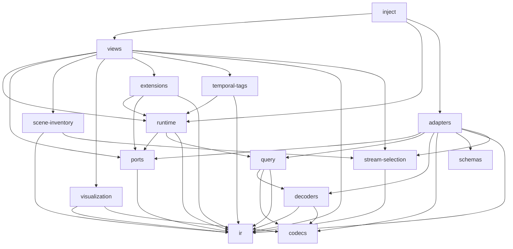
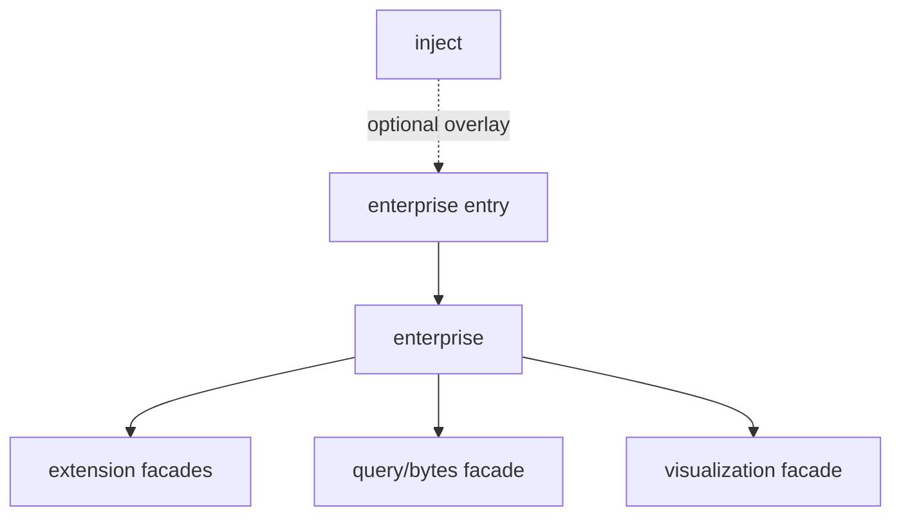

# Multimodal dependency linting

## Why this exists

The multimodal package is organized around architectural responsibilities, not
just code proximity. A decoder turns bytes into shared data. A runtime makes
playback decisions. A view composes product behavior. A visualization renders
semantic data. Those distinctions let each subsystem evolve without dragging
the rest of the application with it.

Directory names and READMEs communicate that intent, but they do not preserve
it. Imports do. Without executable boundaries, convenient imports gradually
turn leaf packages into dependency hubs, make UI code responsible for
infrastructure, and create cycles that are difficult to remove later.

Dependency Cruiser should therefore encode the architecture we want, not merely
describe the imports that happen to exist today. This is a greenfield contract:
accidental dependencies should be moved or redesigned rather than grandfathered
through compatibility barrels, exceptions, or progressively weaker rules.

The first requirement is that the linter inspect the real graph. Only then can
it enforce the intended graph and prevent regressions.

## Intended top-level graph

An arrow means the namespace on the left may depend on the namespace on the
right. A missing arrow is intentional.



The enterprise integration is an optional overlay and has a narrower graph of
its own:



Shared multimodal code must never import the enterprise implementation. The
injection entry may import only the enterprise entry, and enterprise code may
consume shared code only through the named facades. This seam must remain in
the lint configuration even though the enterprise source tree is absent from
the OSS checkout.

The remaining namespaces have stricter roles or special graph semantics:

- `schemas` contains generated transport contracts and should be an
  application-dependency leaf. Generated code may depend on its protobuf
  runtime, but not on another multimodal namespace.
- `codecs` contains low-level bitstream mechanisms. It may use only codec-local
  code and domain-free utilities; it does not own decoded application models.
- `stream-selection` contains pure source-neutral naming, pairing, and
  default-selection policy. It may use IR and utilities, allowing adapters and
  product inventory to share policy without depending on one another.
- `utils` contains only dependency-free, domain-free helpers. Any production
  namespace may import it, but it may not import application namespaces. If a
  helper understands a product concept, a media format, or an IR model, it
  belongs to that domain instead. Its many inbound arrows are omitted from the
  diagram for readability.
- `types` contains ambient declarations for third-party packages only. It
  participates in TypeScript compilation rather than serving as an ordinary
  import target, and it must not import application code.
- `testing` may consume public production boundaries, but production code must
  never import it.
- The package root is its public entrypoint, not an internal communication
  channel.

The top-level DAG describes production modules. Colocated test modules are
still part of the graph for resolution and cycle checks, but are excluded from
the `from` side of production namespace allowlists through one shared test-path
definition. Tests may cross production boundaries to assemble their subjects.
Production code may not import `testing`, test modules, or test-only helpers;
cross-layer harnesses belong in `testing`, while narrow unit tests stay beside
their owner. This is a deliberate test graph, not an exception for dependency
debt.

This graph is deliberately asymmetric. Views may use visualization, for
example, because views assemble product experiences from renderers.
Visualization must not use views because a renderer should not know about
sessions, layout, settings, or application composition. The same principle
applies throughout: policy may depend on mechanisms below it; mechanisms must
not reach upward into policy.

## What the enforcement covers

The configuration now defines positive dependency surfaces for every production
namespace, preserves external targets as visible graph leaves, rejects
unresolved imports and cycles, and isolates optional enterprise composition. It
also protects the narrower runtime, scene-inventory, query, visualization,
extension, episode, and MCAP subgraphs described below.

The rules intentionally expose drift instead of accepting known debt. A new
dependency must fit an existing responsibility or arrive with an explicit
architectural decision that updates both the linter and the relevant namespace
documentation.

## Eight design failures addressed

### 1. Dependency Cruiser inspected the wrong graph

The previous `includeOnly` setting scoped analysis to `packages/multimodal`,
which included package-local `node_modules`. A normal check consequently walked
thousands of vendor modules and dependencies even though the architecture under
review contained only hundreds of source modules.

More importantly, filtering the graph this way removes dependency targets that
resolve outside the package. Imports of format libraries, workspace packages,
and Teams-only modules can disappear before rules inspect them. Rules intended
to restrict those imports may pass because the relevant edge is absent, not
because the boundary is sound.

The command starts from `packages/multimodal/src`. Dependencies outside that
source tree remain visible as leaf targets but are not traversed. `doNotFollow`
avoids excluding those targets with `includeOnly`, and external-target regular
expressions match the resolved paths Dependency Cruiser actually reports.

The check also asserts that representative format-vendor and workspace edges
are visible and that every outside target is a non-traversed leaf. A passing
architecture check is meaningful only when it sees both local and external
edges.

### 2. Cycles obscured ownership

The original source graph contained five local cycles:

1. MCAP reader prefetch types lived beside behavior, then returned through
   message-index and reader types. The request interfaces now live in a
   dependency-free reader type module.
2. Scene colormap value types lived beside colormap behavior, while that
   behavior imported utilities that imported the types. The value types now
   live in a leaf colormap type module.
3. Adjacent-sample prewarming imported the episode barrel to reach network
   health, and that barrel imported the modal shell. It now imports the
   canonical playback capability directly.
4. Plot-opening behavior read the tile catalog, while a raw-message tile
   imported the plot behavior. The behavior now references its own plot
   descriptor directly.
5. Image-opening behavior read the tile catalog, while the 3D tile imported the
   image behavior. It now uses its own image descriptor rather than the
   component-owning catalog.

These were not harmless organizational loops. Each one hid reversed ownership:
types depended on behavior, features depended on composition, or components
participated in their own registry. All five were removed before enabling
`no-circular-dependencies` as an error, including type-only cycles observed by
the tool.

### 3. Transport schemas leaked upward into views

The desired flow is:

```text
transport schema -> adapter -> IR -> view
```

Previously, episode inventory received an IR stream descriptor and
reconstructed a generated protobuf inventory object, including
transport-specific metadata, before giving it to a view-facing service. The
effective flow was:

```text
transport schema -> IR -> transport schema -> view
```

That made views aware of serialization details and prevented scene inventory
from being genuinely format-neutral. Scene inventory and views now consume
`StreamDescriptor`, schema-to-IR conversion remains at the adapter boundary,
and the redundant schema-side IR facade has been removed.

The schemas namespace documents that generated contracts are passive transport
definitions, not application models. Generated schema modules are
application-dependency leaves.

### 4. Decoders masqueraded as owners of IR

The decoder type module re-exported many IR models, and views and
visualizations imported those models through `decoders`. That made it look as
though decoded data belonged to the decoding subsystem.

It does not. Decoders produce IR. They own decoder contracts such as the
decoder interface and decode context; IR owns the data model that survives
decoding. Downstream consumers now import model types directly from `ir`, and
the package root exports shared models from `ir` rather than through a decoder
barrel.

Once those imports are corrected, visualization can depend on IR without
depending on decoders. This keeps rendering independent of how data arrived or
which codec produced it.

### 5. Loose root files evaded namespace rules

Files directly under `src` sat outside most namespace-specific constraints. The
loose error, time, and stream-matching modules could therefore become
accidental shortcuts between layers.

Their responsibilities are now assigned explicitly:

- Keep contract-level episode cancellation under ports, where the read contract
  already owns its public cancellation error. Keep AbortError and byte-read
  cancellation mechanics in query/bytes. Remove duplicate markers instead of
  making either layer interpret the other's private representation.
- Put genuinely generic error conversion or monotonic-clock helpers in strict,
  domain-free utilities. User-facing source error copy belongs in a
  runtime-to-view error mapping, not in a generic helper.
- Put source-neutral stream naming, pairing, and default-selection policy in a
  pure `stream-selection` leaf. Both adapter-side resource discovery and
  product-side scene inventory need that policy; making either one its owner
  would reverse the dependency for the other. Format-specific decoding and
  metadata interpretation remain adapter-local.

The linter enforces that `src` contains no TypeScript files other than its
public `index`. This forces every new responsibility to declare an
architectural owner.

### 6. `utils` had the wrong contract

Describing utilities as algorithms with “no yet-identified owner” invites a
dumping ground. Ownership is most important when a helper encodes a domain
assumption.

Line-segment grouping used for image rendering now belongs with image
visualization and consumes its model from IR. H.264 normalization now belongs
to codec infrastructure. Similar helpers move to the narrowest domain that can
name why they exist.

The remaining `utils` namespace should be dependency-free and domain-free:
small mathematical, collection, timing, or platform helpers that could be
understood without knowing what multimodal data is. If that leaves too little
to justify a namespace, removing it is preferable to preserving a miscellaneous
bucket.

### 7. Views owned infrastructure

Some session-opening and prewarming hooks constructed byte clients, computed
byte-source access keys, and queried raw bytes directly. This made the UI
responsible for source acquisition and cache identity.

Views now express intent: open this session, prewarm this sample, seek to this
time. Runtime owns how those requests become source access, queries, caching,
cancellation, and fallback. Byte-client construction and source-key policy sit
behind a runtime API.

This does not mean views become passive. They still own product composition and
user-driven state. It means they depend on a stable application capability
instead of assembling infrastructure themselves.

### 8. Internal semantic domains were tangled

Top-level boundaries are not enough when subdomains import one another through
convenient barrels.

Within visualization, image and scene-3D code reached into WebGPU, while WebGPU
contained semantic point-cloud projection and scene snapshots. Generic GPU
infrastructure is now a leaf. Point-cloud projection belongs to the explicit
composition domain, scene snapshots belong with scene-3D, and semantic
visualization families remain independent.

Within episode views, feature hooks once read a tile catalog that imported the
concrete components using those hooks. The shell now assembles tile
descriptors. Features depend on leaf tile contracts, direct ownership, or host
commands such as “open tile” and “add field to plot.” Layout receives a
resolver from the shell instead of importing concrete tile domains.

The same principle should guide extensions and MCAP internals: sibling feature
families stay independent, and composition occurs in an explicitly higher
layer.

## Rules encoded

Rules were introduced after the corresponding violations were fixed. They are
errors, not warnings, and contain no exceptions for known debt. Structural
scopes such as generated code and the explicit test graph are defined once and
reused; they are policy, not per-rule escape hatches.

### Foundational graph integrity

1. `no-unresolved-dependencies`: every import must resolve so missing edges
   cannot silently weaken the graph.
2. `no-circular-dependencies`: the local source graph must remain acyclic.
3. `production-does-not-import-testing`: only tests and test support may
   consume the testing namespace.
4. `production-does-not-import-test-modules`: production modules cannot import
   colocated tests or test-only helpers.
5. `package-internals-do-not-import-root-entrypoint`: internal code imports the
   owning namespace directly, avoiding cycles and accidental dependence on the
   public API surface.
6. `no-flat-multimodal-source-files`: only the root public entrypoint may live
   directly under `src`.

### Positive top-level boundaries

An “imports only” rule covers every production top-level namespace: adapters,
codecs, decoders, extensions, inject, IR, ports, query, runtime, scene
inventory, schemas, stream selection, temporal tags, types, utilities, views,
and visualization. Separate positive rules retain the optional enterprise
overlay and its named shared facades.

Positive allowlists are preferable to a growing collection of pairwise
prohibitions. A negative rule says that one known edge is wrong; an allowlist
says what the namespace is. When a new dependency is needed, the author must
either place the code in its correct owner or deliberately update the
architecture contract.

The allowlists should encode the graph above. Their targets must be scoped to
multimodal source paths so ordinary imports of React, Three.js, protobuf
runtimes, and other permitted external packages are not mistaken for
cross-namespace violations. Use one shared test-module expression to exclude
tests from the `from` side of these production rules rather than accumulating
inconsistent `pathNot` clauses.

Add `non-view-layers-do-not-reach-views` with transitive reachability as
defense in depth: only injection and view-owned code may reach views, even
indirectly.

### Headless layers

IR, ports, decoders, query, schemas, adapter core, runtime core, and
scene-inventory core must not import React or UI packages. These layers should
run in workers, tests, and non-browser execution without pulling in the
component tree.

Runtime and scene inventory expose React contexts and hooks only through
explicit `react` subpaths. Only those named binding paths may import React; the
rest of each namespace remains headless.

### Query and schema internals

1. `query-bytes-does-not-import-decoding`: byte acquisition and caching sit
   below decoded-result orchestration.
2. `generated-schemas-are-leaves`: generated transport declarations import no
   application modules.
3. Schema conversion code may depend on schemas and IR only from an
   adapter-owned boundary; views, runtime, and visualization must not import
   schemas.

The query-bytes rule has no known violations and can land with the foundational
phase rather than waiting for later refactoring.

### Visualization internals

1. `visualization-shared-is-a-leaf`: shared primitives cannot import semantic
   families.
2. Generic WebGPU infrastructure is a leaf relative to image, point-cloud, and
   scene-3D domains.
3. `visualization-semantic-families-do-not-import-siblings`: the physical
   families—image, logs, map, message, plot, and scene-3D—remain independent.
   Structured messages and time series are product concepts represented by
   `message` and `plot`.
4. Cross-family behavior belongs to `visualization/composition`. Point-cloud
   projection and its panel-level scene assembly live there; generic GPU
   mechanisms remain under WebGPU and scene snapshots remain owned by scene-3D.
5. Visualization may consume IR and narrow platform utilities, but not views,
   runtime, query, adapters, schemas, or decoders.

### Extension, episode, and MCAP internals

1. `extension-families-do-not-import-each-other`: extensions integrate through
   shared host contracts, not sibling implementation details.
2. Episode feature domains depend on leaf tile contracts and host commands, not
   on the concrete tile catalog. Shell and tile assembly may depend on feature
   descriptors; features must not depend back on assembly.
3. MCAP uses a positive sublayer DAG: `shared` is the leaf; decoders may use
   shared code; readers may use decoders and shared code; resources may use
   readers, decoders, and shared code; workers may use resources and the layers
   below them; the adapter facade composes the stack.

Some contracts do not belong in Dependency Cruiser. Package export parity,
`package.json` export maps, generated-file freshness, and public API snapshots
are better checked by small purpose-built scripts. Dependency Cruiser should
remain focused on module reachability and ownership.

## Implementation sequence

### Phase 0: make the graph trustworthy

- Start the cruise from multimodal source files.
- Preserve outside dependencies as visible leaf targets without traversing
  their internals.
- Update format-vendor, Teams, and other external dependency matchers against
  actual resolved paths.
- Scope positive namespace allowlists to internal targets after outside
  dependencies become visible.
- Validate resolver behavior for workspace dependencies, package subpaths, and
  `typesVersions`, then add unresolved-dependency coverage.
- Add a small architecture fixture or test proving that restricted external
  imports are seen.
- Add `query-bytes-does-not-import-decoding`, which has no known violations.

### Phase 1: remove structural debt

- Remove the schema-to-IR-to-schema round trip.
- Stop re-exporting IR models through decoders and update consumers.
- Relocate loose root modules and domain-aware utilities.
- Extract source-neutral stream matching into `stream-selection`, leaving
  format-specific work in adapters and product inventory in scene inventory.
- Move byte-client construction and session-opening infrastructure behind
  runtime.
- Extract the React bindings from runtime and scene-inventory core into named
  integration subpaths or views.
- Break the five known cycles.

### Phase 2: lock the top-level architecture

- Add explicit import allowlists for every namespace.
- Add the transitive non-view-to-views rule.
- Prevent production imports of testing and internal imports of the root
  entrypoint.
- Apply one explicit test-module policy to all production allowlists while
  retaining resolution and cycle checks for tests.
- Add headless-layer rules.
- Enable the cycle rule as soon as the known cycles are gone.

### Phase 3: lock internal subgraphs

- Separate byte acquisition from decoding orchestration in query.
- Make generated schemas leaves.
- Separate visualization infrastructure, semantic families, and the named
  `visualization/composition` layer.
- Isolate extension families.
- Encode the positive MCAP sublayer DAG.
- Separate episode feature contracts from shell and tile assembly.

### Phase 4: keep documentation and enforcement aligned

- Make each namespace README state the same allowed-dependency contract as the
  linter.
- Add the no-flat-source rule after root modules are relocated.
- Treat every allowlist change as an architecture decision in review, not
  routine lint maintenance.

## Completion contract

The dependency boundary work is complete when:

- The dependency check analyzes multimodal source modules and visible outside
  targets, not vendor implementation graphs.
- An architecture test proves that restricted external imports are visible to
  the rules.
- The local source graph has zero cycles.
- `src` has no loose TypeScript modules other than its public entrypoint.
- Views do not import adapters, schemas, decoders, or query infrastructure.
- Visualization does not import views, runtime, query, adapters, schemas, or
  decoders.
- Generated schemas are passive dependency leaves.
- Production modules cannot import testing helpers.
- Production modules cannot import colocated tests or test-only helpers; tests
  remain covered by resolution and cycle rules.
- Runtime and scene-inventory cores are React-free, with any React bindings
  isolated in named integration paths.
- The optional enterprise overlay remains reachable only through its injection
  entry and named shared facades.
- Namespace READMEs and Dependency Cruiser allowlists describe the same graph.
- `yarn workspace @fiftyone/multimodal check:deps` passes without grandfathered
  violations.

The goal is not a larger lint configuration. It is an architecture in which
ownership is obvious, composition happens in named places, and an innocent
import cannot quietly reverse the system's dependency direction.
