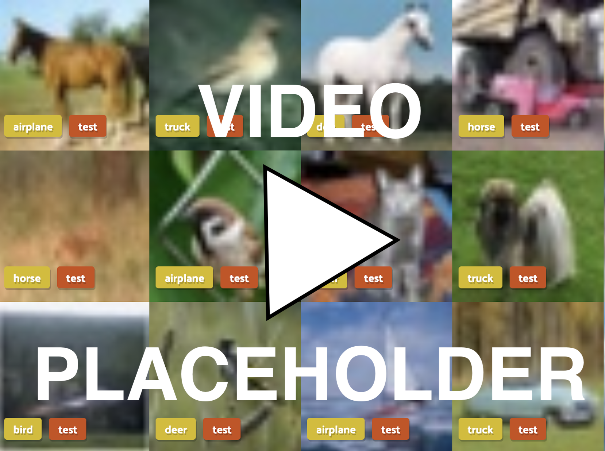
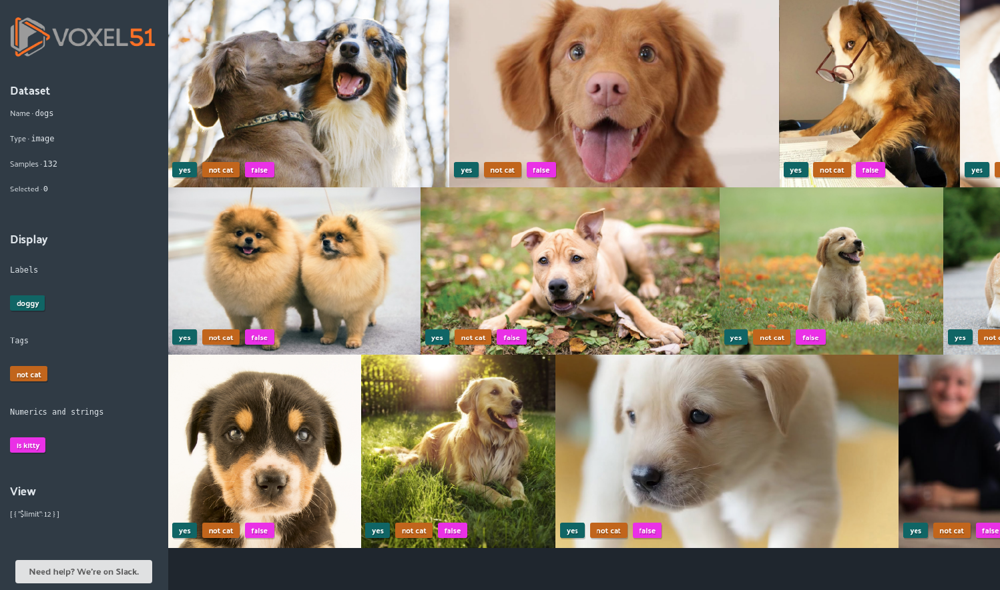

FiftyOne
========

    *"Data is king in the artificial intelligence world."*

If you are looking to boost your model performance, chances are improving
dataset quality is going to provide the highest return on investment.
**FiftyOne** is a cutting-edge, Python-based tool for the visual data scientist
to help in creating valuable and diverse datasets. Work efficiently with
FiftyOne to achieve better models with dependable performance.

    *"Become one with the data."*

FiftyOne does more than improve your dataset; it gets you closer to your data.
Rapidly gain insight by visualizing samples overlayed with with dynamic and
queryable fields such as ground truth and predicted labels, dataset splits, and
much more!

Capabilities
____________

FiftyOne provides advanced capabilities that will turbocharge your machine
learning workflows.

.. rubric:: Finding annotation mistakes

Annotations mistakes create an artificial ceiling on the performance of your
models. However, finding these mistakes by hand is at least as arduous as the
original annotation was, especially in cases of larger datasets. FiftyOne
provides a quantitative `mistakenness` measure that can automatically identify
possible label mistakes in your datasets.
:doc:`>>Try Now<tutorials/label_mistakes>`

.. rubric:: Removing redundant images

During the training loop for a model, the best results will be seen when
training on unique data. For example, finding and removing similar samples in
your dataset cam avoid accidental concept imbalance that can bias the learning
of your model. FiftyOne provides a `uniqueness` measure that can automatically
identify duplicate or near-duplicate images in your datasets.
:doc:`>>Try Now<tutorials/uniqueness>`

.. rubric:: Bootstrapping training datasets from raw images

In the early stages of a machine learning workflow, ML engineers inevitably ask
themselves: *what data should I select to annotate?* This is a critical
question, as acquiring high quality ground truth annotations is an expensive
and time consuming process. FiftyOne provides methods that can automatically
identify a diverse subset of your raw (unlabeled) dataset that you should send
for annotation, enabling you to bootsrap a curated training dataset that can
lead to demonstrably better model performance on a limited time/annotation
budget.

.. note::

    Tutorial coming soon!

.. rubric:: Adding optimal samples to your dataset

While a model is training, it will learn to understand attributes of certain
samples faster than others. The natural question arises: *what types of data
should I add to my training dataset to provide the largest incremental
improvement to the performance of my model?* FiftyOne provides methods that
automatically measure how easy or diffiult it is for your model to understand
the samples in  your dataset. These insights can be leveraged to mine hard
samples from your data lake, a tried and true measure of mature machine
learning processes. For example, FiftyOne enables you to select unlabeled
samples that are the most valuable to have annotated and fed back into the
system as training samples.

.. note::

    Tutorial coming soon!

Concepts
________

.. rubric:: :doc:`The FiftyOne Core Library<user_guide/basics>`

FiftyOne's core library provides a structured yet dynamic representation to
explore your datasets. You can efficiently query and manipulate your dataset by
adding custom tags, model predictions and more.

.. code-block:: python

    import fiftyone as fo

    dataset = fo.Dataset("my_dataset")

    sample = fo.Sample(filepath="path/to/img.png")
    sample.tags.append("train")
    sample["custom_field"] = 51

    dataset.add_sample(sample)

    view = dataset.view().match_tag("train").sort_by("custom_field").limit(10)

    for sample in view:
        print(sample)

.. note::
    FiftyOne is designed to be lightweight and flexible, so it is easy to load
    your datasets. FiftyOne supports loading datasets in a variety of common
    formats out-of-the-box, and it also provides the extensibility to load
    datasets in custom formats.

    Check out the
    :doc:`loading datasets guide<user_guide/dataset_creation/index>` to see how
    to load your data into FiftyOne today.

.. rubric:: :doc:`The FiftyOne App<user_guide/app>`

The FiftyOne App is a graphical user interface (GUI) that makes it easy to
rapidly gain intuition into your datasets. You can visualize labels, bounding
boxes and segmentations overlayed on the samples; sort, query and slice your
dataset into any aspect you need; and more.

.. rubric:: :doc:`The FiftyOne Brain<user_guide/brain>`

The FiftyOne Brain is a library of powerful machine learning-powered
:ref:`capabilities<Capabilities>` that provide insights into your datasets and
recommend ways to modify your datasets that will lead to measurably better
performance of your models.

.. code-block:: python

   import fiftyone.brain as fob

   fob.compute_uniqueness(dataset)
   rank_view = dataset.view().sort_by("uniqueness")

What Next?
__________

Where should you go from here? You could...

* Start by :doc:`installing FiftyOne<getting_started/install>`.
* Try one of the :doc:`tutorials<tutorials/index>` that demonstrate the unique
  capabilities of FiftyOne.
* Explore :doc:`recipes<recipes/index>` for integrating FiftyOne into
  your current ML workflows.
* Consult the :doc:`user guide<user_guide/index>` for detailed instructions on
  how to accomplish various tasks with FiftyOne.

Support
_______

If you run into any issue with FiftyOne that cannot be resolved wih this
documentation, feel free to reach out to us at support@voxel51.com.

.. toctree::
   :maxdepth: 1
   :hidden:

   getting_started/install
   tutorials/index
   recipes/index
   user_guide/index
   api/fiftyone
