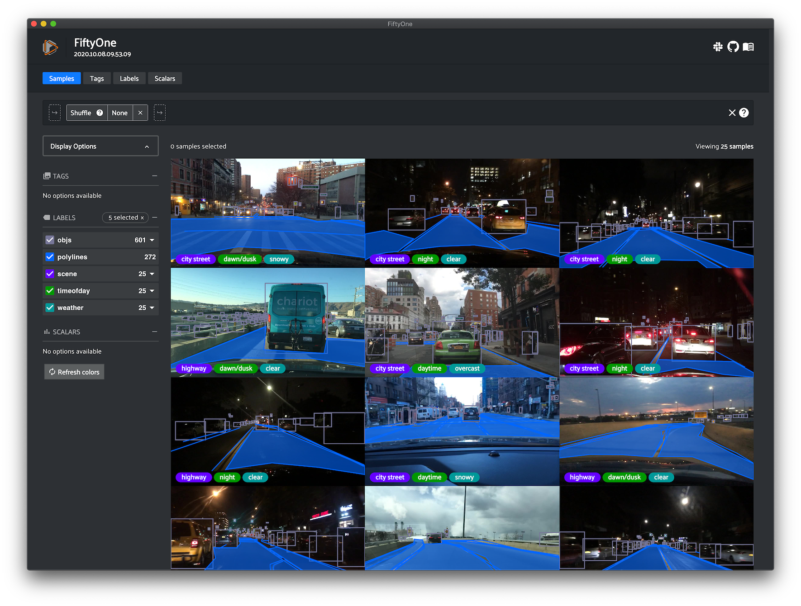
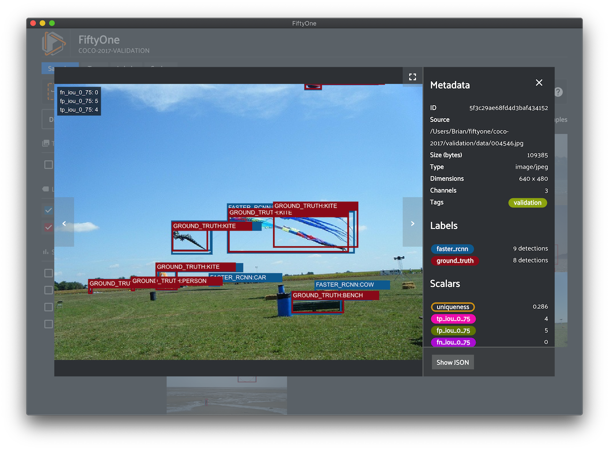

FiftyOne
========

.. Social links ---------------------------------------------------------------

.. raw:: html

  

    <table id="social-links-table">
      <th>
        <a target="_blank" href="https://github.com/voxel51/fiftyone">
          
          &nbsp View on GitHub
        </a>
      </th>
      <th>
        <a target="_blank" href="https://join.slack.com/t/fiftyone-users/shared_invite/zt-gtpmm76o-9AjvzNPBOzevBySKzt02gg">
          
          &nbsp Join us on Slack
        </a>
      </th>
    </table>
  

.. End social links -----------------------------------------------------------

*"Rapidly experiment with your datasets"*

If you are looking to boost the performance of your machine learning models,
chances are improving the quality of your dataset will provide the highest
return on your investment. **Enter FiftyOne.** FiftyOne is a Python-based tool
for machine learning/computer vision engineers and scientists that enables you
to curate better datasets. Work efficiently with FiftyOne to achieve better
models with dependable performance.

*"Become one with your data"*

FiftyOne does more than improve your dataset; it gets you closer to your data.
Rapidly gain insight by visualizing samples overlayed with dynamic and
queryable fields such as ground truth and predicted labels, dataset splits, and
much more!

.. note::

  FiftyOne is rapidly growing.
  `Sign up for the mailing list <https://share.hsforms.com/1zpJ60ggaQtOoVeBqIZdaaA2ykyk>`_
  so we can keep you posted on new features as they come out!

.. _core-capabilities:

Core Capabilities
_________________

FiftyOne provides advanced capabilities that will turbocharge your machine
learning workflows.

.. Callout items --------------------------------------------------------------

.. raw:: html

    

        

.. Add callout items below this line

.. customcalloutitem::
    :header: Finding annotation mistakes
    :description: Annotations mistakes create an artificial ceiling on the performance of your model. However, finding these mistakes by hand is not feasible! Use FiftyOne to automatically identify possible label mistakes in your datasets.
    :button_text: Check out the label mistakes tutorial
    :button_link: tutorials/label_mistakes.html

.. customcalloutitem::
    :header: Removing redundant images
    :description: During model training, the best results will be seen when training on unique data. Use FiftyOne to automatically remove duplicate or near-duplicate images from your datasets and curate diverse training datasets from your raw data.
    :button_text: Try the image uniqueness tutorial
    :button_link: tutorials/uniqueness.html

.. customcalloutitem::
    :header: Bootstrapping datasets from raw images
    :description: "What data should I select to annotate?" Use FiftyOne to automatically recommend unlabeled samples from your dataset to send for annotation, enabling you to bootsrap a training dataset that leads to demonstrably better model performance.
    :button_text: Tutorial coming soon
    :button_link:

.. customcalloutitem::
    :header: Adding optimal samples to your dataset
    :description: "What new samples should I add to my training dataset to see the largest improvement in my model?" FiftyOne provides methods for mining hard samples from your datasets, a tried and true measure of mature machine learning processes.
    :button_text: Tutorial coming soon
    :button_link:

.. End callouts ---------------------------------------------------------------

.. raw:: html

        

    

.. End of callout items -------------------------------------------------------

Core Concepts
_____________

The FiftyOne tool has three components: the core library, the App, and the
Brain.

:doc:`FiftyOne Core Library <user_guide/basics>`
------------------------------------------------

FiftyOne's core library provides a structured yet dynamic representation to
explore your datasets. You can efficiently query and manipulate your dataset by
adding custom tags, model predictions and more.

.. custombutton::
    :button_text: Explore the Core Library
    :button_link: user_guide/basics.html

.. code-block:: python
    :linenos:

    import fiftyone as fo

    dataset = fo.Dataset("my_dataset")

    sample = fo.Sample(filepath="/path/to/image.png")
    sample.tags.append("train")
    sample["custom_field"] = 51

    dataset.add_sample(sample)

    view = dataset.match_tag("train").sort_by("custom_field").limit(10)

    for sample in view:
        print(sample)

.. note::

    FiftyOne is designed to be lightweight and flexible, making it easy to load
    your datasets. FiftyOne supports loading datasets in a variety of common
    formats out-of-the-box, and it also provides the extensibility to load
    datasets in custom formats.

    Check out :doc:`loading datasets <user_guide/dataset_creation/index>` to see
    how to load your data into FiftyOne!

:doc:`FiftyOne App <user_guide/app>`
------------------------------------

The FiftyOne App is a graphical user interface (GUI) that makes it easy to
rapidly gain intuition into your datasets. You can visualize labels, bounding
boxes and segmentations overlayed on the samples; sort, query and slice your
dataset into any aspect you need; and more.

.. custombutton::
    :button_text: See more of the App
    :button_link: user_guide/app.html

:doc:`FiftyOne Brain <user_guide/brain>`
----------------------------------------

The FiftyOne Brain is a library of powerful machine learning-powered
:ref:`capabilities <core-capabilities>` that provide insights into your
datasets and recommend ways to modify your datasets that will lead to
measurably better performance of your models.

.. custombutton::
    :button_text: Learn more about the Brain
    :button_link: user_guide/brain.html

.. code-block:: python
   :linenos:

   import fiftyone.brain as fob

   fob.compute_uniqueness(dataset)
   rank_view = dataset.sort_by("uniqueness")

.. note::

    The FiftyOne Brain is a separate Python package that is bundled with
    FiftyOne. Although it is closed-source, it is licensed as freeware, and you
    have permission to use it for commercial or non-commercial purposes. See
    `the license <https://github.com/voxel51/fiftyone/blob/develop/LICENSE-BRAIN>`_
    for more details.

What's Next?
____________

Where should you go from here? You could...

* :ref:`Install FiftyOne <installing-fiftyone>`
* Try one of the :doc:`tutorials <tutorials/index>` that demonstrate the unique
  capabilities of FiftyOne
* Explore :doc:`recipes <recipes/index>` for integrating FiftyOne into
  your current ML workflows
* Consult the :doc:`user guide <user_guide/index>` for detailed instructions on
  how to accomplish various tasks with FiftyOne

Need Support?
_____________

If you run into any issues with FiftyOne or have any burning questions, feel
free to
`connect with us on Slack <https://join.slack.com/t/fiftyone-users/shared_invite/zt-gtpmm76o-9AjvzNPBOzevBySKzt02gg>`_
or reach out to us at support@voxel51.com.

.. toctree::
   :maxdepth: 1
   :hidden:

   Overview <self>
   Installation <getting_started/install>
   Tutorials <tutorials/index>
   Recipes <recipes/index>
   User Guide <user_guide/index>
   Release Notes <release-notes>
   CLI Documentation <cli/index>
   API Reference <api/fiftyone>
