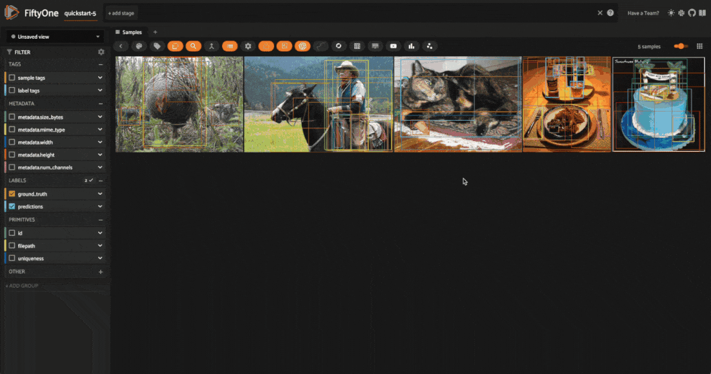
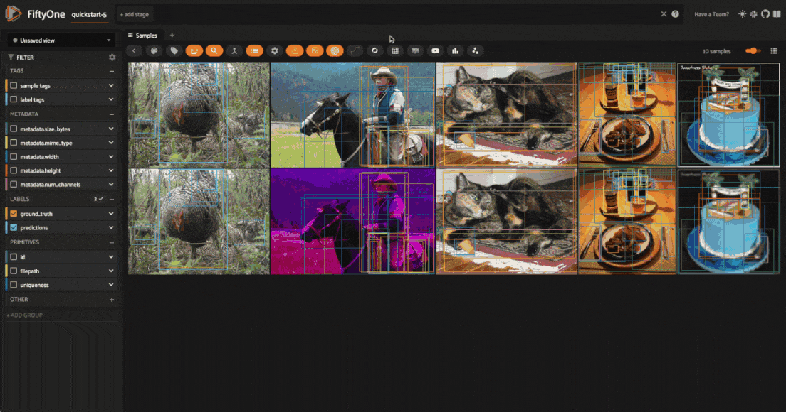
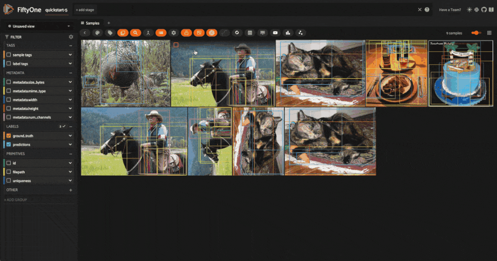
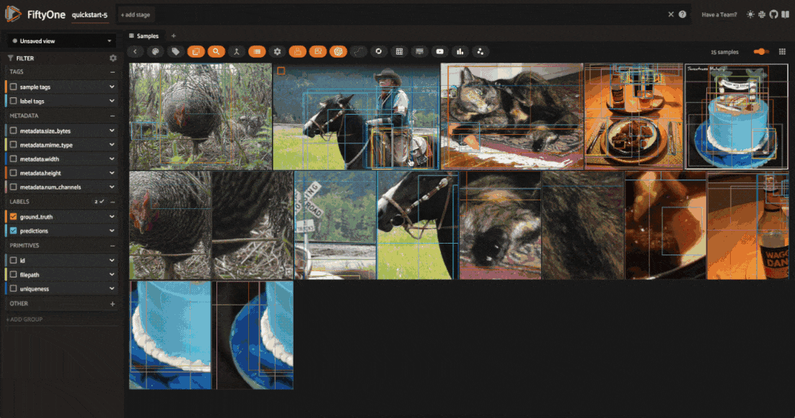
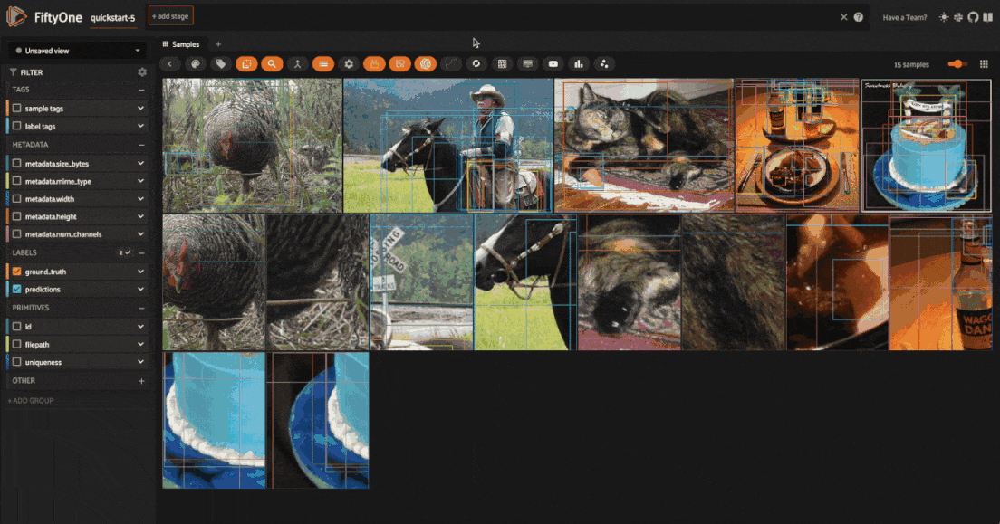
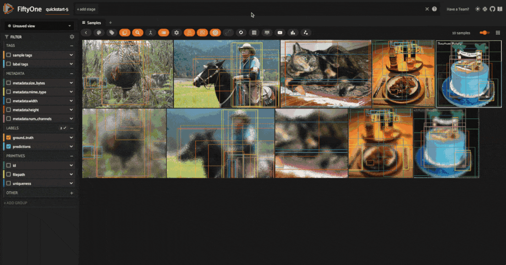
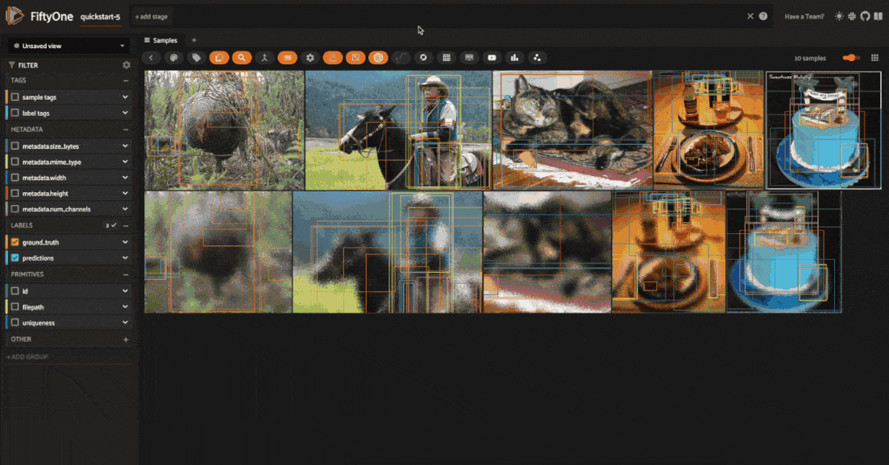

.. _albumentations-integration:

Albumentations Integration
==========================

.. default-role:: code

The `Albumentations <https://albumentations.ai/docs/>`_ library is 
the leading open-source library for image augmentation in machine learning. 
It is widely used in the computer vision community and is known for its
extensive collection of augmentations and its high performance.

Now, we've integrated Albumentations transformation pipelines directly with 
FiftyOne datasets, enabling you to visualize Albumentations augmentations
and test their effects on your data directly within the FiftyOne App!

This integration takes the form of a :ref:`FiftyOne plugin <using-plugins>`, 
which is easy to install and can be used entirely via a convenient graphical
interface.

With the FiftyOne Albumentations plugin, you can transform any and all labels 
of type |Detections|, |Keypoints|, |Segmentation|, and |Heatmap|, or just 
the images themselves.

This integration guide will focus on the setup process and the functionality
of the plugin. For a tutorial on how to curate your augmentations, check out
the :doc:`Data Augmentation Tutorial </tutorials/data_augmentation>`.

.. _albumentations-plugin-overview:

Overview
________

Before we get started, let's take a look at the main features of the FiftyOne
Albumentations integration.

.. _albumentations-supported-transformations:

Supported transformations
-------------------------

Albumentations supports `80+ transformations <https://albumentations.ai/docs/getting_started/transforms_and_targets/>`_,
spanning pixel-level transformations, geometric transformations, and more.

The FiftyOne Albumentations plugin currently supports all but the following transformations:

- `AdvancedBlur <https://albumentations.ai/docs/api_reference/augmentations/blur/transforms/#albumentations.augmentations.blur.transforms.AdvancedBlur>`_
- `GridDropout <https://albumentations.ai/docs/api_reference/augmentations/dropout/grid_dropout/>`_
- `MaskDropout <https://albumentations.ai/docs/api_reference/augmentations/dropout/mask_dropout/#albumentations.augmentations.dropout.mask_dropout>`_
- `PiecewiseAffine <https://albumentations.ai/docs/api_reference/augmentations/geometric/transforms/#albumentations.augmentations.geometric.transforms.PiecewiseAffine>`_
- `RandomGravel <https://albumentations.ai/docs/api_reference/augmentations/transforms/#albumentations.augmentations.transforms.RandomGravel>`_
- `RandomGridShuffle <https://albumentations.ai/docs/api_reference/augmentations/transforms/#albumentations.augmentations.transforms.RandomGridShuffle>`_
- `RandomShadow <https://albumentations.ai/docs/api_reference/augmentations/transforms/#albumentations.augmentations.transforms.RandomShadow>`_
- `RandomSunFlare <https://albumentations.ai/docs/api_reference/augmentations/transforms/#albumentations.augmentations.transforms.RandomSunFlare>`_
- `Rotate <https://albumentations.ai/docs/api_reference/augmentations/geometric/rotate/#albumentations.augmentations.geometric.rotate.Rotate>`_

.. _albumentations-plugin-functionality:

Functionality
-------------

The FiftyOne Albumentations plugin provides the following functionality:

- Apply Albumentations transformations to your dataset, your current view, or selected samples
- Visualize the effects of these transformations directly within the FiftyOne App
- View samples generated by the last applied transformation
- Save augmented samples to the dataset
- Get info about the last applied transformation
- Save transformation pipelines to the dataset for reproducibility

.. _albumentations-installation:

Setup
_____

To get started, first make sure you have FiftyOne and Albumentations installed:

.. code-block:: bash

    $ pip install -U fiftyone albumentations

Next, install the
`FiftyOne Albumentations plugin <https://github.com/jacobmarks/fiftyone-albumentations-plugin>`_:

.. code-block:: bash

    $ fiftyone plugins download https://github.com/jacobmarks/fiftyone-albumentations-plugin

.. note::

    If you have the 
    `FiftyOne Plugin Utils plugin <https://github.com/voxel51/fiftyone-plugins>`_ 
    installed, you can also install the Albumentations plugin via the `install_plugin`
    operator, selecting the Albumentations plugin from the community dropdown menu.

You will also need to load (and download if necessary) a dataset to apply the
augmentations to. For this guide, we'll use the the
`quickstart dataset <https://docs.voxel51.com/user_guide/dataset_zoo/datasets.html#quickstart>`_:

.. code-block:: python

    import fiftyone as fo
    import fiftyone.zoo as foz

    ## only take 5 samples for quick demonstration
    dataset = foz.load_zoo_dataset("quickstart", max_samples=5)

    # only keep the ground truth labels
    dataset.select_fields("ground_truth").keep_fields()

    session = fo.launch_app(dataset)

.. note::

    The quickstart dataset only contains |Detections| labels. If you want to test 
    Albumentations transformations on other label types, here are some quick
    examples to get you started, using FiftyOne's
    :ref:`Hugging Face Transformers <huggingface-integration>` and
    :ref:`Ultralytics <ultralytics-integration>` integrations:

    .. code-block:: bash

        pip install -U transformers ultralytics

    .. code-block:: python

        import fiftyone as fo
        import fiftyone.zoo as foz

        from ultralytics import YOLO

        # Keypoints
        model = YOLO("yolov8l-pose.pt")
        dataset.apply_model(model, label_field="keypoints")

        # Instance Segmentation
        model = YOLO("yolov8l-seg.pt")
        dataset.apply_model(model, label_field="instances")

        # Semantic Segmentation
        model = foz.load_zoo_model(
            "segmentation-transformer-torch",
            name_or_path="Intel/dpt-large-ade",
        )
        dataset.apply_model(model, label_field="mask")

        # Heatmap
        model = foz.load_zoo_model(
            "depth-estimation-transformer-torch",
            name_or_path="LiheYoung/depth-anything-small-hf",
        )
        dataset.apply_model(model, label_field="depth_map")

.. _albumentations-applying-transformations:

Apply transformations
_____________________

To apply Albumentations transformations to your dataset, you can use the
`augment_with_albumentations <https://github.com/jacobmarks/fiftyone-albumentations-plugin?tab=readme-ov-file#applying-augmentations>`_
operator. Press the backtick key ('`') to open the operator modal, and select
the `augment_with_albumentations` operator from the dropdown menu.

You can then configure the transformations to apply:

- **Number of augmentations per sample**: The number of augmented samples to
  generate for each input sample. The default is 1, which is sufficient for 
  deterministic transformations, but for probabilistic transformations, you
  may want to generate multiple samples to see the range of possible outputs.

- **Number of transforms**: The number of transformations to compose into the 
  pipeline to be applied to each sample. The default is 1, but you can set this
  as high as you'd like — the more transformations, the more complex the
  augmentations will be. You will be able to configure each transform
  separately.

- **Target view**: The view to which the transformations will be applied. The
  default is `dataset`, but you can also apply the transformations to the
  current view or to currently selected samples within the app.

- **Execution mode**: If you set `delegated=False`, the operation will be
  executed immediately. If you set `delegated=True`, the operation will be
  :ref:`queued as a job <delegated-operations>`, which you can then run in the
  background from your terminal with:

.. code-block:: bash

    $ fiftyone delegated launch

For each transformation, you can select either a "primitive" transformation
from the Albumentations library, or a "saved" transformation pipeline that you
have previously saved to the dataset. These saved pipelines can consist of one
or more transformations.

When you apply a primitive transformation, you can configure the parameters of
the transformation directly within the app. The available parameters, their 
default values, types, and docstrings are all integrated directly from the
Albumentations library.

When you apply a saved pipeline, there will not be any parameters to configure.

.. _albumentations-visualizing-transformations:

Visualize transformations
_________________________

Once you've applied the transformations, you can visualize the effects of the
transformations directly within the FiftyOne App. All augmented samples will be
added to the dataset, and will be tagged as `augmented` so that you can easily
filter for just augmented or non-augmented samples in the app.

You can also filter for augmented samples programmatically with the 
:meth:`match_tags() <fiftyone.core.collections.SampleCollection.match_tags>` method:

.. code-block:: python

    # get just the augmented samples
    augmented_view = dataset.match_tags("augmented")

    # get just the non-augmented samples
    non_augmented_view = dataset.match_tags("augmented", bool=False)

However, matching on these tags will return *all* samples that have been
generated by an augmentation, not just the samples that were generated by the
last applied transformation — as you will see shortly, we can save augmentations
to the dataset. To get just the samples generated by the last applied 
transformation, you can use the `view_last_albumentations_run <https://github.com/jacobmarks/fiftyone-albumentations-plugin?tab=readme-ov-file#view-last-augmentation>`_ operator:

.. note::

    For all samples added to the dataset by the FiftyOne Albumentations plugin,
    there will be a field `"transform"`, which contains the information not just
    about the pipeline that was applied, but also about the specific parameters
    that were used for this application of the pipeline. For example, if you
    had a `HorizontalFlip` transformation with an application probability of 
    `p=0.5`, the contents of the `"transform"` field tell you whether or not
    this transformation was applied to the sample!

.. _albumentations-saving-augmentations:

Save augmentations
__________________

By default all augmentations are temporary, as the FiftyOne Albumentations
plugin is primarily designed for rapid prototyping and experimentation. This 
means that when you generated a *new* batch of augmented samples, the previous
batch of augmented samples will be removed from the dataset, and the image
files will be deleted from disk.

However, if you want to save the augmented samples to the dataset, you can use
the `save_albumentations_augmentations <https://github.com/jacobmarks/fiftyone-albumentations-plugin?tab=readme-ov-file#saving-augmentations>`_
operator, which will save the augmented samples to the dataset while keeping
the `augmented` tag on the samples.

.. _albumentations-last-transformation-info:

Get last transformation info
____________________________

When you apply a transformation pipeline to samples in your dataset using the
FiftyOne Albumentations plugin, this information is captured and stored using
FiftyOne's :ref:`custom runs <managing-custom-runs>`. This means that you can
easily access the information about the last applied transformation.

In the FiftyOne App, you can use the
`get_last_albumentations_run_info <https://github.com/jacobmarks/fiftyone-albumentations-plugin?tab=readme-ov-file#get-info-about-last-transformation>`_
operator to display a formatted summary of the relevant information:

.. note::

    You can also access this information programmatically by getting info about
    the custom run that the information is stored in. For the Albumentations
    plugin, this info is stored via the key `'_last_albumentations_run'`:

    .. code-block:: python

        last_run_info = dataset.get_run_info("_last_albumentations_run")
        print(last_run_info)

.. _albumentations-saving-transformations:

Save transformations
____________________

If you are satisfied with the transformation pipeline you have created, you can
save the entire composition of transformations to the dataset, hyperparameters
and all. This means that after your rapid prototyping phase, you can easily
move to a more reproducible workflow, and you can share your transformations or
port them to other datasets.

To save a transformation pipeline, you can use the 
`save_albumentations_transform <https://github.com/jacobmarks/fiftyone-albumentations-plugin?tab=readme-ov-file#saving-transformations>`_
operator:

After doing so, you will be able to view the information about this saved 
transformation pipeline using the `get_albumentations_run_info <https://github.com/jacobmarks/fiftyone-albumentations-plugin?tab=readme-ov-file#get-info-about-saved-transformations>`_ operator:

Additionally, you will have access to this saved transformation pipeline under
the "saved" tab for each transformation in the `augment_with_albumentations <https://github.com/jacobmarks/fiftyone-albumentations-plugin?tab=readme-ov-file#applying-augmentations>`_
operator modal.
