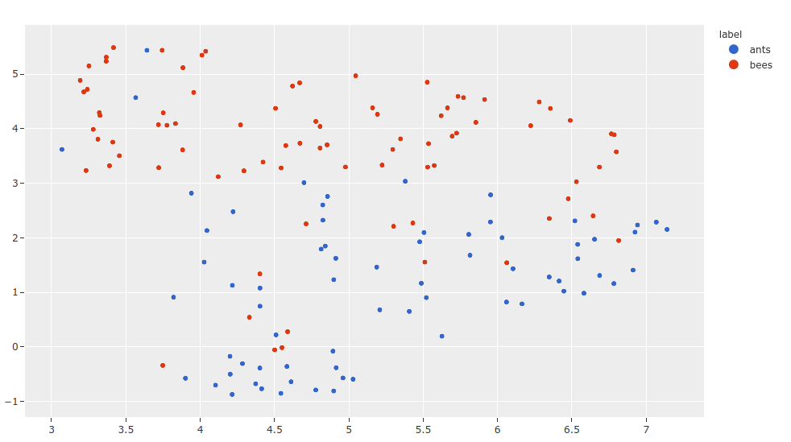

.. _flash:

PyTorch Lightning Flash Integration
===================================

.. default-role:: code

We've collaborated with the
`PyTorch Lightning Flash <https://github.com/PyTorchLightning/lightning-flash>`_
team to make it easy to train :class:`Flash tasks <flash:flash.core.model.Task>`
on your :ref:`FiftyOne datasets <using-datasets>` and add predictions from Flash 
models to your datasets for visualization and analysis, all
in just a few lines of code.

The following Flash tasks are supported natively by FiftyOne:

- :ref:`Image Classification <flash:image_classification>`
- :ref:`Image Object Detection <flash:object_detection>`
- :ref:`Image Semantic Segmentation <flash:semantic_segmentation>`
- :ref:`Image Embedding <flash:image_embedder>`
- :ref:`Video Classification <flash:video_classification>`

Support for future Flash tasks is on the horizon.

.. _install-flash:

Setup
_____

In order to utilize PyTorch Lightning Flash, you need to 
`install the tool <https://lightning-flash.readthedocs.io/en/latest/installation.html>`_:

.. code-block:: shell

    pip install lightning-flash

.. _flash-model-training:

Model training
______________

You can easily train or finetune a Flash 
:class:`Task<flash:flash.core.model.Task>`
on your
:ref:`FiftyOne datasets <using-datasets>` with just a few lines of code using
Flash's builtin 
:meth:`DataModule.from_fiftyone() <flash:flash.core.data.data_module.DataModule.from_fiftyone>`
method, which is implemented for each of the Flash tasks shown below:

.. tabs::

    .. tab:: Image classification

        This example trains a Flash image classification task on a FiftyOne dataset
        with |Classifications| ground truth labels.
        
        .. code-block:: python
            :linenos:

            from itertools import chain
            
            import fiftyone as fo
            import fiftyone.zoo as foz
        
            from flash import Trainer
            from flash.core.classification import FiftyOneLabels
            from flash.core.finetuning import FreezeUnfreeze
            from flash.image import ImageClassificationData, ImageClassifier
        
            # 1. Load your FiftyOne dataset
            # Here we use views into one dataset, but you can also create a
            # different dataset for each split
            dataset = foz.load_zoo_dataset("cifar10", split="test", max_samples=40)
            train_dataset = dataset.shuffle(seed=51)[:20]
            test_dataset = dataset.shuffle(seed=51)[20:25]
            val_dataset = dataset.shuffle(seed=51)[25:30]
            predict_dataset = dataset.shuffle(seed=51)[30:40]
        
            # 2. Load the Datamodule
            datamodule = ImageClassificationData.from_fiftyone(
                train_dataset = train_dataset,
                test_dataset = test_dataset,
                val_dataset = val_dataset,
                predict_dataset = predict_dataset,
                label_field = "ground_truth",
                batch_size=4,
                num_workers=4,
            )
        
            # 3. Build the model
            model = ImageClassifier(
                backbone="resnet18", 
                num_classes=datamodule.num_classes, 
                serializer=FiftyOneLabels(),
            )
        
            # 4. Create the trainer
            trainer = Trainer(
                max_epochs=1, 
                limit_train_batches=1, 
                limit_val_batches=1,
            )
            
            # 5. Finetune the model
            trainer.finetune(
                model, 
                datamodule=datamodule,
                strategy=FreezeUnfreeze(unfreeze_epoch=1),
            )
            
            # 6. Save it!
            trainer.save_checkpoint("image_classification_model.pt")
        
            # 7. Generate predictions
            model = ImageClassifier.load_from_checkpoint(
              "https://flash-weights.s3.amazonaws.com/image_classification_model.pt"
            )
            model.serializer = FiftyOneLabels()

            predictions = trainer.predict(model, datamodule=datamodule)
            
            predictions = list(chain.from_iterable(predictions)) # flatten batches
        
            # 8. Add predictions to dataset and analyze 
            predict_dataset.set_values("flash_predictions", predictions)
            session = fo.launch_app(view=predict_dataset)
        

    .. tab:: Image object detection 

        This example trains a Flash object detection task on a FiftyOne dataset
        with |Detections| ground truth labels.
        
        .. code-block:: python
            :linenos:

            from itertools import chain
            
            import fiftyone as fo
            import fiftyone.zoo as foz
        
            from flash import Trainer
            from flash.image import ObjectDetectionData, ObjectDetector
            from flash.image.detection.serialization import FiftyOneDetectionLabels
        
            # 1. Load your FiftyOne dataset
            # Here we use views into one dataset, but you can also create a
            # different dataset for each split
            dataset = foz.load_zoo_dataset("quickstart", max_samples=40)
            train_dataset = dataset.shuffle(seed=51)[:20]
            test_dataset = dataset.shuffle(seed=51)[20:25]
            val_dataset = dataset.shuffle(seed=51)[25:30]
            predict_dataset = dataset.shuffle(seed=51)[30:40]
        
            # 2. Load the Datamodule
            datamodule = ObjectDetectionData.from_fiftyone(
                train_dataset = train_dataset,
                test_dataset = test_dataset,
                val_dataset = val_dataset,
                predict_dataset = predict_dataset,
                label_field = "ground_truth",
                batch_size=4,
                num_workers=4,
            )
        
            # 3. Build the model
            model = ObjectDetector(
                model="retinanet", 
                num_classes=datamodule.num_classes,
                serializer=FiftyOneDetectionLabels(),
            )
        
            # 4. Create the trainer
            trainer = Trainer(
                max_epochs=1, 
                limit_train_batches=1, 
                limit_val_batches=1,
            )
            
            # 5. Finetune the model
            trainer.finetune(model, datamodule=datamodule)
            
            # 6. Save it!
            trainer.save_checkpoint("object_detection_model.pt")
        
            # 7. Generate predictions
            model = ObjectDetector.load_from_checkpoint(
              "https://flash-weights.s3.amazonaws.com/object_detection_model.pt"
            )
            model.serializer = FiftyOneDetectionLabels()

            predictions = trainer.predict(model, datamodule=datamodule)

            predictions = list(chain.from_iterable(predictions)) # flatten batches
        
            # 8. Add predictions to dataset and analyze 
            predict_dataset.set_values("flash_predictions", predictions)
            session = fo.launch_app(view=predict_dataset)

    .. tab:: Image semantic segmentation

        This example trains a Flash semantic segmentation task on a FiftyOne dataset
        with |Segmentation| ground truth labels.
        
        .. code-block:: python
            :linenos:
            
            from itertools import chain

            import fiftyone as fo
            import fiftyone.zoo as foz
        
            from flash import Trainer
            from flash.core.data.utils import download_data
            from flash.image import SemanticSegmentation, SemanticSegmentationData
            from flash.image.segmentation.serialization import FiftyOneSegmentationLabels 

            # 1. Load your FiftyOne dataset
            # This is a Dataset with Semantic Segmentation Labels generated via CARLA
            self-driving simulator.
            # The data was generated as part of the Lyft Udacity Challenge.
            # More info here:
            https://www.kaggle.com/kumaresanmanickavelu/lyft-udacity-challenge
            download_data(
              "https://github.com/ongchinkiat/LyftPerceptionChallenge/releases/download/v0.1/carla-capture-20180513A.zip",
              "data/"
            )

            # Here we use views into one dataset, but you can also create a
            # different dataset for each split
            dataset = fo.Dataset.from_dir(
                dataset_dir = "data",
                data_path = "CameraRGB",
                labels_path = "CameraSeg",
                max_samples = 40,
                force_grayscale = True,
                dataset_type=fo.types.ImageSegmentationDirectory,
            )
            train_dataset = dataset.shuffle(seed=51)[:20]
            test_dataset = dataset.shuffle(seed=51)[20:25]
            val_dataset = dataset.shuffle(seed=51)[25:30]
            predict_dataset = dataset.shuffle(seed=51)[30:40]
        
            # 2. Load the Datamodule
            datamodule = SemanticSegmentationData.from_fiftyone(
                train_dataset = train_dataset,
                test_dataset = test_dataset,
                val_dataset = val_dataset,
                predict_dataset = predict_dataset,
                label_field = "ground_truth",
                batch_size=4,
                num_workers=4,
            )
        
            # 3. Build the model
            model = SemanticSegmentation(
                backbone="fcn_resnet50", 
                num_classes=datamodule.num_classes,
                serializer=FiftyOneSegmentationLabels(),
            )
        
            # 4. Create the trainer
            trainer = Trainer(
                max_epochs=1,
                fast_dev_run=1,
            )
            
            # 5. Finetune the model
            trainer.finetune(model, datamodule=datamodule, strategy="freeze")
            
            # 6. Save it!
            trainer.save_checkpoint("semantic_segmentation_model.pt")
        
            # 7. Generate predictions
            model = ObjectDetector.load_from_checkpoint(
              "https://flash-weights.s3.amazonaws.com/semantic_segmentation_model.pt"
            )
            model.serializer = FiftyOneSegmentationLabels()

            predictions = trainer.predict(model, datamodule=datamodule)

            predictions = list(chain.from_iterable(predictions)) # flatten batches
        
            # 8. Add predictions to dataset and analyze 
            predict_dataset.set_values("flash_predictions", predictions)
            session = fo.launch_app(view=predict_dataset)

    .. tab:: Video classification

        This example trains a Flash video classification task on a FiftyOne dataset
        with |Classifications| ground truth labels.
        
        .. code-block:: python
            :linenos:

            from torch.utils.data.sampler import RandomSampler
            
            import flash
            from flash.core.classification import FiftyOneLabels
            from flash.core.data.utils import download_data
            from flash.video import VideoClassificationData, VideoClassifier
            
            import fiftyone as fo
            
            # 1. Download data
            download_data("https://pl-flash-data.s3.amazonaws.com/kinetics.zip")
            
            # 2. Load data into FiftyOne
            # Here we use different datasets for each split, but you can also
            # use views into the same dataset 
            train_dataset = fo.Dataset.from_dir(
                "data/kinetics/train",
                fo.types.VideoClassificationDirectoryTree,
                label_field="ground_truth",
                max_samples=5,
            )
            
            val_dataset = fo.Dataset.from_dir(
                "data/kinetics/val",
                fo.types.VideoClassificationDirectoryTree,
                label_field="ground_truth",
                max_samples=5,
            )
            
            predict_dataset = fo.Dataset.from_dir(
                "data/kinetics/predict",
                fo.types.VideoDirectory,
                max_samples=5,
            )
            
            # 3. Finetune a model
            classifier = VideoClassifier.load_from_checkpoint(
              "https://flash-weights.s3.amazonaws.com/video_classification.pt",
              pretrained=False,
            )
            
            datamodule = VideoClassificationData.from_fiftyone(
                train_dataset=train_dataset,
                val_dataset=val_dataset,
                predict_dataset=predict_dataset,
                label_field="ground_truth",
                batch_size=8,
                clip_sampler="uniform",
                clip_duration=1,
                video_sampler=RandomSampler,
                decode_audio=False,
                num_workers=8,
            )
            
            trainer = flash.Trainer(max_epochs=1, fast_dev_run=1)
            trainer.finetune(classifier, datamodule=datamodule)
            trainer.save_checkpoint("video_classification.pt")
            
            # 4. Predict from checkpoint
            classifier = VideoClassifier.load_from_checkpoint(
              "https://flash-weights.s3.amazonaws.com/video_classification.pt",
              pretrained=False,
            )
            
            classifier.serializer = FiftyOneLabels()
            
            filepaths = predict_dataset.values("filepath")
            predictions = classifier.predict(filepaths)
            
            predict_dataset.set_values("predictions", predictions)
            
            # 5. Visualize in FiftyOne App
            session = fo.launch_app(predict_dataset)

.. _adding-model-predictions:

Adding model predictions
________________________

Once you have a trained Flash task, there are a couple of ways that 
you can use the FiftyOne integrations to
add generate and add model predictions to your |Dataset| or |DatasetView|.

Apply model
-----------

The easiest way to generate predictions on an existing |Dataset| or |DatasetView| is
to use the :meth:`apply_model() <fiftyone.core.collections.SampleCollection.apply_model>`
function, passing in your Flash model. Behind the scenes, FiftyOne will
construct the appropriate Flash 
:class:`Trainer() <flash:flash.core.trainer.Trainer>` and use it to perform
inference to generate the predictions. These 
:class:`Trainers <flash:flash.core.trainer.Trainer>` support distributed and
parallel inference, so you can pass additional arguments like `num_gpus=32`
into :meth:`apply_model() <fiftyone.core.collections.SampleCollection.apply_model>`
and they will be passed along when constructing the 
:class:`Trainer <flash:flash.core.trainer.Trainer>`.

.. code-block:: python
    :linenos:

    import fiftyone as fo
    import fiftyone.zoo as foz

    from flash.image import ObjectDetector

    # Load your dataset
    dataset = foz.load_zoo_dataset("quickstart", max_samples=5)

    # Load the finetuned model
    model = ObjectDetector.load_from_checkpoint(
      "https://flash-weights.s3.amazonaws.com/object_detection_model.pt"
    )

    # Predict
    dataset.apply_model(model, label_field="flash_predictions")

    # Visualize
    session = fo.launch_app(dataset)

Manually adding predictions
---------------------------

In some cases, you may have loaded your FiftyOne dataset into a Flash 
:class:`DataModule <flash:flash.core.data.data_module.DataModule>`
already and want to generate predictions with those. 

Flash models support different 
:class:`serializers <flash:flash.core.data.process.Serializer>`
, objects that reformat the output of
models. Using 
:ref:`FiftyOne serializers <flash:fiftyone_labels>`, you can return predictions as FiftyOne
|Label| objects directly. All you need to do is set the model serializer to the
corresponding FiftyOne serializer for your task and generate predictions.
FiftyOne serializers also support a :class:`return_filepath <flash:flash.core.classification.FiftyOneLabels>`
flag that will return the corresponding filepath of every sample along
with the |Label| objects. 

.. code-block:: python
    :linenos:
    
    from itertools import chain

    import fiftyone as fo
    import fiftyone.zoo as foz

    from flash import Trainer
    from flash.image import ObjectDetectionData, ObjectDetector
    from flash.image.detection.serialization import FiftyOneDetectionLabels

    # Load your dataset
    dataset = foz.load_zoo_dataset("quickstart", max_samples=5)

    # Load the finetuned model
    model = ObjectDetector.load_from_checkpoint(
      "https://flash-weights.s3.amazonaws.com/object_detection_model.pt"
    )
    model.serializer = FiftyOneDetectionLabels() 

    # Option 1: Predict with trainer (Supports distributed inference)
    datamodule = ObjectDetectionData.from_fiftyone(
        predict_dataset=dataset,
    )
    trainer = Trainer() 
    predictions = trainer.predict(model, datamodule=datamodule)

    predictions = list(chain.from_iterable(predictions)) # flatten batches

    # Option 2: Predict with model
    filepaths = dataset.values("filepath")
    predictions = model.predict(filepaths)

    # Add predictions to dataset
    dataset.set_values("flash_predictions", predictions)

    # Visualize
    session = fo.launch_app(dataset)

Image Embeddings
________________

Lightning Flash has a 
:ref:`task that generates image embeddings <flash:image_embedder>`
in the form of a vector of image features. When used together with the 
:ref:`dimensionality reduction<brain-embeddings-visualization>` and
:ref:`interactive plotting<embeddings-plots>`
capabilities in the FiftyOne, you can accomplish
powerful workflows like clustering, similarity search, pre-annotation, and more
in only a few lines of code.

.. code-block:: python
    :linenos:

    import numpy as np
    import torch
    
    from flash.core.data.utils import download_data
    from flash.image import ImageEmbedder
    
    import fiftyone as fo
    import fiftyone.brain as fob
    
    # 1 Download data
    download_data(
        "https://pl-flash-data.s3.amazonaws.com/hymenoptera_data.zip"
    )
    
    # 2 Load data into FiftyOne
    dataset = fo.Dataset.from_dir(
        "data/hymenoptera_data/test/",
        fo.types.ImageClassificationDirectoryTree,
    )
    
    # 3 Load model
    embedder = ImageEmbedder(backbone="swav-imagenet", embedding_dim=128)
    
    # 4 Generate embeddings
    filepaths = dataset.values("filepath")
    embeddings = np.stack(embedder.predict(filepaths))
    
    # 5 Visualize in FiftyOne App
    results = fob.compute_visualization(dataset, embeddings=embeddings)
    
    session = fo.launch_app(dataset)
    
    plot = results.visualize(labels="ground_truth.label")
    plot.show()

.. note::

    Interactive plots are currently only supported in Jupyter notebooks. In the
    meantime, you can still use FiftyOne's plotting features in other
    environments, but you must manually call
    :meth:`plot.show() <fiftyone.core.plots.base.Plot.show>` to update the
    state of a plot to match the state of a connected |Session|, and any
    callbacks that would normally be triggered in response to interacting with
    a plot will not be triggered.

    See :ref:`this section <working-in-notebooks>` for more information.

