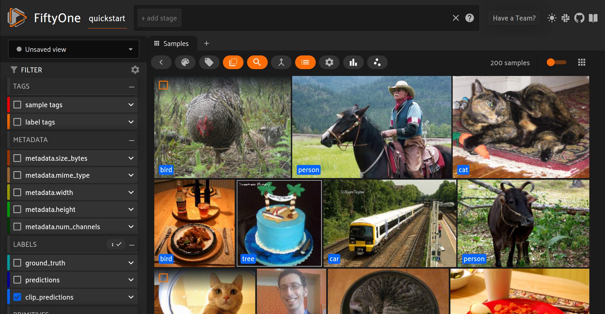

.. _openclip-integration:

OpenCLIP Integration
====================

.. default-role:: code

FiftyOne integrates natively with the
`OpenCLIP <https://github.com/mlfoundations/open_clip>`_ library, an open
source implementation of OpenAI's CLIP (Contrastive Language-Image
Pre-training) model that you can use to run inference on your FiftyOne datasets
with a few lines of code!

.. _openclip-setup:

Setup
_____

To get started with OpenCLIP, install the `open_clip_torch` package:

.. code-block:: shell
    :linenos:

    pip install open_clip_torch

    # May also be needed
    pip install timm --upgrade

.. _openclip-model-zoo:

Model zoo
_________

You can load the original ViT-B-32 OpenAI pretrained model from the
:ref:`FiftyOne Model Zoo <model-zoo>` as follows:

.. code-block:: python
    :linenos:

    import fiftyone.zoo as foz

    model = foz.load_zoo_model("open-clip-torch")

You can also specify different model architectures and pretrained weights by 
passing in optional parameters. Pretrained models can be loaded directly from 
OpenCLIP or from
`Hugging Face's Model Hub <https://huggingface.co/docs/hub/models-the-hub>`_:

.. code-block:: python
    :linenos:

    rn50 = foz.load_zoo_model(
        "open-clip-torch",
        clip_model="RN50",
        pretrained="cc12m",
    )

    meta_clip = foz.load_zoo_model(
        "open-clip-torch",
        clip_model="ViT-B-32-quickgelu",
        pretrained="metaclip_400m",
    )

    eva_clip = foz.load_zoo_model(
        "open-clip-torch",
        clip_model="EVA02-B-16",
        pretrained="merged2b_s8b_b131k",
    )

    clipa = foz.load_zoo_model(
        "open-clip-torch",
        clip_model="hf-hub:UCSC-VLAA/ViT-L-14-CLIPA-datacomp1B",
        pretrained="",
    )

    siglip = foz.load_zoo_model(
        "open-clip-torch",
        clip_model="hf-hub:timm/ViT-B-16-SigLIP",
        pretrained="",
    )

.. _openclip_inference:

Inference
_________

When running inference with OpenCLIP, you can specify a text prompt to help
guide the model towards a solution as well as only specify a certain number of
classes to output during zero shot classification.

For example we can run inference as such:

.. code-block:: python
    :linenos:

    import fiftyone as fo
    import fiftyone.zoo as foz

    dataset = foz.load_zoo_dataset("quickstart")

    model = foz.load_zoo_model(
        "open-clip-torch",
        text_prompt="A photo of a",
        classes=["person", "dog", "cat", "bird", "car", "tree", "chair"],
    )

    dataset.apply_model(model, label_field="clip_predictions")

    session = fo.launch_app(dataset)

.. _openclip_embeddings:

Embeddings
__________

Another application of OpenCLIP is
:ref:`embeddings visualization <brain-embeddings-visualization>`.

For example, let's compare the embeddings of the original OpenAI CLIP model to
MetaCLIP. We'll also perform a quick zero shot classification to color the
embeddings:

.. code-block:: python
    :linenos:

    import fiftyone.brain as fob

    meta_clip = foz.load_zoo_model(
        "open-clip-torch",
        clip_model="ViT-B-32-quickgelu",
        pretrained="metaclip_400m",
        text_prompt="A photo of a",
    )

    dataset.apply_model(meta_clip, label_field="meta_clip_classification")

    fob.compute_visualization(
        dataset,
        model=meta_clip,
        brain_key="meta_clip",
    )

    openai_clip = foz.load_zoo_model(
        "open-clip-torch",
        text_prompt="A photo of a",
    )

    dataset.apply_model(openai_clip, label_field="openai_clip_classifications")

    fob.compute_visualization(
        dataset,
        model=openai_clip,
        brain_key="openai_clip",
    )

Here is the final result!

.. image:: ../images/integrations/clip-compare.gif
   :alt: clip-compare
   :align: center

.. _openclip-text-similarity-search:

Text similarity search
______________________

OpenCLIP can also be used for
:ref:`text similarity search <brain-similarity-text>`.

To use a specific pretrained-checkpoint pair for text similarity search, pass
these in as a  dictionary via the `model_kwargs` argument to
:meth:`compute_similarity() <fiftyone.brain.compute_similarity>`.

For example, for MetaCLIP, we can do the following:

.. code-block:: python
    :linenos:

    import fiftyone as fo
    import fiftyone.zoo as foz
    import fiftyone.brain as fob

    dataset = foz.load_zoo_dataset("quickstart")

    model_kwargs = {
        "clip_model": "ViT-B-32-quickgelu",
        "pretrained": "metaclip_400m",
        "text_prompt": "A photo of a",
    }

    fob.compute_similarity(
        dataset,
        model="open-clip-torch",
        model_kwargs=model_kwargs,
        brain_key="sim_metaclip",
    )

You can then search by text similarity in Python via the
:meth:`sort_by_similarity() <fiftyone.core.collections.SampleCollection.sort_by_similarity>`
stage as follows:

.. code-block:: python
    :linenos:

    query = "kites flying in the sky"

    view = dataset.sort_by_similarity(query, k=25, brain_key="sim_metaclip")

.. note::

    Did you know? You can also perform text similarity queries directly
    :ref:`in the App <app-text-similarity>`!
