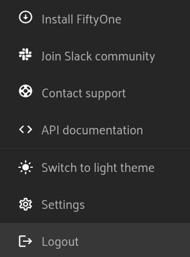

.. _install-overview:

Installation overview
======================

An installation of FiftyOne Teams results in a centralized FiftyOne Teams App
and database allowing your entire team to collaborate securely on the same datasets.
FiftyOne Teams is deployed entirely into your environment, either on-premises
or in a private cloud. Your data never leaves your environment.

A FiftyOne Teams installation involves a set of interoperable services hosted
in your environment that connect to your authentication solution and your
media, no matter where it lives.

Importantly, FiftyOne Teams can be deployed on a wide variety of infrastructure
solutions, including Kubernetes and Docker.

.. note::

    The specific details of the FiftyOne Teams installation, along with all
    necessary components, are made available to you by the Voxel51 team during the
    onboarding process.

.. _teams-python-sdk:

Python SDK
----------

While the :ref:`FiftyOne Teams App <teams-app>` allows for countless new App-centric
workflows, any existing Python-based workflows that you've fallen in love with
in the open-source version of FiftyOne are still directly applicable!

.. note::

   The FiftyOne Teams Python module is still named ``fiftyone`` so any existing
   scripts are able to run immediately after you upgrade!

FiftyOne Teams comes with an updated Python SDK which is a wrapper around the
open-source FiftyOne package adding new functionality (like support for
cloud-backed media!).

You can find the pip installation instructions under the "Install FiftyOne"
section after you click on your user icon in the FiftyOne Teams App.

|br|

.. code-block:: shell

    pip install --index-url https://{$TOKEN}@pypi.fiftyone.ai fiftyone

**Next Steps:**

After installing the FiftyOne Teams-specific ``fiftyone`` package in your virtual
environment, you then need to configure:

* the :ref:`connection to the centralized database <configuring-mongodb-connection>`

* the :ref:`cloud credentials <cloud-credentials>` to access your cloud-backed
  media

.. note::

   You may need to ask your FiftyOne Teams admin for the necessary MongoDB
   connection URI and relevant cloud credentials.

That's it! Any datasets you now load through Python will automatically show up
in the deployed FiftyOne Teams App and can be shared with the rest of your
team.

.. _cloud-credentials:

Cloud credentials
-----------------

.. default-role:: code

.. _amazon-s3:

Amazon S3
_____________________

To work with FiftyOne datasets whose media are stored in Amazon S3, you simply need to provide `AWS credentials <https://boto3.amazonaws.com/v1/documentation/api/latest/guide/configuration.html#using-a-configuration-file>`_ to your Teams client with read access to the relevant files.

You can do this in any of the following ways:

#. Permanently register AWS credentials on a particular machine by adding the following keys to your media cache config:

	|

    .. code-block:: python

        {
        "aws_config_file": "/path/to/aws-config.ini",
        "aws_profile": "default"  # optional
        }

    In the above, the ``.ini`` file should use the syntax of the `boto3 configuration file <https://boto3.amazonaws.com/v1/documentation/api/latest/guide/configuration.html#using-a-configuration-file>`_.

#. Configure/provide AWS credentials in accordance with the `boto3 <https://boto3.amazonaws.com/v1/documentation/api/latest/guide/credentials.html#configuring-credentials>`_ python library.

.. _google-cloud:

Google Cloud Storage
_____________________

To work with FiftyOne datasets whose media are stored in Google Cloud Storage, you simply need to provide `service account credentials <https://cloud.google.com/iam/docs/service-accounts>`_ to your Teams client with read access to the relevant files.

You can do this in any of the following ways:

#. Permanently register GCP credentials on a particular machine by adding the following key to your media cache config:

	|

    .. code-block:: python

        {
            "google_application_credentials": "/path/to/gcp-service-account.json"
        }

#. Configure/provide GCP credentials in accordance with `Application Default Credentials <https://cloud.google.com/docs/authentication/production#automatically>`_.

.. _minio:

MinIO
_____

To work with FiftyOne datasets whose media are stored in `MinIO <https://min.io/>`_, you simply need to provide the credentials to your Teams client with read access to the relevant files.

You can do this in any of the following ways:

#. Permanently register MinIO credentials on a particular machine by adding the following keys to your media cache config:

	|

    .. code-block:: python

        {
            "minio_config_file": "/path/to/minio-config.ini",
            "minio_profile": "default"  # optional
        }

#. Provide MinIO credentials on a per-session basis by setting the following environment variables to point to your MinIO credentials:

	|

    .. code-block:: shell

        export MINIO_CONFIG_FILE=/path/to/minio-config.ini
        export MINIO_PROFILE=default  # optional

#. Provide your MinIO credentials on a per-session basis by setting the individual environment variables shown below:

	|

    .. code-block:: shell

        export MINIO_ACCESS_KEY=...
        export MINIO_SECRET_ACCESS_KEY=...
        export MINIO_ENDPOINT_URL=...
        export MINIO_ALIAS=...  # optional
        export MINIO_REGION=...  # if applicable

    If you combine multiple options above, environment variables will take precedence over JSON config settings.

    |

    In the options above, the ``.ini`` file should have syntax similar the following:

    |

    .. code-block:: shell

        [default]
        access_key = ...
        secret_access_key = ...
        endpoint_url = ...
        alias = ...  # optional
        region = ...  # if applicable

    When creating samples with MinIO-backed media, specify paths by prefixing your endpoint URL:

    |

    .. code-block:: shell

        filepath = ${endpoint_url}/bucket/path/to/object.ext

        # For example
        filepath = https://play.min.io/test-bucket/image.jpg

    Or, if you have defined an alias in your config, you may instead prefix the alias:

    |

    .. code-block:: shell

        filepath = ${alias}://bucket/path/to/object.ext

        # For example
        filepath = voxel51://test-bucket/image.jpg

