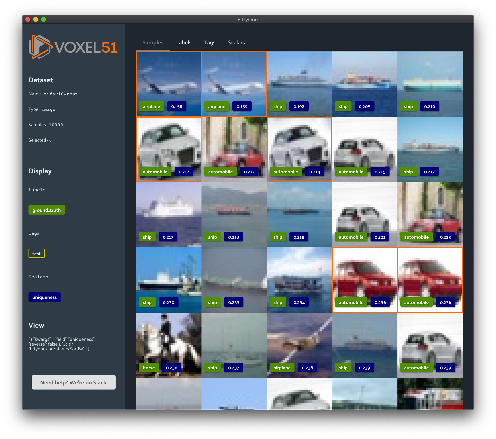
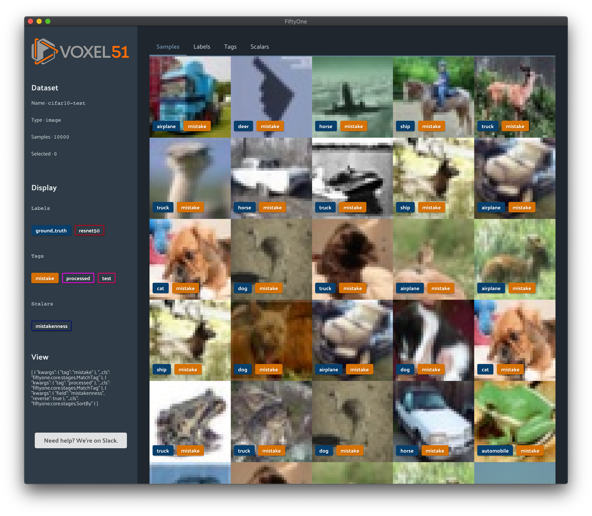

FiftyOne Tutorials
==================

.. default-role:: code

Welcome to FiftyOne tutorials!

Each tutorial below is a curated demonstration of how FiftyOne can help refine
your datasets and turn your good models into *great models*.

:doc:`Exploring image uniqueness with FiftyOne <uniqueness>`

A dataset with predominantly unique data is going to give the best results
during training. Furthermore, if very similar or duplicate data is present in
both training and validation/test splits, evaluation results may not be
reliable. This tutorial shows how FiftyOne can automatically
find near-duplicate images in your datasets and recommend the most unique
samples in your data to start your model training off right.

:doc:`Finding label mistakes with FiftyOne <label_mistakes>`

Better models start with better data. This tutorial shows how FiftyOne can
automatically find possible label mistakes in your datasets.

.. toctree::
   :maxdepth: 1
   :hidden:

   Exploring image uniqueness<uniqueness.ipynb>
   Finding label mistakes<label_mistakes.ipynb>
