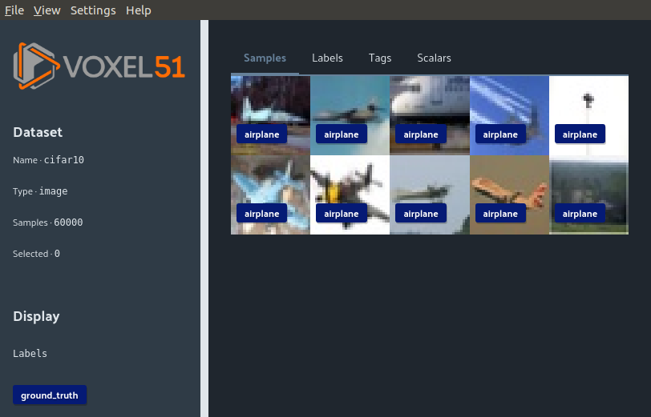

Viewing Datasets in the FiftyOne App
====================================

.. include:: ../substitutions.rst
.. default-role:: code

The FiftyOne App is a powerful graphical user interface that enables you to
visualize, browse, and interact directly with your
:ref:`FiftyOne Datasets <what-is-a-fiftyone-dataset>`.

Sessions
________

The basic FiftyOne workflow is to open a Python session and load a |Dataset|.
From there you can launch the FiftyOne App and interact with it
programmatically via a *session*.

.. _creating-an-app-session:

Create a session
----------------

You can launch an instance of the App by calling
:func:`fo.launch_app() <fiftyone.core.session.launch_app>`. This method returns
a :class:`session <fiftyone.core.session.Session>` instance, which you can use
to interact programmatically with the App:

.. code-block:: python
    :linenos:

    import fiftyone as fo

    session = fo.launch_app()

.. note::

    :func:`fo.launch_app() <fiftyone.core.session.launch_app>` will launch the
    App asynchronously and return control to your Python process. The App will
    then remain open until you close it or the process exits.

    If you are using the App in a non-interactive script, you should use
    :meth:`session.wait() <fiftyone.core.session.Session.wait>` to block
    execution until you close it manually:

    .. code-block:: python

        # Launch the App
        session = fo.launch_app(...)
        # (Perform any additional operations here)

        # Blocks execution until the App is closed
        session.wait()

.. image:: ../images/empty_app.png
   :alt: App Startup
   :align: center

Update a session dataset
------------------------

Sessions can be updated to show a new |Dataset| by updating the session
object directly:

.. code-block:: python
    :linenos:

    import fiftyone.zoo as foz

    dataset = foz.load_zoo_dataset("cifar10")
    session.dataset = dataset

.. image:: ../images/cifar10.png
   :alt: CIFAR-10
   :align: center

Update a session view
---------------------

Sessions can also directly display a |DatasetView|. For example, you can
sort the |DatasetView| by ground truth labels and then select the first 10
|Sample| objects to display.:

.. code-block:: python
    :linenos:

    session.view = dataset.sort_by("ground_truth")[:10]

Remote sessions
_______________

If your data is stored on a remote machine, you can forward a session from
the remote machine to the FiftyOne App on your local machine and seemlessly
browse your remote |Dataset|.

Remote machine
--------------

First log into the **remote machine**, load a FiftyOne |Dataset|, and create a
session with the argument `remote=True`. This will send the session to port
`5151`:

.. code-block:: python
    :linenos:

    # Remote Machine
    import fiftyone as fo

    dataset = fo.Dataset(name="my_dataset")
    session = fo.launch_app(dataset=dataset, remote=True)

This is the session that will be modified to change what is being displayed.

Local machine
-------------

The easiest way to port forward and load the FiftyOne App is using the CLI.
Alternatively, the port forwarding and App launching steps can be run
separately.

.. tabs::

  .. group-tab:: CLI

    On the local machine, the :doc:`FiftyOne CLI <../cli/index>` can be used to
    forward the port `5151` and open the FiftyOne App locally.

    In a local terminal, run the command:

    .. code-block:: shell

        # Local machine
        fiftyone app connect --destination username@remote_machine_ip --port 5151

  .. group-tab:: Python

    Open two terminal windows on the **local machine**. In order to forward the
    port `5151` from the remote machine to the local machine, run the following
    command directly in one of the terminal windows and leave this command running:

    .. code-block:: shell

        # Local machine
        ssh -N -L 5151:127.0.0.1:5151 username@remote_machine_ip

    The port `5151` is now being forwarded from the remote machine to port `5151`
    of the local machine through a process running in the background. Now in the
    other terminal window, open the FiftyOne App locally by starting python and
    running the following commands:

    .. code-block:: python
        :linenos:

        # Local machine
        import fiftyone.core.session as fos

        fos.launch_app()

Using the FiftyOne App
______________________

The App has various functionality built into the user interface itself.

Toggle attribute bubbles
------------------------

Any labels, tags, and scalar fields can be viewed in the App directly on the
sample images by toggling the corresponding buttons on the left hand side of
the App.

.. image:: ../images/cifar10_button_toggle.gif
    :alt: CIFAR-10 Toggle
    :align: center

Accessing selected samples
--------------------------

First select samples in the App.

.. image:: ../images/cifar10_selected.gif
   :alt: CIFAR-10 Selected
   :align: center

Second, load those samples into python:

.. code-block:: python
    :linenos:

    print(session.selected)

.. code-block:: text

    ['5ef0eef405059ebb0ddfa6cc',
     '5ef0eef405059ebb0ddfa7c4',
     '5ef0eef405059ebb0ddfa86e']

Viewing a sample
----------------

A sample can be double clicked to view a large version of it in a sidebar. This
sidebar also contains the fields of the sample.

.. image:: ../images/cifar10_sidebar.gif
    :alt: CIFAR-10 Sidebar
    :align: center

Tabs
----

The four tabs, Samples, Labels, Tags, and Scalars let you visualize different
aspects and statistics about your dataset.
Samples is the default tab that lets you visualize and select your image samples.
The Labels tab shows a distribution of labels of the currently loaded |Dataset|
or |DatasetView|.
Any tags that were added and their corresponding counts will show up under the
Tags tab.
Scalar fields, for example if you computed `uniqueness` on your dataset, will
be displayed under the Scalars tab.

.. image:: ../images/cifar10_tabs.gif
   :alt: CIFAR-10 Scalars
   :align: center

Accessing selected samples
--------------------------

As previously explained, a session lets you modify what is seen in the App by
modifying the python object in the terminal. Additionally, you can also use the App to
select samples and bring those into your python terminal.

First select samples in the App.

.. image:: ../images/cifar10_selected.gif
   :alt: CIFAR-10 Selected
   :align: center

Second, load those samples into python:

.. code-block:: python

    selected = session.selected
    print(selected)

.. code-block:: text

    ['5ef0eef405059ebb0ddfa6cc',
     '5ef0eef405059ebb0ddfa7c4',
     '5ef0eef405059ebb0ddfa86e',
     '5ef0eef405059ebb0ddfa93c']

