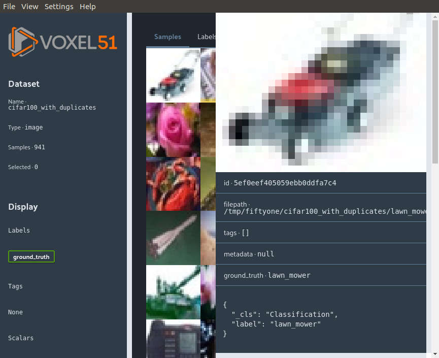
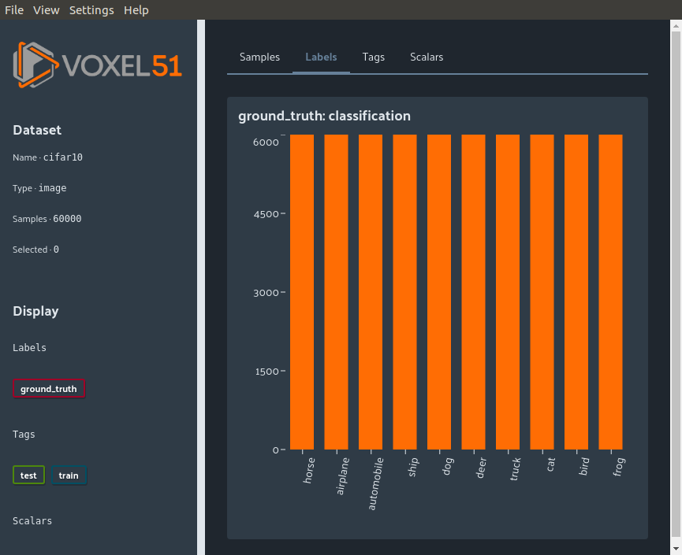
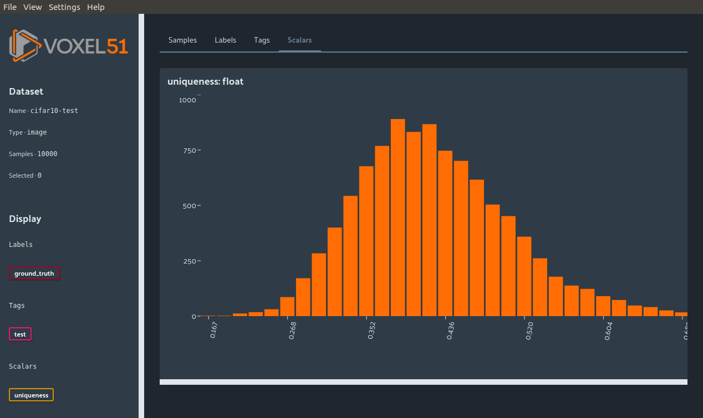

Viewing Datasets in the FiftyOne App
====================================

.. default-role:: code

The FiftyOne App is a light weight user interface that allows you to browse and
interact directly with your loaded `Datasets`.

Sessions
________

The workflow when working with FiftyOne is to open interactive python
(`ipython`) and load a `Dataset`. The FiftyOne App is the graphical user
interface that allows you to view the `Dataset` as well as any `DatasetViews`
into the `Dataset`.

`Sessions` are the python objects that contain the instance of the app:

.. code-block:: python

    import fiftyone as fo

    session = fo.launch_dashboard()

.. image:: ../images/empty_dashboard.png
   :alt: App Startup Page
   :align: center

`Sessions` can be updated to show new `Datasets` by updating the `session`
object directly:

.. code-block:: python

    import fiftyone.zoo as foz

    dataset = foz.load_zoo_dataset("cifar10")
    session.dataset = dataset

.. image:: ../images/cifar10.png
   :alt: Cifar10
   :align: center

`Sessions` can also directly display a `DatasetView`. For example, you can
sort the `DatasetView` by ground truth labels and then select the first 10
`Samples` to display.:

.. code-block:: python

    session.view = dataset.view().sort_by("ground_truth")[:10]

.. image:: ../images/cifar10_sorted.png
   :alt: Cifar10 Sorted
   :align: center

Remote sessions
---------------

If your data is stored on a remote machine, you can forward a `Session` from
the remote machine to the FiftyOne App on your local machine and seemlessly
browse your remote `Dataset`.

Remote machine
##############

First log into the **remote machine**, load a FiftyOne `Dataset`, and create a
`Session` with the argument `remote=True`. This will send the `Session` to port
`5151`:

.. code-block:: python

    # Remote Machine
    import fiftyone as fo

    dataset = fo.Dataset(name="my_dataset")
    session = fo.launch_dashboard(dataset=dataset, remote=True)

This is the session that will be modified to change what is being displayed.

Local machine
#############

The easiest way to port forward and load the FiftyOne App is using the CLI.
Alternatively, the port forwarding and App launching steps can be run
separately.

.. tabs::

  .. group-tab:: CLI

    On the local machine, the :doc:`FiftyOne CLI <../cli/index>` can be used to
    forward the port `5151` and open the FiftyOne App locally.

    In a local terminal, run the command:

    .. code-block:: shell

        # Local machine
        fiftyone dashboard connect --destination username@remote_machine_ip --port 5151

  .. group-tab:: python

    Open two terminal windows on the **local machine**. In order to forward the
    port `5151` from the remote machine to the local machine, run the following
    command directly in one of the terminal windows and leave this command running:

    .. code-block:: shell

        # Local machine
        ssh -N -L 5151:127.0.0.1:5151 username@remote_machine_ip

    The port `5151` is now being forwarded from the remote machine to port `5151`
    of the local machine through a process running in the background. Now in the
    other terminal window, open the FiftyOne App locally by starting python and
    running the following commands:

    .. code-block:: python

        # Local machine
        import fiftyone.core.session as fos

        fos.launch_dashboard()

Using the FiftyOne App
______________________

The App has various functionality built into the user interface itself.

Accessing selected samples
--------------------------

As previously explained, a `Session` lets you modify what is seen in the App by
modifying the python object in the terminal. Additionally, you can also use the App to
select samples and bring those into your python terminal.

First select samples in the App.

.. image:: ../images/cifar10_selected.gif
   :alt: Cifar10 Selected
   :align: center

Second, load those samples into python:

.. code-block:: python

    selected = session.selected
    print(selected)

.. code-block:: text

    ['5ef0eef405059ebb0ddfa6cc',
     '5ef0eef405059ebb0ddfa7c4',
      '5ef0eef405059ebb0ddfa86e']

Viewing a Sample
----------------

A sample can be double clicked to view a large version of it in a sidebar. This
sidebar also contains the fields of the sample.

Tabs
----

The four tabs, Samples, Labels, Tags, and Scalars let you visualize different
aspects and statistics about your dataset.

Samples
^^^^^^^

This is the default tab that lets you visualize and select your image samples.

.. image:: ../images/cifar10.png
   :alt: Cifar10
   :align: center

Labels
^^^^^^

The Labels tab shows a distribution of labels of the currently loaded `Dataset`
or `DatasetView`.

Tags
^^^^

Any tags that were added and their corresponding counts will show up under the
Tags tab.

.. image:: ../images/cifar10_tags.png
   :alt: Cifar10 Tags
   :align: center

Scalars
^^^^^^^

Scalar fields, for example if you computed `uniqueness` on your dataset, will
be displayed under the Scalars tab.

