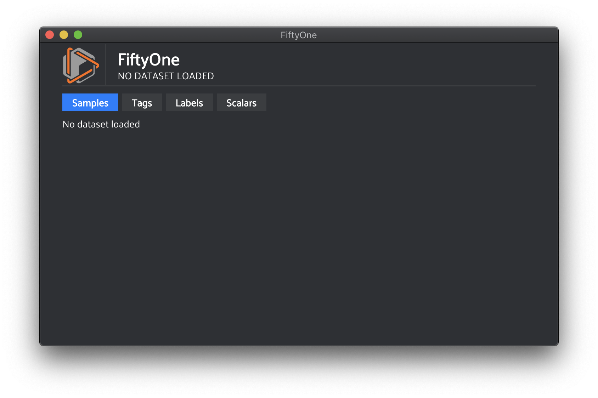
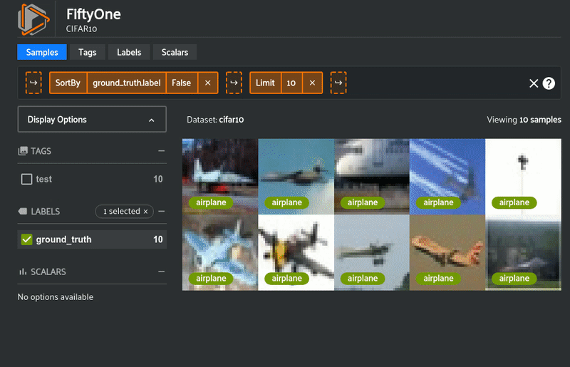
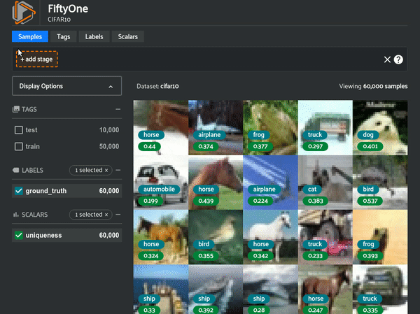

Using the FiftyOne App
======================

.. default-role:: code

The FiftyOne App is a powerful graphical user interface that enables you to
visualize, browse, and interact directly with your
:ref:`FiftyOne Datasets <what-is-a-fiftyone-dataset>`.

Sessions
________

The basic FiftyOne workflow is to open a Python shell and load a |Dataset|.
From there you can launch the FiftyOne App and interact with it
programmatically via a *session*.

.. _creating-an-app-session:

Creating a session
------------------

You can launch an instance of the App by calling
:func:`fo.launch_app() <fiftyone.core.session.launch_app>`. This method returns
a |Session| instance, which you can subsequently use to interact
programmatically with the App!

.. code-block:: python
    :linenos:

    import fiftyone as fo

    session = fo.launch_app()

.. note::

    :func:`fo.launch_app() <fiftyone.core.session.launch_app>` will launch the
    App asynchronously and return control to your Python process. The App will
    then remain open until you close it or the process exits.

    If you are using the App in a non-interactive script, you should use
    :meth:`session.wait() <fiftyone.core.session.Session.wait>` to block
    execution until you close it manually:

    .. code-block:: python

        # Launch the App
        session = fo.launch_app(...)
        # (Perform any additional operations here)

        # Blocks execution until the App is closed
        session.wait()

Updating a session's dataset
----------------------------

Sessions can be updated to show a new |Dataset| by updating the
:meth:`Session.dataset <fiftyone.core.session.Session.dataset>` property of the
session object:

.. code-block:: python
    :linenos:

    import fiftyone.zoo as foz

    dataset = foz.load_zoo_dataset("cifar10")
    session.dataset = dataset

.. image:: ../images/cifar10.gif
   :alt: CIFAR-10
   :align: center

Updating a session's view
-------------------------

You can also show a specific |DatasetView| into the current dataset in the App
by updating the :meth:`Session.view <fiftyone.core.session.Session.view>`
property of the session.

For example, the command below loads a |DatasetView| in the App that shows the
first 10 samples in the dataset sorted alphabetically by ground truth label:

.. code-block:: python
    :linenos:

    session.view = dataset.sort_by("ground_truth.label")[:10]

Remote sessions
_______________

If your data is stored on a remote machine, you can forward a session from
the remote machine to the FiftyOne App on your local machine and seemlessly
browse your remote dataset.

Remote machine
--------------

On the remote machine, load a |Dataset| and launch a session using
:meth:`launch_app() <fiftyone.core.session.launch_app>` with the `remote=True`
argument. This will open the session on port `5151` on your machine:

.. code-block:: python
    :linenos:

    # On remote machine

    import fiftyone as fo

    dataset = fo.Dataset(name="my_dataset")
    session = fo.launch_app(dataset=dataset, remote=True)

You can manipulate the `session` object as usual to programmatically interact
with the remote App instance that you'll connect to next.

Local machine
-------------

On the local machine, you can launch an App instance connected to a remote
session via the CLI. Alternatively, you can manually setup port forwarding on
your local machine via `ssh` and connect to the App via Python.

.. tabs::

  .. group-tab:: CLI

    On the local machine, you can :ref:`use the CLI <cli-fiftyone-app-connect>`
    to automatically configure port forwarding and open the App.

    In a local terminal, run the command:

    .. code-block:: shell

        # On local machine
        fiftyone app connect --destination username@remote_machine_ip --port 5151

  .. group-tab:: Python

    Open two terminal windows on the local machine. In order to forward the
    port `5151` from the remote machine to the local machine, run the following
    command in one terminal and leave the process running:

    .. code-block:: shell

        # On local machine
        ssh -N -L 5151:127.0.0.1:5151 username@remote_machine_ip

    Port `5151` is now being forwarded from the remote machine to port
    `5151` of the local machine.

    In the other terminal, launch the FiftyOne App locally by starting Python
    and running the following commands:

    .. code-block:: python
        :linenos:

        # On local machine
        import fiftyone.core.session as fos

        fos.launch_app()

Using the FiftyOne App
______________________

The App exposes powerful dataset exploration functionality directly in its
user interface.

Display options
---------------

Any labels, tags, and scalar fields can be overlaid on the samples in the App
by toggling the corresponding display options on the lefthand side of the App.

.. image:: ../images/cifar10_button_toggle.gif
    :alt: CIFAR-10 Toggle
    :align: center

Viewing a sample
----------------

Double-click a sample to open an expanded view of the sample. This modal also
contains information about the fields of the |Sample| and allows you to access
the raw JSON description of the sample.

.. image:: ../images/cifar10_sidebar.gif
    :alt: CIFAR-10 Sidebar
    :align: center

Using the view bar
------------------

The view bar makes all of the powerful searching, sorting, and filtering
operations :ref:`provided by DatasetViews <using-views>` available directly in
the App. Any changes to the current view that you make in the view bar are
reflected in the |DatasetView| exposed by the
:meth:`Session.view <fiftyone.core.session.Session.view>` property of the
|Session| object associated with the App.

Tabs
----

The `Samples`, `Labels`, `Tags`, and `Scalars` tabs in the App let you
visualize different aspects and statistics about your dataset. `Samples` is the
default tab, which lets you visualize and select your image samples. The
`Labels` tab shows a distribution of labels of the currently loaded |Dataset|
or |DatasetView|. Any tags that were added and their corresponding counts will
show up under the `Tags` tab. Scalar fields, for example if you computed
`uniqueness` on your dataset, will be displayed under the `Scalars` tab.

.. image:: ../images/cifar10_tabs.gif
   :alt: CIFAR-10 Scalars
   :align: center

Accessing selected samples
--------------------------

As previously explained, the |Session| object created when you launch the App
lets you interact with the App from your Python process.

One common workflow is to select samples visually in the App and then access
the data for the selected samples in Python. To perform this workflow, first
select some samples in the App:

.. image:: ../images/cifar10_selected.gif
   :alt: CIFAR-10 Selected
   :align: center

Next, access the
:meth:`Session.selected <fiftyone.core.session.Session.selected>` property of
your session to retrieve the IDs of the currently selected samples in the App:

.. code-block:: python

    # Print the IDs of the currently selected samples
    print(session.selected)

    # Create a view containing only the selected samples
    selected_view = dataset.select(session.selected)

.. code-block:: text

    ['5ef0eef405059ebb0ddfa6cc',
     '5ef0eef405059ebb0ddfa7c4',
     '5ef0eef405059ebb0ddfa86e',
     '5ef0eef405059ebb0ddfa93c']
