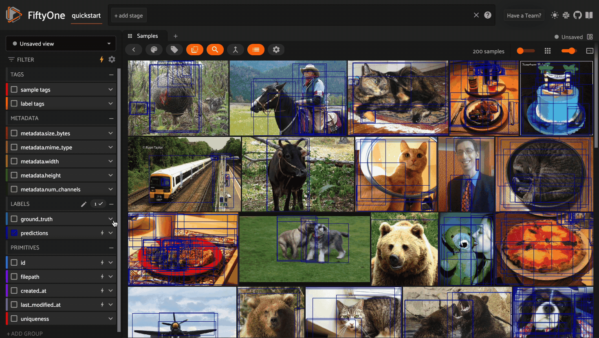
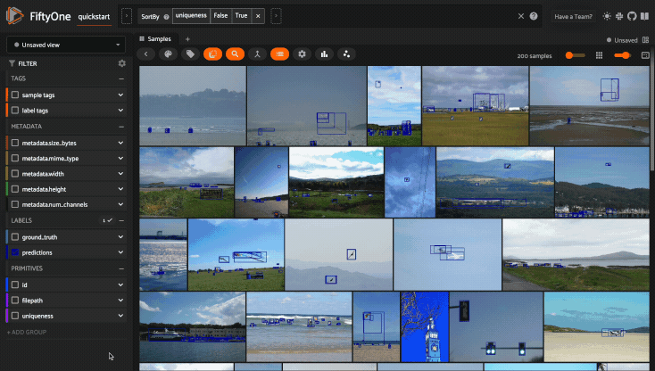

.. _fiftyone-app:

Using the FiftyOne App
======================

.. default-role:: code

The FiftyOne App is a powerful graphical user interface that enables you to
visualize, browse, and interact directly with your
:ref:`FiftyOne Datasets <using-datasets>`.

App environments
________________

The FiftyOne App can be used in any environment that you're working in, from
a local IPython shell, to a remote machine or cloud instance, to a Jupyter or
Colab notebook. Check out the :ref:`environments guide <environments>` for best
practices when working in each environment.

Sessions
________

The basic FiftyOne workflow is to open a Python shell and load a |Dataset|.
From there you can launch the FiftyOne App and interact with it
programmatically via a *session*.

.. _creating-an-app-session:

Creating a session
------------------

You can launch an instance of the App by calling
:func:`launch_app() <fiftyone.core.session.launch_app>`. This method returns a
|Session| instance, which you can subsequently use to interact programmatically
with the App!

.. code-block:: python
    :linenos:

    import fiftyone as fo

    session = fo.launch_app()

App sessions are highly flexible. For example, you can launch
:ref:`launch multiple App instances <faq-multiple-apps>` and connect multiple
App instances to the  :ref:`same dataset <faq-multiple-sessions-same-dataset>`.

By default, when you're working in a non-notebook context, the App will be
opened in a new tab of your web browser. However, there is also a
:ref:`desktop App <installing-fiftyone-desktop>` that you can install if you
would like to run the App as a desktop application.

.. note::

    :func:`fo.launch_app() <fiftyone.core.session.launch_app>` will launch the
    App asynchronously and return control to your Python process. The App will
    then remain connected until the process exits.

    If you are using the App in a non-interactive script, you should use
    :meth:`session.wait() <fiftyone.core.session.Session.wait>` to block
    execution until you close it manually:

    .. code-block:: python

        # Launch the App
        session = fo.launch_app(...)

        # (Perform any additional operations here)

        # Blocks execution until the App is closed
        session.wait()

.. image:: ../images/app/app-empty.gif
   :alt: app-empty
   :align: center

Updating a session's dataset
----------------------------

Sessions can be updated to show a new |Dataset| by updating the
:meth:`Session.dataset <fiftyone.core.session.Session.dataset>` property of the
session object:

.. code-block:: python
    :linenos:

    import fiftyone.zoo as foz

    dataset = foz.load_zoo_dataset("cifar10")

    # View the dataset in the App
    session.dataset = dataset

.. image:: ../images/app/app-scroll.gif
   :alt: app-scroll
   :align: center

Updating a session's view
-------------------------

You can also show a specific :ref:`view <using-views>` into the current dataset
in the App by setting the
:meth:`Session.view <fiftyone.core.session.Session.view>` property of the
session.

For example, the command below loads a |DatasetView| in the App that shows the
first 10 samples in the dataset sorted by their `uniqueness` field:

.. code-block:: python
    :linenos:

    session.view = dataset.sort_by("uniqueness").limit(10)

.. image:: ../images/app/app-views1.gif
   :alt: app-views1
   :align: center

.. _remote-session:

Remote sessions
_______________

If your data is stored on a remote machine, you can forward a session from
the remote machine to your local machine and seemlessly browse your remote
dataset from you web browser.

Check out the :ref:`environments page <environments>` for more information on
possible configurations of local/remote/cloud data and App access.

Remote machine
--------------

On the remote machine, you can load a |Dataset| and launch a remote session
using either the Python library or the CLI.

.. tabs::

  .. group-tab:: Python

    Load a |Dataset| and call
    :meth:`launch_app() <fiftyone.core.session.launch_app>` with the
    ``remote=True`` argument.

    .. code-block:: python
        :linenos:

        # On remote machine

        import fiftyone as fo

        dataset = fo.load_dataset("<dataset-name>")

        session = fo.launch_app(dataset, remote=True)  # optional: port=XXXX

    You can use the optional ``port`` parameter to choose the port of your
    remote machine on which to serve the App. The default is ``5151``, which
    can also be customized via the ``default_app_port`` parameter of your
    :ref:`FiftyOne config <configuring-fiftyone>`.

    Note that you can manipulate the `session` object on the remote machine as
    usual to programmatically interact with the App instance that you'll
    connect to locally next.

  .. group-tab:: CLI

    Run the :ref:`fiftyone app launch <cli-fiftyone-app-launch>` command in a
    terminal:

    .. code-block:: shell

        # On remote machine

        fiftyone app launch <dataset-name> --remote  # optional: --port XXXX

    You can use the optional ``--port`` flag to choose the port of your
    remote machine on which to serve the App. The default is ``5151``, which
    can also be customized via the ``default_app_port`` parameter of your
    :ref:`FiftyOne config <configuring-fiftyone>`.

.. _remote-app-local-machine:

Local machine
-------------

On the local machine, you can access an App instance connected to the remote
session by either manually configuring port forwarding or via the FiftyOne CLI:

.. tabs::

  .. group-tab:: Manual

    Open a new terminal window on your local machine and execute the following
    command to setup port forwarding to connect to your remote session:

    .. code-block:: shell

        # On local machine
        ssh -N -L 5151:127.0.0.1:XXXX [<username>@]<hostname>

    Leave this process running and open http://localhost:5151 in your browser
    to access the App.

    In the above, `[<username>@]<hostname>` specifies the remote machine to
    connect to, `XXXX` refers to the port that you chose when you launched the
    session on your remote machine (the default is 5151), and `5151` specifies
    the local port to use to connect to the App (and can be customized).

  .. group-tab:: FiftyOne

    If you have FiftyOne installed on your local machine, you can
    :ref:`use the CLI <cli-fiftyone-app-connect>` to automatically configure
    port forwarding and open the App in your browser as follows:

    .. code-block:: shell

        # On local machine
        fiftyone app connect --destination [<username>@]<hostname>

    If you choose a custom port `XXXX` on the remote machine, add a
    ``--port XXXX`` flag to the above command.

    If you would like to use a custom local port to serve the App, add a
    ``--local-port YYYY`` flag to the above command.

.. note::

    Remote sessions are highly flexible. For example, you can connect to
    :ref:`multiple remote sessions <faq-connect-to-multiple-remote-sessions>`
    and run multiple remote sessions
    :ref:`from one machine <faq-serve-multiple-remote-sessions>`.

Fields
______

Any labels, tags, and scalar fields can be overlaid on the samples in the App
by toggling the corresponding display options on the lefthand side of the App.

Viewing a sample
________________

Click a sample to open an expanded view of the sample. This modal also
contains information about the fields of the |Sample| and allows you to access
the raw JSON description of the sample.

.. image:: ../images/app/app-expanded.gif
    :alt: app-expanded
    :align: center

.. _app-filtering:

Filtering sample fields
_______________________

The App provides UI elements in both grid view and expanded sample view that
you can use to filter your dataset. To view the available filter options for a
field, click the caret icon to the right of the field's name.

Whenever you modify a filter element, the App will automatically update to show
only those samples and/or labels that match the filter.

.. _app-create-view:

Using the view bar
__________________

The view bar makes all of the powerful searching, sorting, and filtering
operations :ref:`provided by dataset views <using-views>` available directly in
the App.

.. note::

    Any changes to the current view that you make in the view bar are
    automatically reflected in the |DatasetView| exposed by the
    :meth:`Session.view <fiftyone.core.session.Session.view>` property of the
    App's session object.

.. image:: ../images/app/app-views2.gif
    :alt: app-views2
    :align: center

.. _app-stats-tabs:

Statistics tabs
_______________

The `Labels`, `Scalars`, and `Tags` tabs in the App let you visualize different
statistics about your dataset.

.. note::

    The statistics in these tabs automatically update to reflect the current
    :ref:`view <using-views>` that you have loaded in the App, or the entire
    :ref:`dataset <using-datasets>` if no view is loaded.

The `Labels` tab shows distributions of the `label` values for each
:ref:`labels field <using-labels>` that you've added to your dataset. For
example, you may have histograms of ground truth labels and one more sets of
model predictions.

The `Scalars` tab shows distributions for numeric (integer or float) or
categorical (e.g., string) :ref:`primitive fields <adding-sample-fields>` that
you've added to your dataset. For example, if you computed
:ref:`uniqueness <brain-image-uniqueness>` on your dataset, a histogram of
uniqueness values will be displayed under the `Scalars` tab.

The `Tags` tab shows the distribution of any :ref:`tags <using-tags>` that
you've added to your dataset.

.. image:: ../images/app/app-stats.gif
    :alt: app-stats
    :align: center

.. _app-select-samples:

Selecting samples
_________________

As previously explained, the |Session| object created when you launch the App
lets you interact with the App from your Python process.

One common workflow is to select samples visually in the App and then access
the data for the selected samples in Python. To perform this workflow, first
select some samples in the App:

The selected samples dropdown on the upper-left of the sample grid records the
number of samples that you have currently selected. You can also take actions
such as updating the view to only show (or exclude) the currently selected
samples.

You can also access the
:meth:`Session.selected <fiftyone.core.session.Session.selected>` property of
your session to retrieve the IDs of the currently selected samples in the App:

.. code-block:: python

    # Print the IDs of the currently selected samples
    print(session.selected)

    # Create a view containing only the selected samples
    selected_view = dataset.select(session.selected)

.. code-block:: text

    ['5ef0eef405059ebb0ddfa6cc',
     '5ef0eef405059ebb0ddfa7c4',
     '5ef0eef405059ebb0ddfa86e',
     '5ef0eef405059ebb0ddfa93c']

.. _app-select-labels:

Selecting labels
_________________

You can also use the App to select individual labels within samples. You can
use this functionality to visually show/hide labels of interest in the App; or
you can access the data for the selected labels from Python, for example by
creating a |DatasetView| that includes/excludes the selected labels.

To perform this workflow, open the expanded sample modal by clicking on
a sample in the App. Then click on individual labels to select them:

.. image:: ../images/app/app-object-selection.gif
    :alt: app-label-selection
    :align: center

Selected labels will appear with dotted lines around them. The example above
shows selecting an object detection, but classifications, polygons, polylines,
segmentations, and keypoints can be selected as well.

When you have selected labels in the App, you can use the selected labels
options in the top-right (the orange checkmark button) to hide these labels
from view or exclude all other labels.

You can also access the
:meth:`Session.selected_labels <fiftyone.core.session.Session.selected_labels>`
property of your session to retrieve information about the currently selected
labels in the App:

.. code-block:: python

    # Print information about the currently selected samples in the App
    fo.pprint(session.selected_labels)

    # Create a view containing only the selected labels
    selected_view = dataset.select_labels(session.selected_labels)

    # Create a view containing everything except the selected labels
    excluded_view = dataset.exclude_labels(session.selected_labels)

.. code-block:: text

    [
        {
            'object_id': '5f99d2eb36208058abbfc02a',
            'sample_id': '5f99d2eb36208058abbfc030',
            'field': 'ground_truth',
        },
        {
            'object_id': '5f99d2eb36208058abbfc02b',
            'sample_id': '5f99d2eb36208058abbfc030',
            'field': 'ground_truth',
        },
        ...
    ]

.. _app-tagging:

Tags and tagging
________________

Tagging is a first-class citizen in FiftyOne. At both the |Sample|-level and
|Label|-level. And |Dataset| and |DatasetView| methods like
:meth:`tag_samples() <fiftyone.core.collections.SampleCollection.tag_samples>`,
:meth:`tag_labels() <fiftyone.core.collections.SampleCollection.tag_samples>`
are always at your disposal in Python. But tagging and filtering by tags also
extends to the App.

In the App, tagging can be done via the sample grid to tag any shown labels or
samples in the current view. Any filters in the Filters Sidebar will also
be taken into account. In the case of labels, tagging in the App will only
apply to labels that are checked, i.e. visible. And when samples are selected
in the grid, tagging will also be restricted the selected samples.

For example, if one only want to tag labels in the
:class:`Detections <fiftyone.core.labels.Detections>` named `predictions`,
simply uncheck all other labels fields and click the tag icon in the top-left
of the grid. Then select `Labels`, type in the tag, hit enter, and then click
`Apply`. Removing tags can also be done within the tagging element by
unchecking any existing labels and clicking `Apply`.

Tagging is also available within the expanded sample view in the top-right
corner. When in the expanded view, any filters in the Filters Sidebar also
apply when tagging labels. Individual labels can targeted by first selecting,
even across multiple samples. Or the current sample itself can be tagged.

And once you have tags on your samples or labels, the Filters Sidebar offers
filtering by your tags. Simply click the eye icon next to tag in the sidebar
and results will be limited to samples and labels with that tag. Note that
filtering by multiple tags is an `OR` expression.

.. image:: ../images/app/app-tagging.gif
    :alt: app-tagging
    :align: center

.. _app-config:

Configuring the App
___________________

The behavior of the App can be configured in various ways. The code sample
below shows the basic pattern for customizing the App on a one-off basis:

.. code-block:: python
    :linenos:

    import fiftyone as fo
    import fiftyone.zoo as foz

    dataset = foz.load_zoo_dataset("quickstart")

    # Create a custom App config
    app_config = fo.AppConfig()
    app_config.show_confidence = False
    app_config.show_attributes = True

    session = fo.launch_app(dataset, config=app_config)

You can also reconfigure a live |Session| by editing its
:meth:`session.config <fiftyone.core.session.Session.config>` property and
calling :meth:`session.refresh() <fiftyone.core.session.Session.refresh>` to
apply the changes:

.. code-block:: python
    :linenos:

    # Customize the config of a live Session
    session.config.show_confidence = True
    session.config.show_attributes = True

    # Refresh the session to apply the changes
    session.refresh()

See :ref:`this page <configuring-fiftyone-app>` for more information about
configuring the App.
