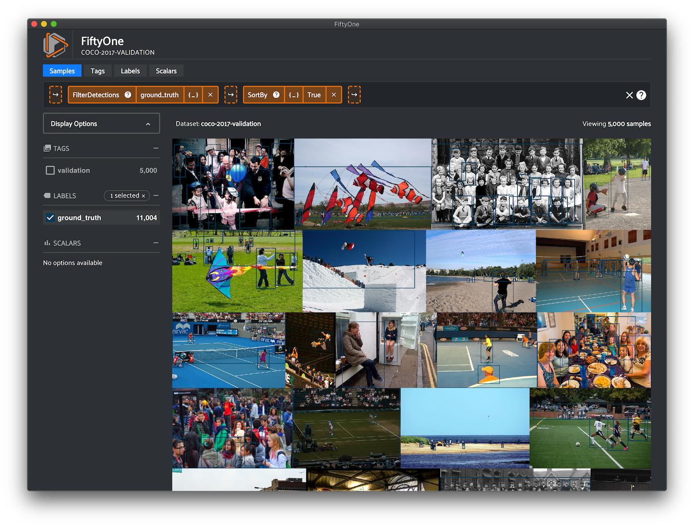
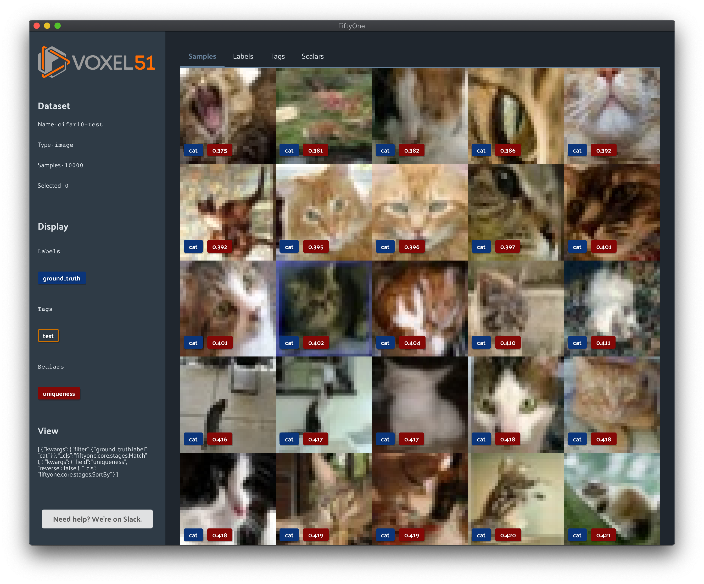

FiftyOne Dataset Basics
=======================

.. default-role:: code

FiftyOne Datasets are the core data structure in FiftyOne, allowing you to
represent your data and manipulate it through the Python library and the
:doc:`FiftyOne App <app>`.

.. _what-is-a-fiftyone-dataset:

What is a FiftyOne Dataset?
---------------------------

FiftyOne Datasets allow you to easily :doc:`load <dataset_creation/index>`,
:doc:`modify <using_datasets>` and :doc:`visualize <app>` your data along with
any related labels (classification, detection, etc). It provides a way to
easily load images, videos, annotations, and model predictions into a format
that can be visualized in the FiftyOne App.

If you have your own collection of data, loading it as a |Dataset| will allow
you to easily search and sort your samples. You can use FiftyOne to identify
unique samples as well as possible mistakes in your labels.

If you are training a model, the output predictions and logits can be loaded
into your |Dataset|. The FiftyOne App makes it easy to visually debug what
your model has learned, even for complex label types like detection and
segmentation masks. With this knowledge, you can update your |Dataset| to
include more representative samples and samples that your model found difficult
into your training set.

.. note::

    Check out :doc:`creating FiftyOne datasets <dataset_creation/index>` for
    more information about loading your data into FiftyOne.

A |Dataset| is composed of multiple |Sample| objects which contain |Field|
attributes, all of which can be dynamically created, modified and deleted.
FiftyOne uses a lightweight non-relational database to store datasets, so you
can easily scale to datasets of any size without worrying about RAM
constraints on your machine.

Datasets are ordered collections of samples. When a |Sample| is added to a
|Dataset|, it is assigned a unique ID that can be used to retrieve the sample
from the dataset.

Slicing and other batch operations on datasets are done through the use of
:doc:`DatasetViews <using_views>`. A |DatasetView| provides a view into the
|Dataset|, which can be filtered, sorted, sampled, etc. along various axes to
obtain a desired subset of the samples.

.. custombutton::
    :button_text: Learn more about using datasets
    :button_link: using_datasets.html#using-datasets

.. code-block:: python
    :linenos:

    import fiftyone as fo

    # Create an empty dataset
    dataset = fo.Dataset(name="test-dataset")

    print(dataset)

.. code-block:: text

    Name:           test-dataset
    Media type      None
    Num samples:    0
    Persistent:     False
    Info:           {}
    Tags:           []
    Sample fields:
        media_type: fiftyone.core.fields.StringField
        filepath:   fiftyone.core.fields.StringField
        tags:       fiftyone.core.fields.ListField(fiftyone.core.fields.StringField)
        metadata:   fiftyone.core.fields.EmbeddedDocumentField(fiftyone.core.metadata.Metadata)

Samples
-------

Samples are the atomic elements of a |Dataset| that store all the information
related to a given piece of data (e.g., an image or video).

All |Sample| instances store the path to their source data on disk in their
`filepath` field. Any number of fields can be dynamically added to samples to
store additional custom information about the sample.

.. custombutton::
    :button_text: Learn more about using samples
    :button_link: using_datasets.html#using-samples

.. code-block:: python
   :linenos:

   import fiftyone as fo

   # An image sample
   sample = fo.Sample(filepath="/path/to/image.png")

   # A video sample
   sample = fo.Sample(filepath="/path/to/video.mp4")

Fields
------

Fields are attributes of |Sample| instances that store customizable information
about the samples. Thinking of a |Dataset| as a table where each row is a
|Sample|, each column of the table is a |Field|.

All samples must have their `filepath` field populated, which points to the
source data for the sample on disk. By default, samples are also given `id`,
`media_type`, `metadata`, and `tags` fields that store common information.

.. code-block:: python
    :linenos:

    import fiftyone as fo

    sample = fo.Sample(filepath="/path/to/image.png")

    print(sample)

.. code-block:: text

    <Sample: {
        'id': None,
        'media_type': 'image',
        'filepath': 'path/to/image.png',
        'tags': [],
        'metadata': None,
    }>

Fields can be dynamically created, modified, and deleted. When a new |Field|
is assigned to a |Sample| in a |Dataset|, it is automatically added to the
dataset's schema and thus accessible on all other samples in the dataset. If
a |Field| has not been set (or has been deleted) on a particular |Sample|, its
value will be `None`.

.. custombutton::
    :button_text: Learn more about sample fields
    :button_link: using_datasets.html#using-fields

.. code-block:: python
    :linenos:

    import fiftyone as fo

    sample = fo.Sample(filepath="/path/to/image.png")

    sample["quality"] = 89.7
    sample["keypoints"] = [[31, 27], [63, 72]]
    sample["geo_json"] = {
        "type": "Feature",
        "geometry": {"type": "Point", "coordinates": [125.6, 10.1]},
        "properties": {"name": "camera"},
    }

    print(sample)

.. code-block:: text

    <Sample: {
        'id': None,
        'media_type': 'image',
        'filepath': 'path/to/image.png',
        'tags': [],
        'metadata': None,
        'quality': 89.7,
        'keypoints': [[31, 27], [63, 72]],
        'geo_json': {
            'type': 'Feature',
            'geometry': {'type': 'Point', 'coordinates': [125.6, 10.1]},
            'properties': {'name': 'camera'},
        },
    }>

Media type
----------

When a |Sample| is created, its media type is inferred from the `filepath` to
the source media and exposed via the `media_type` attribute of the sample.

.. custombutton::
    :button_text: Learn more about media types
    :button_link: using_datasets.html#using-media-type

Tags
----

All |Sample| instances have a `tags` attribute, which stores a list of strings
that can be used flexibly to store information about a sample.

A typical use case is to tag the dataset split (`test`, `train`, `validation`)
to which the |Sample| belongs. However, you are free to use tags however you
like.

.. custombutton::
    :button_text: See more information about using tags
    :button_link: using_datasets.html#using-tags

.. code-block:: python
    :linenos:

    import fiftyone as fo

    sample = fo.Sample(filepath="/path/to/image.png", tags=["train"])
    sample.tags.append("my_favorite_samples")

    print(sample.tags)
    # ["train", "my_favorite_samples"]

Metadata
--------

All |Sample| instances have a `metadata` attribute, which stores media
type-specific metadata about the source data in the sample.

.. custombutton::
    :button_text: Learn more about adding metadata to your samples
    :button_link: using_datasets.html#using-metadata

.. code-block:: python
    :linenos:

    image_path = "/path/to/image.png"

    metadata = fo.ImageMetadata.build_for(image_path)

    sample = fo.Sample(filepath=image_path, metadata=metadata)
    print(sample)

.. code-block:: text

    <Sample: {
        'id': None,
        'media_type': 'image',
        'filepath': '/path/to/image.png',
        'tags': [],
        'metadata': <ImageMetadata: {
            'size_bytes': 544559,
            'mime_type': 'image/png',
            'width': 698,
            'height': 664,
            'num_channels': 3,
        }>,
    }>

Labels
------

Labels store semantic information about the sample, such as ground annotations
or model predictions.

FiftyOne provides a |Label| subclass for common tasks:

- :ref:`Classification <classification>`: a classification label
- :ref:`Classifications <multilabel-classification>`: a list of classifications
  (typically for multilabel tasks)
- :ref:`Detections <object-detection>`: a list of object detections
- :ref:`Polylines <polylines>`: a list of polylines or polygons in an image
- :ref:`Keypoints <keypoints>`: a list of keypoints in an image
- :ref:`Segmentation <semantic-segmentation>`: a semantic segmentation mask for
  an image
- :ref:`ImageLabels <multitask-predictions>`: a generic collection of multitask
  predictions for an image

.. custombutton::
    :button_text: Learn more about storing labels in your samples
    :button_link: using_datasets.html#using-labels

.. code-block:: python
    :linenos:

    import fiftyone as fo

    sample = fo.Sample(filepath="/path/to/image.png")

    sample["weather"] = fo.Classification(label="sunny")
    sample["animals"] = fo.Detections(
        detections=[
            fo.Detection(label="cat", bounding_box=[0.5, 0.5, 0.4, 0.3]),
            fo.Detection(label="dog", bounding_box=[0.2, 0.2, 0.2, 0.4]),
        ]
    )

    print(sample)

.. code-block:: text

    <Sample: {
        'id': None,
        'media_type': 'image',
        'filepath': 'path/to/image.png',
        'tags': [],
        'metadata': None,
        'weather': <Classification: {'label': 'sunny', 'confidence': None, 'logits': None}>,
        'animals': <Detections: {
            'detections': BaseList([
                <Detection: {
                    'label': 'cat',
                    'bounding_box': BaseList([0.5, 0.5, 0.4, 0.3]),
                    'confidence': None,
                    'attributes': BaseDict({}),
                }>,
                <Detection: {
                    'label': 'dog',
                    'bounding_box': BaseList([0.2, 0.2, 0.2, 0.4]),
                    'confidence': None,
                    'attributes': BaseDict({}),
                }>,
            ]),
        }>,
    }>

DatasetViews
------------

Dataset views are a powerful tool for exploring your datasets. You can use
|DatasetView| instances to search, filter, sort, and manipulate subsets of your
datasets to perform the analysis that you need.

.. custombutton::
    :button_text: Get a full walkthough of dataset views
    :button_link: using_views.html

.. code-block:: python
    :linenos:

    import fiftyone as fo
    import fiftyone.zoo as foz
    import fiftyone.brain as fob
    from fiftyone import ViewField as F

    dataset = foz.load_zoo_dataset("cifar10", split="test")

    cats = dataset.match(F("ground_truth.label") == "cat")
    fob.compute_uniqueness(cats)

    similar_cats = cats.sort_by("uniqueness", reverse=False)

    session = fo.launch_app(view=similar_cats)
    session.wait()

