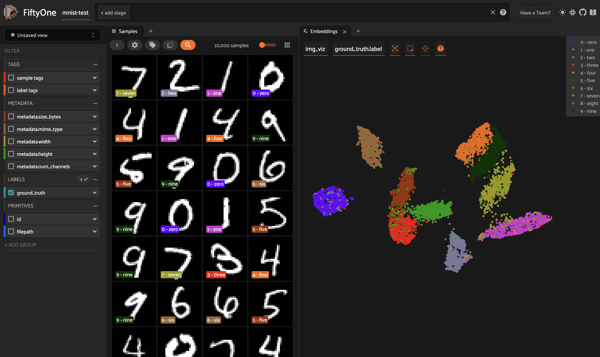
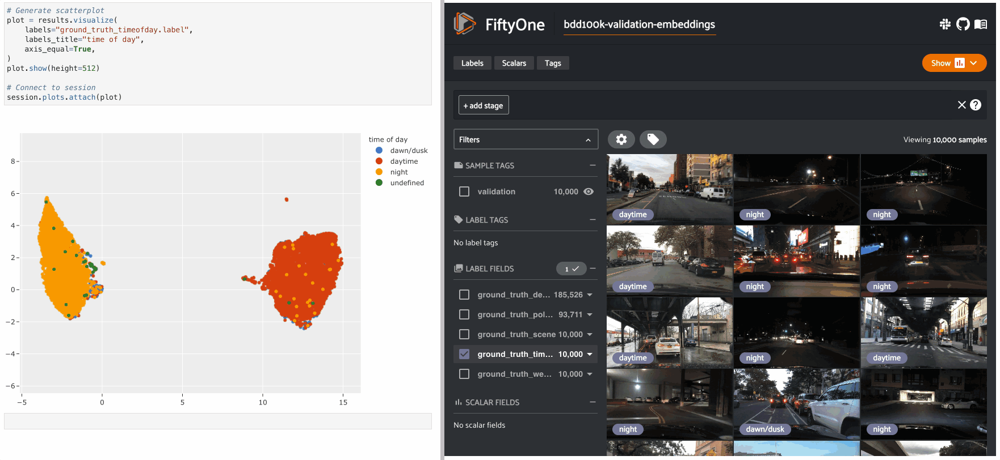
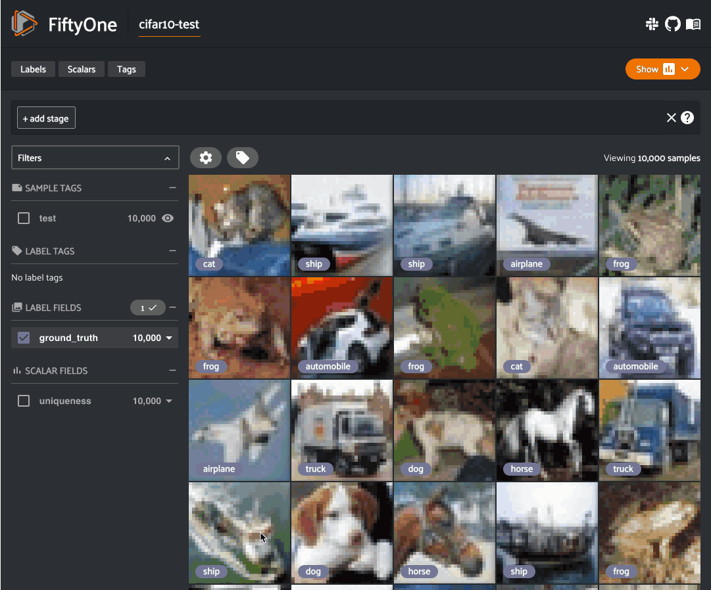
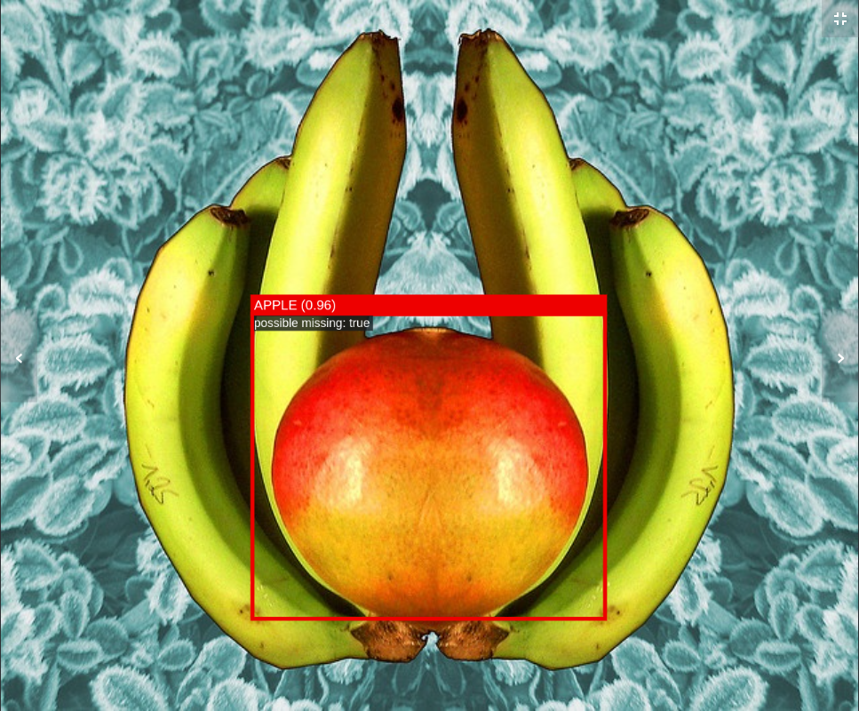

.. _fiftyone-brain:

FiftyOne Brain
==============

.. default-role:: code

The FiftyOne Brain provides powerful machine learning techniques that are
designed to transform how you curate your data from an art into a measurable
science.

.. note::

    The FiftyOne Brain is a separate Python package that is bundled with
    FiftyOne. Although it is closed-source, it is licensed as freeware, and you
    have permission to use it for commercial or non-commercial purposes. See
    `the license <https://github.com/voxel51/fiftyone/blob/develop/package/brain/LICENSE>`_
    for more details.

The FiftyOne Brain methods are useful across the stages of the machine learning
workflow:

* :ref:`Visualizing embeddings <brain-embeddings-visualization>`:
  Tired of combing through individual images/videos
  and staring at aggregate performance metrics trying to figure out how to
  improve the performance of your model? Visualizing your dataset in a
  low-dimensional embedding space reveal patterns and clusters in your data
  that can help you answer many important questions about your data, from
  identifying the most critical failure modes of your model, to isolating
  examples of critical scenarios, to recommending new samples to add to your
  training dataset, and more! The FiftyOne Brain provides a powerful
  :meth:`compute_visualization() <fiftyone.brain.compute_visualization>` method
  that you can use to generate out-of-the-box or highly customized
  visualizations of your samples and labels.

* :ref:`Uniqueness <brain-image-uniqueness>`:
  During the training loop for a model, the best results will
  be seen when training on unique data. The FiftyOne Brain provides a
  *uniqueness measure* for images that compare the content of every image in a
  :ref:`dataset <using-datasets>` with all other images. Uniqueness operates on
  raw images and does not require any prior annotation on the data. It is hence
  very useful in the early stages of the machine learning workflow when you are
  likely asking "What data should I select to annotate?"

* :ref:`Mistakenness <brain-label-mistakes>`:
  Annotations mistakes create an artificial ceiling on the performance of your
  models. However, finding these mistakes by hand is at least as arduous as the
  original annotation was, especially in cases of larger datasets. The FiftyOne
  Brain provides a quantitative *mistakenness measure* to identify possible
  label mistakes. Mistakenness operates on labeled images and requires the
  logit-output of your model predictions in order to provide maximum efficacy.
  It also works on detection datasets to find missed objects, incorrect
  annotations, and localization issues.

* :ref:`Hardness <brain-sample-hardness>`:
  While a model is training, it will learn to understand attributes of certain
  samples faster than others. The FiftyOne Brain provides a *hardness measure*
  that calculates how easy or difficult it is for your model to understand any
  given sample. Mining hard samples is a tried and true measure of mature
  machine learning processes. Use your current model instance to compute
  predictions on unlabeled samples to determine which are the most valuable to
  have annotated and fed back into the system as training samples, for example.

.. note::

    Check out the :ref:`tutorials page <tutorials>` for detailed examples
    demonstrating the use of each Brain capability.

.. _brain-embeddings-visualization:

Visualizing embeddings
______________________

The FiftyOne Brain provides a powerful
:meth:`compute_visualization() <fiftyone.brain.compute_visualization>` method
that you can use to generate low-dimensional representations of the samples
and/or individual objects in your datasets.

These representations can be visualized via
:ref:`interactive plots <interactive-plots>`, which can be connected to the
:ref:`FiftyOne App <fiftyone-app>` so that when points of interest are selected
in the plot, the corresponding samples/labels are automatically selected in the
App, and vice versa.

.. note::

    Interactive plots are currently only supported in Jupyter notebooks. In the
    meantime, you can still use FiftyOne's plotting features in other
    environments, but you must manually call
    :meth:`plot.show() <fiftyone.core.plots.base.Plot.show>` to update the
    state of a plot to match the state of a connected |Session|, and any
    callbacks that would normally be triggered in response to interacting with
    a plot will not be triggered.

    See :ref:`this section <working-in-notebooks>` for more information.

There are two primary components to an embedding visualization: the method used
to generate the embeddings, and the dimensionality reduction method used to
compute a low-dimensional representation of the embeddings.

Embedding methods
-----------------

The ``embeddings`` and ``model`` parameters of
:meth:`compute_visualization() <fiftyone.brain.compute_visualization>`
support a variety of ways to generate embeddings for your data:

-   Provide nothing, in which case a default general purpose model is used to
    embed your data
-   Provide a |Model| instance or the name of any model from the
    :ref:`model zoo <model-zoo>` that supports embeddings
-   Compute your own embeddings and provide them in array form
-   Provide the name of a |VectorField| or |ArrayField| of your dataset in
    which your embeddings are stored

Dimensionality reduction methods
--------------------------------

The ``method`` parameter of
:meth:`compute_visualization() <fiftyone.brain.compute_visualization>` allows
you to specify the dimensionality reduction method to use. The supported
methods are:

-   ``"umap"`` (default): Uniform Manifold Approximation and Projection
    (`UMAP <https://github.com/lmcinnes/umap>`_)
-   ``"t-sne"``: t-distributed Stochastic Neighbor Embedding (`t-SNE <https://lvdmaaten.github.io/tsne>`_)
-   ``"pca"``: Principal Component Analysis (`PCA <https://scikit-learn.org/stable/modules/generated/sklearn.decomposition.PCA.html>`_)

.. note::

    When you use the default `UMAP <https://github.com/lmcinnes/umap>`_ method
    for the first time, you will be prompted to install the
    `umap-learn <https://github.com/lmcinnes/umap>`_ package.

Applications
------------

How can embedding-based visualization of your data be used in practice? These
visualizations often uncover hidden structure in you data that has important
semantic meaning depending on the data you use to color/size the points.

Here are a few of the many possible applications:

-   Identifying anomolous and/or visually similar examples
-   Uncovering patterns in incorrect/spurious predictions
-   Finding examples of target scenarios in your data lake
-   Mining hard examples for your evaluation pipeline
-   Recommending samples from your data lake for classes that need additional
    training data
-   Unsupervised pre-annotation of training data

The best part about embedding visualizations is that you will likely discover
more applications specific to your use case when you try it out on your data!

.. note::

    Check out the
    :doc:`image embeddings tutorial <../tutorials/image_embeddings>` to see
    example uses of the Brain's embeddings-powered visualization methods to
    uncover hidden structure in datasets.

Example usage
-------------

The following example gives a taste of the powers of visual embeddings in
FiftyOne using the :ref:`BDD100K dataset <dataset-zoo-bdd100k>` from the
dataset zoo, embeddings generated by a
:ref:`mobilenet model <model-zoo-mobilenet-v2-imagenet-torch>` from the model
zoo, and the default `UMAP <https://github.com/lmcinnes/umap>`_ dimensionality
reduction method.

In this setup, the scatterpoints correspond to images in the validation split
colored by the ``time of day`` labels provided by the BDD100K dataset. The plot
is :ref:`attached to an App instance <attaching-plots>`, so when points are
lasso-ed in the plot, the corresponding samples are automatically selected in
the session's :meth:`view <fiftyone.core.session.Session.view>`.

Each block in the example code below denotes a separate cell in a
:ref:`Jupyter notebook <working-in-notebooks>`:

.. code-block:: python
    :linenos:

    import fiftyone as fo
    import fiftyone.brain as fob
    import fiftyone.zoo as foz

    # The BDD dataset must be manually downloaded. See the zoo docs for details
    source_dir = "/path/to/dir-with-bdd100k-files"

    # Load dataset
    dataset = foz.load_zoo_dataset(
        "bdd100k", split="validation", source_dir=source_dir,
    )

    # Compute embeddings
    # You will likely want to run this on a machine with GPU, as this requires
    # running inference on 10,000 images
    model = foz.load_zoo_model("mobilenet-v2-imagenet-torch")
    embeddings = dataset.compute_embeddings(model)

    # Compute visualization
    results = fob.compute_visualization(dataset, embeddings=embeddings, seed=51)

    # Launch App instance
    session = fo.launch_app(dataset)

.. code-block:: python
    :linenos:

    # Generate scatterplot
    plot = results.visualize(
        labels="ground_truth_timeofday.label",
        labels_title="time of day",
        axis_equal=True,
    )
    plot.show(height=512)

    # Connect to session
    session.plots.attach(plot)

The GIF shows the variety of insights that are revealed by running this simple
protocol:

-   The first cluster of points selected reveals a set of samples whose field
    of view is corrupted by hardware gradients at the top and bottom of the
    image.
-   The second cluster of points reveals a set of images in rainy conditions
    with water droplets on the windshield.
-   Hiding the primary cluster of ``daytime`` points and selecting the
    remaining ``night`` points reveals that the ``night`` points have incorrect
    labels

.. _brain-image-uniqueness:

Image uniqueness
________________

The FiftyOne Brain allows for the computation of the uniqueness of an image,
in comparison with other images in a dataset; it does so without requiring
any model from you. One good use of uniqueness is in the early stages of the
machine learning workflow when you are deciding what subset of data with which
to bootstrap your models. Unique samples are vital in creating training
batches that help your model learn as efficiently and effectively as possible.

The uniqueness of a |Dataset| can be computed directly without need the
predictions of a pre-trained model via the
:meth:`compute_uniqueness() <fiftyone.brain.compute_uniqueness>` method:

.. code-block:: python
    :linenos:

    import fiftyone as fo
    import fiftyone.brain as fob

    dataset = fo.load_dataset(...)

    fob.compute_uniqueness(dataset)

**Input**: An unlabeled (or labeled) image dataset. There are
:ref:`recipes <recipes>` for building datasets from a wide variety of image
formats, ranging from a simple directory of images to complicated dataset
structures like `COCO <https://cocodataset.org/#home>`_.

.. note::

    Did you know? Instead of using FiftyOne's default model to generate
    embeddings, you can provide your own embeddings or specify a model from the
    :ref:`Model Zoo <model-zoo>` to use to generate embeddings via the optional
    ``embeddings`` argument to
    :meth:`compute_uniqueness() <fiftyone.brain.compute_uniqueness>`.

**Output**: A scalar-valued ``uniqueness`` field is populated on each sample
that ranks the uniqueness of that sample (higher value means more unique).
The uniqueness values for a dataset are normalized to ``[0, 1]``, with the most
unique sample in the collection having a uniqueness value of ``1``.

You can customize the name of this field by passing the optional
``uniqueness_field`` argument to
:meth:`compute_uniqueness() <fiftyone.brain.compute_uniqueness>`.

**What to expect**: Uniqueness uses a tuned algorithm that measures the
distribution of each |Sample| in the |Dataset|. Using this distribution, it
ranks each sample based on its relative *similarity* to other samples. Those
that are close to other samples are not unique whereas those that are far from
most other samples are more unique.

.. note::

    Did you know? You can specify a region of interest within each image to use
    to compute uniqueness by providing the optional ``roi_field`` argument to
    :meth:`compute_uniqueness() <fiftyone.brain.compute_uniqueness>`, which
    contains |Detections| or |Polylines| that define the ROI for each sample.

.. note::

    Check out the :doc:`uniqueness tutorial <../tutorials/uniqueness>` to see
    an example use case of the Brain's uniqueness method to detect
    near-duplicate images in a dataset.

.. _brain-label-mistakes:

Label mistakes
______________

Label mistakes can be calculated for both classification and detection
datasets.

.. tabs::

    .. tab:: Classification

        Correct annotations are crucial in developing high performing models.
        Using the FiftyOne Brain and the predictions of a pre-trained model,
        you can identify possible labels mistakes in |Classification| fields
        of your dataset via the
        :meth:`compute_mistakenness() <fiftyone.brain.compute_mistakenness>`
        method:

        .. code-block:: python
            :linenos:

            import fiftyone as fo
            import fiftyone.brain as fob

            dataset = fo.load_dataset(...)

            fob.compute_mistakenness(
                dataset, "predictions", label_field="ground_truth"
            )

        **Input**: Label mistakes operate on samples for which there are both
        human annotations (`"ground_truth"` above) and model predictions
        (`"predictions"` above).

        **Output**: A float ``mistakenness`` field is populated on each sample
        that ranks the chance that the human annotation is mistaken. You can
        customize the name of this field by passing the optional
        ``mistakenness_field`` argument to
        :meth:`compute_mistakenness() <fiftyone.brain.compute_mistakenness>`.

        **What to expect**: Finding mistakes in human annotations is
        non-trivial (if it could be done perfectly then the approach would
        sufficiently replace your prediction model!) The FiftyOne Brain uses a
        proprietary scoring model that ranks samples for which your prediction
        model is highly confident but wrong (according to the human annotation
        label) as a high chance of being a mistake.

        .. note::

            Check out the
            :doc:`label mistakes tutorial <../tutorials/classification_mistakes>`
            to see an example use case of the Brain's mistakenness method on
            a classification dataset.

    .. tab:: Detection

        Correct annotations are crucial in developing high performing models.
        Using the FiftyOne Brain and the predictions of a pre-trained model,
        you can identify possible labels mistakes in |Detections| fields of
        your dataset via the
        :meth:`compute_mistakenness() <fiftyone.brain.compute_mistakenness>`
        method:

        .. code-block:: python
            :linenos:

            import fiftyone as fo
            import fiftyone.brain as fob

            dataset = fo.load_dataset(...)

            fob.compute_mistakenness(
                dataset, "predictions", label_field="ground_truth"
            )

        **Input**: You can compute label mistakes on samples for which there
        are both human annotations (`"ground_truth"` above) and model
        predictions (`"predictions"` above).

        **Output**: New fields on both the detections in `label_field` and the
        samples will be populated:

        Detection-level fields:

        * `mistakenness` (float): Objects in `label_field` that matched with a
          prediction have their `mistakenness` field populated with a measure
          of the likelihood that the ground truth annotation is a mistake.

        * `mistakenness_loc` (float): Objects in `label_field` that matched
          with a prediction have their `mistakenness_loc` field populated with
          a measure of the mistakenness in the localization (bounding box) of
          the ground truth annotation.

        * `possible_missing` (bool): If there are predicted objects with no
          matches in `label_field` but which are deemed to be likely correct
          annotations, these objects will have their `possible_missing`
          attribute set to True. In addition, if you pass the optional
          ``copy_missing=True`` flag to
          :meth:`compute_mistakenness() <fiftyone.brain.compute_mistakenness>`,
          then these objects will be copied into `label_field`.

        * `possible_spurious` (bool): Objects in `label_field` that were not
          matched with a prediction and deemed to be likely spurious
          annotations will have their `possible_spurious` field set to True.

        Sample-level fields:

        * `mistakenness` (float): The maximum mistakenness of an object in the
          `label_field` of the sample.

        * `possible_missing` (int): The number of objects that were added to
          the `label_field` of the sample and marked as likely missing
          annotations.

        * `possible_spurious` (int): The number of objects in the `label_field`
          of the sample that were deemed to be likely spurious annotations.

        You can customize the names of these fields by passing optional
        arguments to
        :meth:`compute_mistakenness() <fiftyone.brain.compute_mistakenness>`.

        **What to expect**: Finding mistakes in human annotations is
        non-trivial (if it could be done perfectly then the approach would
        sufficiently replace your prediction model!) The FiftyOne Brain uses a
        proprietary scoring model that ranks detections for which your
        prediction model is highly confident but wrong (according to the human
        annotation label) as a high chance of being a mistake.

        .. note::

            Check out the
            :doc:`detection mistakes tutorials <../tutorials/detection_mistakes>`
            to see an example use case of the Brain's mistakenness method on a
            detection dataset.

.. _brain-sample-hardness:

Sample hardness
_______________

During training, it is useful to identify samples that are more difficult for a
model to learn so that training can be more focused around these hard samples.
These hard samples are also useful as seeds when considering what other new
samples to add to a training dataset.

In order to compute hardness, all you need to do is add your model predictions
and their logits to your FiftyOne |Dataset| and then run the
:meth:`compute_hardness() <fiftyone.brain.compute_hardness>` method:

.. code-block:: python
    :linenos:

    import fiftyone as fo
    import fiftyone.brain as fob

    dataset = fo.load_dataset(...)

    fob.compute_hardness(dataset, "predictions")

**Input**: A |Dataset| or |DatasetView| on which predictions have been
computed and are stored in the ``"predictions"`` argument. Ground truth
annotations are not required for hardness.

**Output**: A scalar-valued ``hardness`` field is populated on each sample that
ranks the hardness of the sample. You can customize the name of this field via
the ``hardness_field`` argument of
:meth:`compute_hardness() <fiftyone.brain.compute_hardness>`.

**What to expect**: Hardness is computed in the context of a prediction model.
The FiftyOne Brain hardness measure defines hard samples as those for which the
prediction model is unsure about what label to assign. This measure
incorporates prediction confidence and logits in a tuned model that has
demonstrated empirical value in many model training exercises.

.. note::

    Check out the
    :doc:`classification evaluation tutorial <../tutorials/evaluate_classifications>`
    to see example uses of the Brain's hardness method to uncover annotation
    mistakes in a dataset.

.. image:: ../images/brain/brain-hardness.png
   :alt: hardness
   :align: center

.. _brain-managing-runs:

Managing brain runs
___________________

When you run a brain method on a dataset, the run is recorded on the dataset,
allowing you to retrive information about it later, delete it (along with any
modifications to your dataset that were performed by it), or even retrieve the
view into your dataset that you processed.

Brain method runs can be accessed later by their `brain_key`:

.. tabs::

    .. tab:: Visualizations

        The
        :meth:`compute_visualization() <fiftyone.brain.compute_visualization>`
        method accepts an optional ``brain_key`` parameter that specifies the
        brain key under which to store the results of the visualization.

    .. tab:: Uniqueness

        The brain key of uniqueness runs is the value of the
        ``uniqueness_field`` passed to
        :meth:`compute_uniqueness() <fiftyone.brain.compute_uniqueness>`.

    .. tab:: Mistakenness

        The brain key of mistakenness runs is the value of the
        ``mistakenness_field`` passed to
        :meth:`compute_mistakenness() <fiftyone.brain.compute_mistakenness>`.

    .. tab:: Hardness

        The brain key of hardness runs is the value of the ``hardness_field``
        passed to :meth:`compute_hardness() <fiftyone.brain.compute_hardness>`.

The example below demonstrates the basic interface:

.. code-block:: python
    :linenos:

    import fiftyone as fo
    import fiftyone.brain as fob
    import fiftyone.zoo as foz

    dataset = foz.load_zoo_dataset("quickstart")

    view = dataset.take(100)

    # Run a brain method that returns results
    results = fob.compute_visualization(view, brain_key="visualization")

    # Run a brain method that populates a new sample field on the dataset
    fob.compute_uniqueness(view)

    # List the brain methods that have been run
    print(dataset.list_brain_runs())
    # ['visualization', 'uniqueness']

    # Print information about a brain run
    print(dataset.get_brain_info("visualization"))

    # Load the results of a previous brain run
    also_results = dataset.load_brain_results("visualization")

    # Load the view on which a brain run was performed
    same_view = dataset.load_brain_view("visualization")

    # Delete brain runs
    # This will delete any stored results and fields that were populated
    dataset.delete_brain_run("visualization")
    dataset.delete_brain_run("uniqueness")
