.. _dataset-zoo-datasets:

Available Zoo Datasets
======================

.. default-role:: code

This page lists all of the datasets available in the Dataset Zoo.

.. note::

    Check out the :ref:`API reference <dataset-zoo-api>` for complete
    instructions for using the Dataset Zoo.

.. table::
    :widths: 40 60

    +--------------------------------------------------------------------+---------------------------------------------+
    | Dataset name                                                       | Tags                                        |
    +====================================================================+=============================================+
    | :ref:`BDD100K <dataset-zoo-bdd100k>`                               | image, multilabel, automotive, manual       |
    +--------------------------------------------------------------------+---------------------------------------------+
    | :ref:`Caltech-101 <dataset-zoo-caltech101>`                        | image, classification                       |
    +--------------------------------------------------------------------+---------------------------------------------+
    | :ref:`Caltech-256 <dataset-zoo-caltech256>`                        | image, classification                       |
    +--------------------------------------------------------------------+---------------------------------------------+
    | :ref:`CIFAR-10 <dataset-zoo-cifar10>`                              | image, classification                       |
    +--------------------------------------------------------------------+---------------------------------------------+
    | :ref:`CIFAR-100 <dataset-zoo-cifar100>`                            | image, classification                       |
    +--------------------------------------------------------------------+---------------------------------------------+
    | :ref:`Cityscapes <dataset-zoo-cityscapes>`                         | image, multilabel, automotive, manual       |
    +--------------------------------------------------------------------+---------------------------------------------+
    | :ref:`COCO-2014 <dataset-zoo-coco-2014>`                           | image, detection                            |
    +--------------------------------------------------------------------+---------------------------------------------+
    | :ref:`COCO-2014 Segmentation <dataset-zoo-coco-2014-segmentation>` | image, detection, segmentation              |
    +--------------------------------------------------------------------+---------------------------------------------+
    | :ref:`COCO-2017 <dataset-zoo-coco-2017>`                           | image, detection                            |
    +--------------------------------------------------------------------+---------------------------------------------+
    | :ref:`COCO-2017 Segmentation <dataset-zoo-coco-2017-segmentation>` | image, detection, segmentation              |
    +--------------------------------------------------------------------+---------------------------------------------+
    | :ref:`Fashion MNIST <dataset-zoo-fashion-mnist>`                   | image, classification                       |
    +--------------------------------------------------------------------+---------------------------------------------+
    | :ref:`HMDB51 <dataset-zoo-hmdb51>`                                 | video, action-recognition                   |
    +--------------------------------------------------------------------+---------------------------------------------+
    | :ref:`ImageNet 2012 <dataset-zoo-imagenet-2012>`                   | image, classification, manual               |
    +--------------------------------------------------------------------+---------------------------------------------+
    | :ref:`ImageNet Sample <dataset-zoo-imagenet-sample>`               | image, classification                       |
    +--------------------------------------------------------------------+---------------------------------------------+
    | :ref:`KITTI <dataset-zoo-kitti>`                                   | image, detection                            |
    +--------------------------------------------------------------------+---------------------------------------------+
    | :ref:`Labeled Faces in the Wild <dataset-zoo-lfw>`                 | image, classification, facial-recognition   |
    +--------------------------------------------------------------------+---------------------------------------------+
    | :ref:`MNIST <dataset-zoo-mnist>`                                   | image, classification                       |
    +--------------------------------------------------------------------+---------------------------------------------+
    | :ref:`Quickstart <dataset-zoo-quickstart>`                         | image, quickstart                           |
    +--------------------------------------------------------------------+---------------------------------------------+
    | :ref:`Quickstart Geo <dataset-zoo-quickstart-geo>`                 | image, location, quickstart                 |
    +--------------------------------------------------------------------+---------------------------------------------+
    | :ref:`Quickstart Video <dataset-zoo-quickstart-video>`             | video, quickstart                           |
    +--------------------------------------------------------------------+---------------------------------------------+
    | :ref:`UCF101 <dataset-zoo-ucf101>`                                 | video, action-recognition                   |
    +--------------------------------------------------------------------+---------------------------------------------+
    | :ref:`VOC-2007 <dataset-zoo-voc-2007>`                             | image, detection                            |
    +--------------------------------------------------------------------+---------------------------------------------+
    | :ref:`VOC-2012 <dataset-zoo-voc-2012>`                             | image, detection                            |
    +--------------------------------------------------------------------+---------------------------------------------+

.. _dataset-zoo-bdd100k:

BDD100K
-------

The Berkeley Deep Drive (BDD) dataset is one of the largest and most diverse
video datasets for autonomous vehicles.

The BDD100K dataset contains 100,000 video clips collected from more than
50,000 rides covering New York, San Francisco Bay Area, and other regions.
The dataset contains diverse scene types such as city streets, residential
areas, and highways. Furthermore, the videos were recorded in diverse
weather conditions at different times of the day.

The videos are split into training (70K), validation (10K) and testing
(20K) sets. Each video is 40 seconds long with 720p resolution and a frame
rate of 30fps. The frame at the 10th second of each video is annotated for
image classification, detection, and segmentation tasks.

This version of the dataset contains only the 100K images extracted from
the videos as described above, together with the image classification,
detection, and segmentation labels.

.. note::

    In order to load the BDD100K dataset, you must download the source data
    manually. The directory should be organized in the following format:

    .. code-block:: text

        source_dir/
            labels/
                bdd100k_labels_images_train.json
                bdd100k_labels_images_val.json
            images/
                100k/
                    train/
                    test/
                    val/

    You can register at https://bdd-data.berkeley.edu in order to get links
    to download the data.

**Details**

-   Dataset name: ``bdd100k``
-   Dataset source: https://bdd-data.berkeley.edu
-   Dataset size: 7.10 GB
-   Tags: ``image, multilabel, automotive, manual``
-   Supported splits: ``train, validation, test``
-   ZooDataset class:
    :class:`BDD100KDataset <fiftyone.zoo.datasets.base.BDD100KDataset>`

**Example usage**

.. tabs::

  .. group-tab:: Python

    .. code-block:: python
        :linenos:

        import fiftyone as fo
        import fiftyone.zoo as foz

        # The path to the source files that you manually downloaded
        source_dir = "/path/to/dir-with-bdd100k-files"

        dataset = foz.load_zoo_dataset(
            "bdd100k",
            split="validation",
            source_dir=source_dir,
        )

        session = fo.launch_app(dataset)

  .. group-tab:: CLI

    .. code-block:: shell

        # The path to the source files that you manually downloaded
        SOURCE_DIR="/path/to/dir-with-bdd100k-files"

        fiftyone zoo datasets load bdd100k --split validation \
            --kwargs "source_dir=${SOURCE_DIR}"

        fiftyone app launch bdd100k-validation

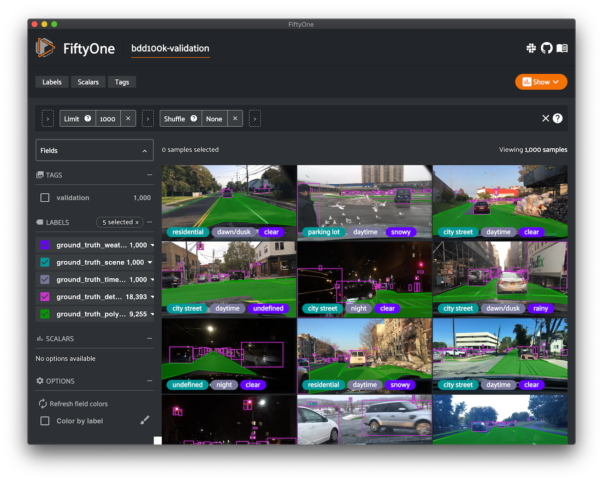

.. _dataset-zoo-caltech101:

Caltech-101
-----------

The Caltech-101 dataset of images.

The dataset consists of pictures of objects belonging to 101 classes, plus
one background clutter class (``BACKGROUND_Google``). Each image is labelled
with a single object.

Each class contains roughly 40 to 800 images, totalling around 9,000
images. Images are of variable sizes, with typical edge lengths of 200-300
pixels. This version contains image-level labels only.

**Details**

-   Dataset name: ``caltech101``
-   Dataset source: http://www.vision.caltech.edu/Image_Datasets/Caltech101
-   Dataset size: 138.60 MB
-   Tags: ``image, classification``
-   Supported splits: ``N/A``
-   ZooDataset class:
    :class:`Caltech101Dataset <fiftyone.zoo.datasets.base.Caltech101Dataset>`

.. note::

    As of FiftyOne v0.7.1, this dataset is available directly without requiring
    the TensorFlow backend. The splits have been removed, per
    `the author's organization <http://www.vision.caltech.edu/Image_Datasets/Caltech101>`_
    as well.

**Example usage**

.. tabs::

  .. group-tab:: Python

    .. code-block:: python
        :linenos:

        import fiftyone as fo
        import fiftyone.zoo as foz

        dataset = foz.load_zoo_dataset("caltech101")

        session = fo.launch_app(dataset)

  .. group-tab:: CLI

    .. code-block:: shell

        fiftyone zoo datasets load caltech101

        fiftyone app launch caltech101

.. image:: ../../images/dataset_zoo/caltech101.png
   :alt: caltech101
   :align: center

.. _dataset-zoo-caltech256:

Caltech-256
-----------

The Caltech-256 dataset of images.

The dataset consists of pictures of objects belonging to 256 classes, plus
one background clutter class (``clutter``). Each image is labelled with a
single object.

Each class contains between 80 and 827 images, totalling 30,607 images.
Images are of variable sizes, with typical edge lengths of 80-800 pixels.

**Details**

-   Dataset name: ``caltech256``
-   Dataset source: http://www.vision.caltech.edu/Image_Datasets/Caltech256
-   Dataset size: 1.16 GB
-   Tags: ``image, classification``
-   Supported splits: ``N/A``
-   ZooDataset class:
    :class:`Caltech101Dataset <fiftyone.zoo.datasets.base.Caltech256Dataset>`

**Example usage**

.. tabs::

  .. group-tab:: Python

    .. code-block:: python
        :linenos:

        import fiftyone as fo
        import fiftyone.zoo as foz

        dataset = foz.load_zoo_dataset("caltech256")

        session = fo.launch_app(dataset)

  .. group-tab:: CLI

    .. code-block:: shell

        fiftyone zoo datasets load caltech256

        fiftyone app launch caltech256

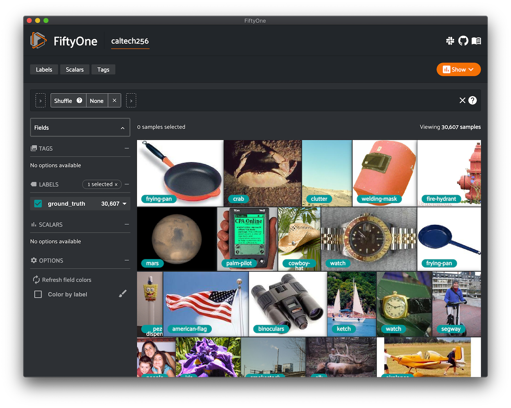

.. _dataset-zoo-cifar10:

CIFAR-10
--------

The CIFAR-10 dataset of images.

The dataset consists of 60,000 32 x 32 color images in 10 classes, with 6,000
images per class. There are 50,000 training images and 10,000 test images.

**Details**

-   Dataset name: ``cifar10``
-   Dataset source: https://www.cs.toronto.edu/~kriz/cifar.html
-   Dataset size: 132.40 MB
-   Tags: ``image, classification``
-   Supported splits: ``train, test``
-   ZooDataset classes:

    -   :class:`CIFAR10Dataset <fiftyone.zoo.datasets.tf.CIFAR10Dataset>` (TF backend)
    -   :class:`CIFAR10Dataset <fiftyone.zoo.datasets.torch.CIFAR10Dataset>` (Torch backend)

.. note::

    You must have the
    :ref:`Torch or TensorFlow backend(s) <dataset-zoo-ml-backend>` installed to
    load this dataset.

**Example usage**

.. tabs::

  .. group-tab:: Python

    .. code-block:: python
        :linenos:

        import fiftyone as fo
        import fiftyone.zoo as foz

        dataset = foz.load_zoo_dataset("cifar10", split="test")

        session = fo.launch_app(dataset)

  .. group-tab:: CLI

    .. code-block:: shell

        fiftyone zoo datasets load cifar10 --split test

        fiftyone app launch cifar10-test

.. image:: ../../images/dataset_zoo/cifar10-test.png
   :alt: cifar10-test
   :align: center

.. _dataset-zoo-cifar100:

CIFAR-100
---------

The CIFAR-100 dataset of images.

The dataset consists of 60,000 32 x 32 color images in 100 classes, with
600 images per class. There are 50,000 training images and 10,000 test
images.

**Details**

-   Dataset name: ``cifar100``
-   Dataset source: https://www.cs.toronto.edu/~kriz/cifar.html
-   Dataset size: 132.03 MB
-   Tags: ``image, classification``
-   Supported splits: ``train, test``
-   ZooDataset classes:

    -   :class:`CIFAR100Dataset <fiftyone.zoo.datasets.tf.CIFAR100Dataset>` (TF backend)
    -   :class:`CIFAR100Dataset <fiftyone.zoo.datasets.torch.CIFAR100Dataset>` (Torch backend)

.. note::

    You must have the
    :ref:`Torch or TensorFlow backend(s) <dataset-zoo-ml-backend>` installed to
    load this dataset.

**Example usage**

.. tabs::

  .. group-tab:: Python

    .. code-block:: python
        :linenos:

        import fiftyone as fo
        import fiftyone.zoo as foz

        dataset = foz.load_zoo_dataset("cifar100", split="test")

        session = fo.launch_app(dataset)

  .. group-tab:: CLI

    .. code-block:: shell

        fiftyone zoo datasets load cifar100 --split test

        fiftyone app launch cifar100-test

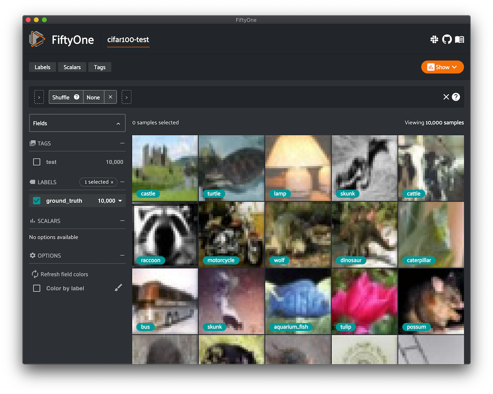

.. _dataset-zoo-cityscapes:

Cityscapes
----------

Cityscapes is a large-scale dataset that contains a diverse set of
stereo video sequences recorded in street scenes from 50 different cities,
with high quality pixel-level annotations of 5,000 frames in addition to a
larger set of 20,000 weakly annotated frames.

The dataset is intended for:

-   Assessing the performance of vision algorithms for major tasks of
    semantic urban scene understanding: pixel-level, instance-level, and
    panoptic semantic labeling
-   Supporting research that aims to exploit large volumes of (weakly)
    annotated data, e.g. for training deep neural networks

.. note::

    In order to load the Cityscapes dataset, you must download the source data
    manually. The directory should be organized in the following format:

    .. code-block:: text

        source_dir/
            leftImg8bit_trainvaltest.zip
            gtFine_trainvaltest.zip         # optional
            gtCoarse.zip                    # optional
            gtBbox_cityPersons_trainval     # optional

    You can register at https://www.cityscapes-dataset.com/register in order
    to get links to download the data.

**Details**

-   Dataset name: ``cityscapes``
-   Dataset source: https://www.cityscapes-dataset.com
-   Dataset size: 11.80 GB
-   Tags: ``image, multilabel, automotive, manual``
-   Supported splits: ``train, validation, test``
-   ZooDataset class:
    :class:`CityscapesDataset <fiftyone.zoo.datasets.base.CityscapesDataset>`

**Example usage**

.. tabs::

  .. group-tab:: Python

    .. code-block:: python
        :linenos:

        import fiftyone as fo
        import fiftyone.zoo as foz

        # The path to the source files that you manually downloaded
        source_dir = "/path/to/dir-with-cityscapes-files"

        dataset = foz.load_zoo_dataset(
            "cityscapes",
            split="validation",
            source_dir=source_dir,
        )

        session = fo.launch_app(dataset)

  .. group-tab:: CLI

    .. code-block:: shell

        # The path to the source files that you manually downloaded
        SOURCE_DIR="/path/to/dir-with-cityscapes-files"

        fiftyone zoo datasets load cityscapes --split validation \
            --kwargs "source_dir=${SOURCE_DIR}"

        fiftyone app launch cityscapes-validation

.. image:: ../../images/dataset_zoo/cityscapes-validation.png
   :alt: cityscapes-validation
   :align: center

.. _dataset-zoo-coco-2014:

COCO-2014
---------

COCO is a large-scale object detection, segmentation, and captioning
dataset.

This version contains images, bounding boxes and labels for the 2014
version of the dataset.

Notes:

-   COCO defines 91 classes but the data only uses 80 classes
-   Some images from the train and validation sets don't have annotations
-   The test set does not have annotations
-   COCO 2014 and 2017 uses the same images, but different train/val/test
    splits

**Details**

-   Dataset name: ``coco-2014``
-   Dataset source: http://cocodataset.org/#home
-   Dataset size: 37.57 GB
-   Tags: ``image, detection``
-   Supported splits: ``train, validation, test``
-   ZooDataset classes:

    -   :class:`COCO2014Dataset <fiftyone.zoo.datasets.tf.COCO2014Dataset>` (TF backend)
    -   :class:`COCO2014Dataset <fiftyone.zoo.datasets.torch.COCO2014Dataset>` (Torch backend)

.. note::

    You must have the
    :ref:`Torch or TensorFlow backend(s) <dataset-zoo-ml-backend>` installed to
    load this dataset.

**Example usage**

.. tabs::

  .. group-tab:: Python

    .. code-block:: python
        :linenos:

        import fiftyone as fo
        import fiftyone.zoo as foz

        dataset = foz.load_zoo_dataset("coco-2014", split="validation")

        session = fo.launch_app(dataset)

  .. group-tab:: CLI

    .. code-block:: shell

        fiftyone zoo datasets load coco-2014 --split validation

        fiftyone app launch coco-2014-validation

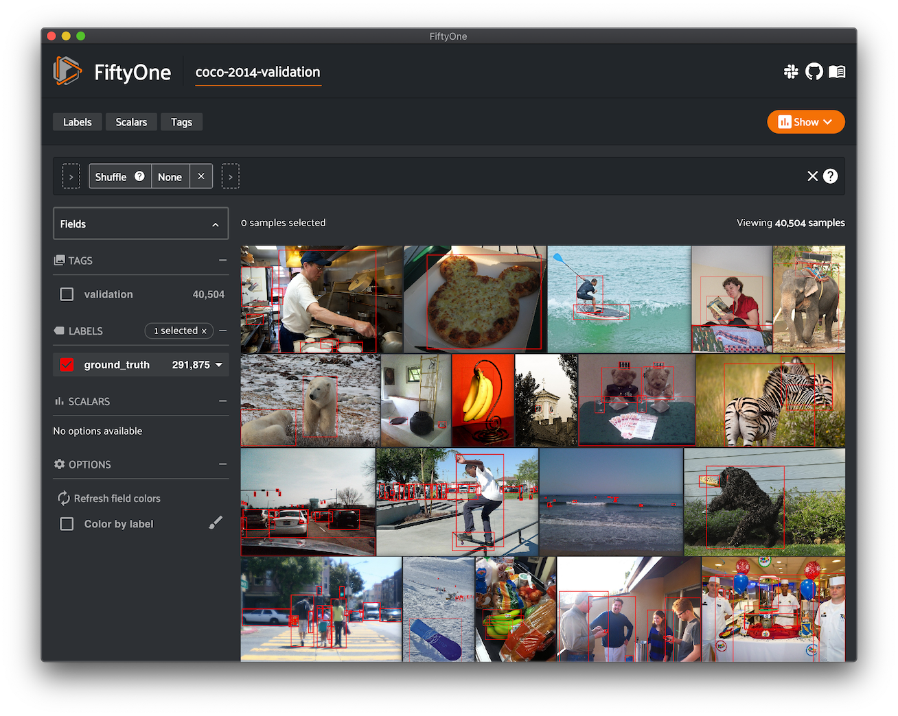

.. _dataset-zoo-coco-2014-segmentation:

COCO-2014 Segmentation
----------------------

COCO is a large-scale object detection, segmentation, and captioning
dataset.

This version contains images, bounding boxes, segmentations, and labels for
the 2014 version of the dataset.

Notes:

-   COCO defines 91 classes but the data only uses 80 classes
-   Some images from the train and validation sets don't have annotations
-   The test set does not have annotations
-   COCO 2014 and 2017 uses the same images, but different train/val/test
    splits

**Details**

-   Dataset name: ``coco-2014-segmentation``
-   Dataset source: http://cocodataset.org/#home
-   Dataset size: 37.57 GB
-   Tags: ``image, detection, segmentation``
-   Supported splits: ``test, train, validation``
-   ZooDataset class:
    :class:`COCO2014Dataset <fiftyone.zoo.datasets.base.COCO2014Dataset>`

**Example usage**

.. tabs::

  .. group-tab:: Python

    .. code-block:: python
        :linenos:

        import fiftyone as fo
        import fiftyone.zoo as foz

        dataset = foz.load_zoo_dataset("coco-2014-segmentation", split="validation")

        session = fo.launch_app(dataset)

  .. group-tab:: CLI

    .. code-block:: shell

        fiftyone zoo datasets load coco-2014-segmentation --split validation

        fiftyone app launch coco-2014-segmentation-validation

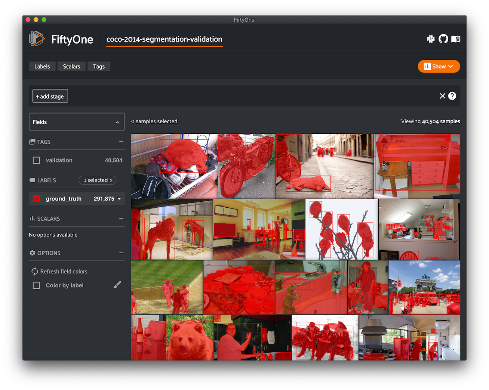

.. _dataset-zoo-coco-2017:

COCO-2017
---------

COCO is a large-scale object detection, segmentation, and captioning
dataset.

This version contains images, bounding boxes and labels for the 2017
version of the dataset.

Notes:

-   COCO defines 91 classes but the data only uses 80 classes
-   Some images from the train and validation sets don't have annotations
-   The test set does not have annotations
-   COCO 2014 and 2017 uses the same images, but different train/val/test
    splits

**Details**

-   Dataset name: ``coco-2017``
-   Dataset source: http://cocodataset.org/#home
-   Dataset size: 25.20 GB
-   Tags: ``image, detection``
-   Supported splits: ``train, validation, test``
-   ZooDataset classes:

    -   :class:`COCO2017Dataset <fiftyone.zoo.datasets.tf.COCO2017Dataset>` (TF backend)
    -   :class:`COCO2017Dataset <fiftyone.zoo.datasets.torch.COCO2017Dataset>` (Torch backend)

.. note::

    You must have the
    :ref:`Torch or TensorFlow backend(s) <dataset-zoo-ml-backend>` installed to
    load this dataset.

**Example usage**

.. tabs::

  .. group-tab:: Python

    .. code-block:: python
        :linenos:

        import fiftyone as fo
        import fiftyone.zoo as foz

        dataset = foz.load_zoo_dataset("coco-2017", split="validation")

        session = fo.launch_app(dataset)

  .. group-tab:: CLI

    .. code-block:: shell

        fiftyone zoo datasets load coco-2017 --split validation

        fiftyone app launch coco-2017-validation

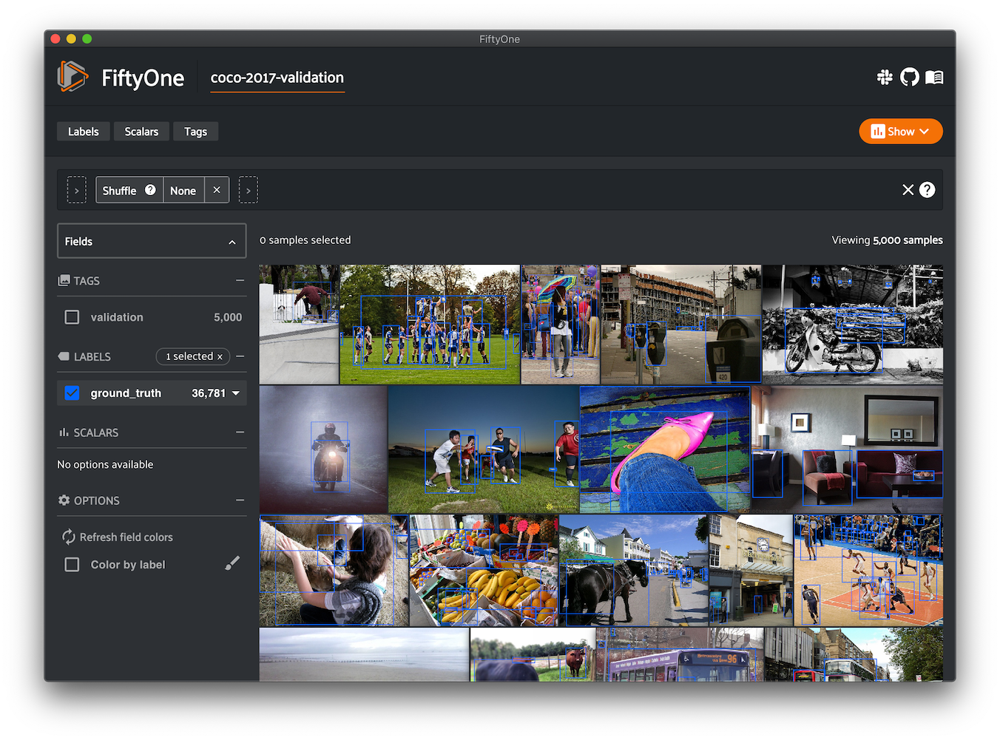

.. _dataset-zoo-coco-2017-segmentation:

COCO-2017 Segmentation
----------------------

COCO is a large-scale object detection, segmentation, and captioning
dataset.

This version contains images, bounding boxes, segmentations, and labels for
the 2017 version of the dataset.

Notes:

-   COCO defines 91 classes but the data only uses 80 classes
-   Some images from the train and validation sets don't have annotations
-   The test set does not have annotations
-   COCO 2014 and 2017 uses the same images, but different train/val/test
    splits

**Details**

-   Dataset name: ``coco-2017-segmentation``
-   Dataset source: http://cocodataset.org/#home
-   Dataset size: 25.20 GB
-   Tags: ``image, detection, segmentation``
-   Supported splits: ``test, train, validation``
-   ZooDataset class:
    :class:`COCO2017Dataset <fiftyone.zoo.datasets.base.COCO2017Dataset>`

**Example usage**

.. tabs::

  .. group-tab:: Python

    .. code-block:: python
        :linenos:

        import fiftyone as fo
        import fiftyone.zoo as foz

        dataset = foz.load_zoo_dataset("coco-2017-segmentation", split="validation")

        session = fo.launch_app(dataset)

  .. group-tab:: CLI

    .. code-block:: shell

        fiftyone zoo datasets load coco-2017-segmentation --split validation

        fiftyone app launch coco-2017-segmentation-validation

.. image:: ../../images/dataset_zoo/coco-2017-segmentation-validation.png
   :alt: coco-2017-segmentation-validation
   :align: center

.. _dataset-zoo-fashion-mnist:

Fashion MNIST
-------------

The Fashion-MNIST database of Zalando's fashion article images.

The dataset consists of 70,000 28 x 28 grayscale images in 10 classes.
There are 60,000 training images and 10,000 test images.

**Details**

-   Dataset name: ``fashion-mnist``
-   Dataset source: https://github.com/zalandoresearch/fashion-mnist
-   Dataset size: 36.42 MB
-   Tags: ``image, classification``
-   Supported splits: ``train, test``
-   ZooDataset classes:

    -   :class:`FashionMNISTDataset <fiftyone.zoo.datasets.tf.FashionMNISTDataset>` (TF backend)
    -   :class:`FashionMNISTDataset <fiftyone.zoo.datasets.torch.FashionMNISTDataset>` (Torch backend)

.. note::

    You must have the
    :ref:`Torch or TensorFlow backend(s) <dataset-zoo-ml-backend>` installed to
    load this dataset.

**Example usage**

.. tabs::

  .. group-tab:: Python

    .. code-block:: python
        :linenos:

        import fiftyone as fo
        import fiftyone.zoo as foz

        dataset = foz.load_zoo_dataset("fashion-mnist", split="test")

        session = fo.launch_app(dataset)

  .. group-tab:: CLI

    .. code-block:: shell

        fiftyone zoo datasets load fashion-mnist --split test

        fiftyone app launch fashion-mnist-test

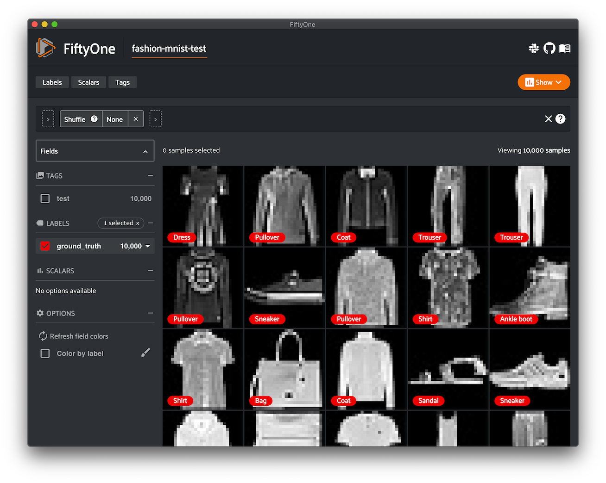

.. _dataset-zoo-hmdb51:

HMBD51
-------

HMDB51 is an action recognition dataset containing a total of 6,766
clips distributed across 51 action classes.

**Details**

-   Dataset name: ``hmdb51``
-   Dataset source: https://serre-lab.clps.brown.edu/resource/hmdb-a-large-human-motion-database
-   Dataset size: 2.16 GB
-   Tags: ``video, action-recognition``
-   Supported splits: ``train, test, other``
-   ZooDataset class:
    :class:`HMDB51Dataset <fiftyone.zoo.datasets.base.HMDB51Dataset>`

**Example usage**

.. tabs::

  .. group-tab:: Python

    .. code-block:: python
        :linenos:

        import fiftyone as fo
        import fiftyone.zoo as foz
        import fiftyone.utils.video as fouv

        dataset = foz.load_zoo_dataset("hmdb51", split="test")

        # Re-encode source videos as H.264 MP4s so they can be viewed in the App
        fouv.reencode_videos(dataset)

        session = fo.launch_app(dataset)

  .. group-tab:: CLI

    .. code-block:: shell

        fiftyone zoo datasets load hmdb51 --split test

        # Re-encode source videos as H.264 MP4s so they can be viewed in the App
        fiftyone utils transform-videos hmdb51-test --reencode

        fiftyone app launch hmdb51-test

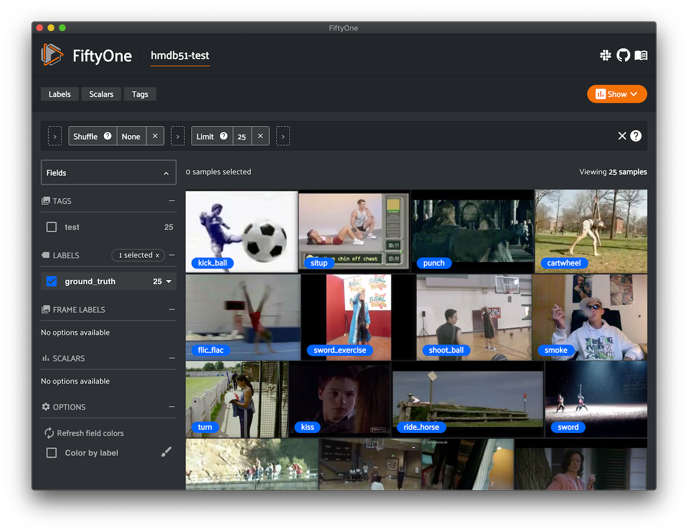

.. _dataset-zoo-imagenet-2012:

ImageNet 2012
-------------

The ImageNet 2012 dataset.

ImageNet, as known as ILSVRC 2012, is an image dataset organized according
to the WordNet hierarchy. Each meaningful concept in WordNet, possibly
described by multiple words or word phrases, is called a "synonym set" or
"synset". There are more than 100,000 synsets in WordNet, majority of them
are nouns (80,000+). ImageNet provides on average 1,000 images to
illustrate each synset. Images of each concept are quality-controlled and
human-annotated. In its completion, we hope ImageNet will offer tens of
millions of cleanly sorted images for most of the concepts in the WordNet
hierarchy.

Note that labels were never publicly released for the test set, so only the
training and validation sets are provided.

.. note::

    In order to load the ImageNet dataset, you must download the source data
    manually. The directory should be organized in the following format:

    .. code-block:: text

        source_dir/
            ILSVRC2012_devkit_t12.tar.gz    # both splits
            ILSVRC2012_img_train.tar        # train split
            ILSVRC2012_img_val.tar          # validation split

    You can register at http://www.image-net.org/download-images in order to
    get links to download the data.

**Details**

-   Dataset name: ``imagenet-2012``
-   Dataset source: http://image-net.org
-   Dataset size: 144.02 GB
-   Tags: ``image, classification, manual``
-   Supported splits: ``train, validation``
-   ZooDataset classes:

    -   :class:`ImageNet2012Dataset <fiftyone.zoo.datasets.tf.ImageNet2012Dataset>` (TF backend)
    -   :class:`ImageNet2012Dataset <fiftyone.zoo.datasets.torch.ImageNet2012Dataset>` (Torch backend)

.. note::

    You must have the
    :ref:`Torch or TensorFlow backend(s) <dataset-zoo-ml-backend>` installed to
    load this dataset.

**Example usage**

.. tabs::

  .. group-tab:: Python

    .. code-block:: python
        :linenos:

        import fiftyone as fo
        import fiftyone.zoo as foz

        # The path to the source files that you manually downloaded
        source_dir = "/path/to/dir-with-imagenet-files"

        dataset = foz.load_zoo_dataset(
            "imagenet-2012",
            split="validation",
            source_dir=source_dir,
        )

        session = fo.launch_app(dataset)

  .. group-tab:: CLI

    .. code-block:: shell

        # The path to the source files that you manually downloaded
        SOURCE_DIR="/path/to/dir-with-imagenet-files"

        fiftyone zoo datasets load imagenet-2012 --split validation \
            --kwargs "source_dir=${SOURCE_DIR}"

        fiftyone app launch imagenet-2012-validation

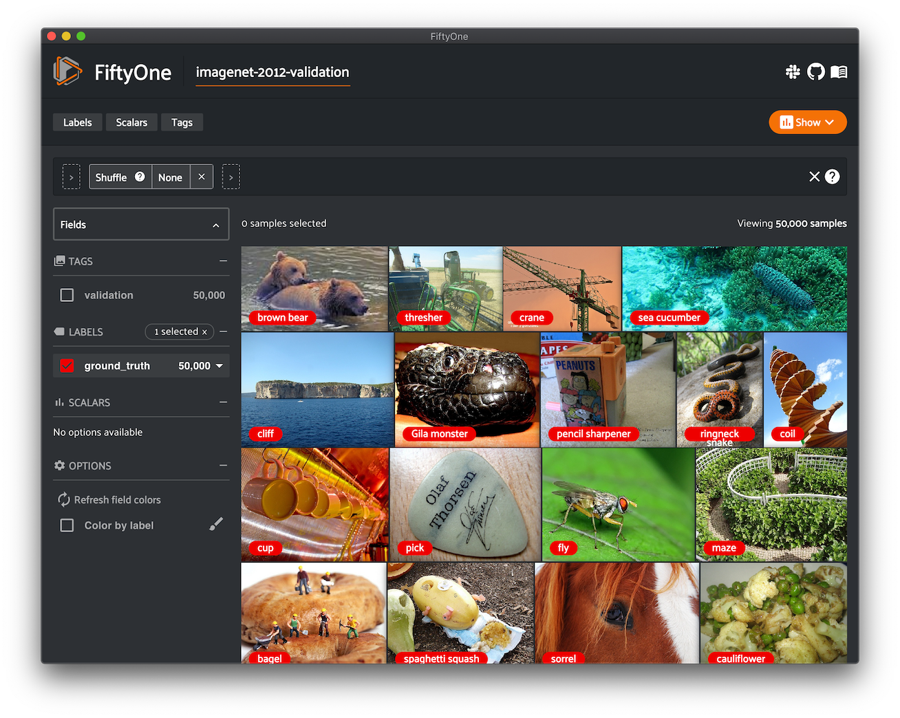

.. _dataset-zoo-imagenet-sample:

ImageNet Sample
---------------

A small sample of images from the ImageNet 2012 dataset.

The dataset contains 1,000 images, one randomly chosen from each class of
the validation split of the ImageNet 2012 dataset.

These images are provided according to the terms below.

.. code-block:: text

    You have been granted access for non-commercial research/educational
    use. By accessing the data, you have agreed to the following terms.

    You (the "Researcher") have requested permission to use the ImageNet
    database (the "Database") at Princeton University and Stanford
    University. In exchange for such permission, Researcher hereby agrees
    to the following terms and conditions:

    1.  Researcher shall use the Database only for non-commercial research
        and educational purposes.
    2.  Princeton University and Stanford University make no
        representations or warranties regarding the Database, including but
        not limited to warranties of non-infringement or fitness for a
        particular purpose.
    3.  Researcher accepts full responsibility for his or her use of the
        Database and shall defend and indemnify Princeton University and
        Stanford University, including their employees, Trustees, officers
        and agents, against any and all claims arising from Researcher's
        use of the Database, including but not limited to Researcher's use
        of any copies of copyrighted images that he or she may create from
        the Database.
    4.  Researcher may provide research associates and colleagues with
        access to the Database provided that they first agree to be bound
        by these terms and conditions.
    5.  Princeton University and Stanford University reserve the right to
        terminate Researcher's access to the Database at any time.
    6.  If Researcher is employed by a for-profit, commercial entity,
        Researcher's employer shall also be bound by these terms and
        conditions, and Researcher hereby represents that he or she is
        fully authorized to enter into this agreement on behalf of such
        employer.
    7.  The law of the State of New Jersey shall apply to all disputes
        under this agreement.

**Details**

-   Dataset name: ``imagenet-sample``
-   Dataset source: http://image-net.org
-   Dataset size: 98.26 MB
-   Tags: ``image, classification``
-   Supported splits: ``N/A``
-   ZooDataset class:
    :class:`ImageNetSampleDataset <fiftyone.zoo.datasets.base.ImageNetSampleDataset>`

**Example usage**

.. tabs::

  .. group-tab:: Python

    .. code-block:: python
        :linenos:

        import fiftyone as fo
        import fiftyone.zoo as foz

        dataset = foz.load_zoo_dataset("imagenet-sample")

        session = fo.launch_app(dataset)

  .. group-tab:: CLI

    .. code-block:: shell

        fiftyone zoo datasets load imagenet-sample

        fiftyone app launch imagenet-sample

.. image:: ../../images/dataset_zoo/imagenet-sample.png
   :alt: imagenet-sample
   :align: center

.. _dataset-zoo-kitti:

KITTI
-----

KITTI contains a suite of vision tasks built using an autonomous
driving platform.

The full benchmark contains many tasks such as stereo, optical flow, visual
odometry, etc. This dataset contains the object detection dataset,
including the monocular images and bounding boxes.

The training split contains 7,481 images annotated with 2D and 3D bounding
boxes (currently only the 2D detections are loaded), and the test split
contains 7,518 unlabeled images.

A full description of the annotations can be found in the README of the
object development kit on the KITTI homepage.

**Details**

-   Dataset name: ``kitti``
-   Dataset source: http://www.cvlibs.net/datasets/kitti
-   Dataset size: 11.71 GB
-   Tags: ``image, detection``
-   Supported splits: ``train, test``
-   ZooDataset class:
    :class:`KITTIDataset <fiftyone.zoo.datasets.base.KITTIDataset>`

.. note::

    As of FiftyOne v0.7.1, this dataset is available directly without requiring
    the TensorFlow backend. The splits have been updated to match
    `the author's organization <http://www.cvlibs.net/datasets/kitti/eval_object.php?obj_benchmark=2d>`_
    as well.

**Example usage**

.. tabs::

  .. group-tab:: Python

    .. code-block:: python
        :linenos:

        import fiftyone as fo
        import fiftyone.zoo as foz

        dataset = foz.load_zoo_dataset("kitti", split="train")

        session = fo.launch_app(dataset)

  .. group-tab:: CLI

    .. code-block:: shell

        fiftyone zoo datasets load kitti --split train

        fiftyone app launch kitti-train

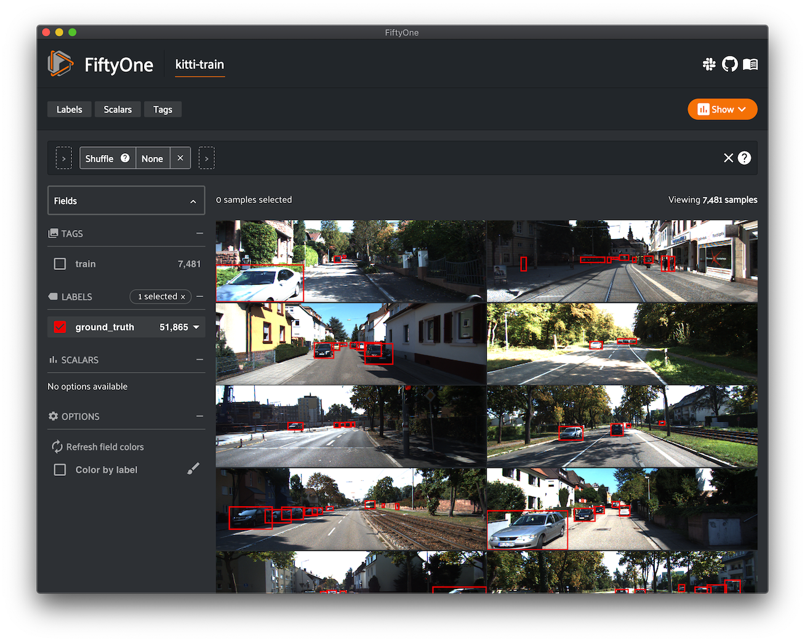

.. _dataset-zoo-lfw:

Labeled Faces in the Wild
-------------------------

Labeled Faces in the Wild is a public benchmark for face verification,
also known as pair matching.

The dataset contains 13,233 images of 5,749 people's faces collected from
the web. Each face has been labeled with the name of the person pictured.
1,680 of the people pictured have two or more distinct photos in the data
set. The only constraint on these faces is that they were detected by the
Viola-Jones face detector.

**Details**

-   Dataset name: ``lfw``
-   Dataset source: http://vis-www.cs.umass.edu/lfw
-   Dataset size: 173.00 MB
-   Tags: ``image, classification, facial-recognition``
-   Supported splits: ``test, train``
-   ZooDataset class:
    :class:`LabeledFacesInTheWildDataset <fiftyone.zoo.datasets.base.LabeledFacesInTheWildDataset>`

**Example usage**

.. tabs::

  .. group-tab:: Python

    .. code-block:: python
        :linenos:

        import fiftyone as fo
        import fiftyone.zoo as foz

        dataset = foz.load_zoo_dataset("lfw", split="test")

        session = fo.launch_app(dataset)

  .. group-tab:: CLI

    .. code-block:: shell

        fiftyone zoo datasets load lfw --split test

        fiftyone app launch lfw-test

.. image:: ../../images/dataset_zoo/lfw-test.png
   :alt: lfw-test
   :align: center

.. _dataset-zoo-mnist:

MNIST
-----

The MNIST database of handwritten digits.

The dataset consists of 70,000 28 x 28 grayscale images in 10 classes.
There are 60,000 training images and 10,000 test images.

**Details**

-   Dataset name: ``mnist``
-   Dataset source: http://yann.lecun.com/exdb/mnist
-   Dataset size: 21.00 MB
-   Tags: ``image, classification``
-   Supported splits: ``train, test``
-   ZooDataset classes:

    -   :class:`MNISTDataset <fiftyone.zoo.datasets.tf.MNISTDataset>` (TF backend)
    -   :class:`MNISTDataset <fiftyone.zoo.datasets.torch.MNISTDataset>` (Torch backend)

.. note::

    You must have the
    :ref:`Torch or TensorFlow backend(s) <dataset-zoo-ml-backend>` installed to
    load this dataset.

**Example usage**

.. tabs::

  .. group-tab:: Python

    .. code-block:: python
        :linenos:

        import fiftyone as fo
        import fiftyone.zoo as foz

        dataset = foz.load_zoo_dataset("mnist", split="test")

        session = fo.launch_app(dataset)

  .. group-tab:: CLI

    .. code-block:: shell

        fiftyone zoo datasets load mnist --split test

        fiftyone app launch mnist-test

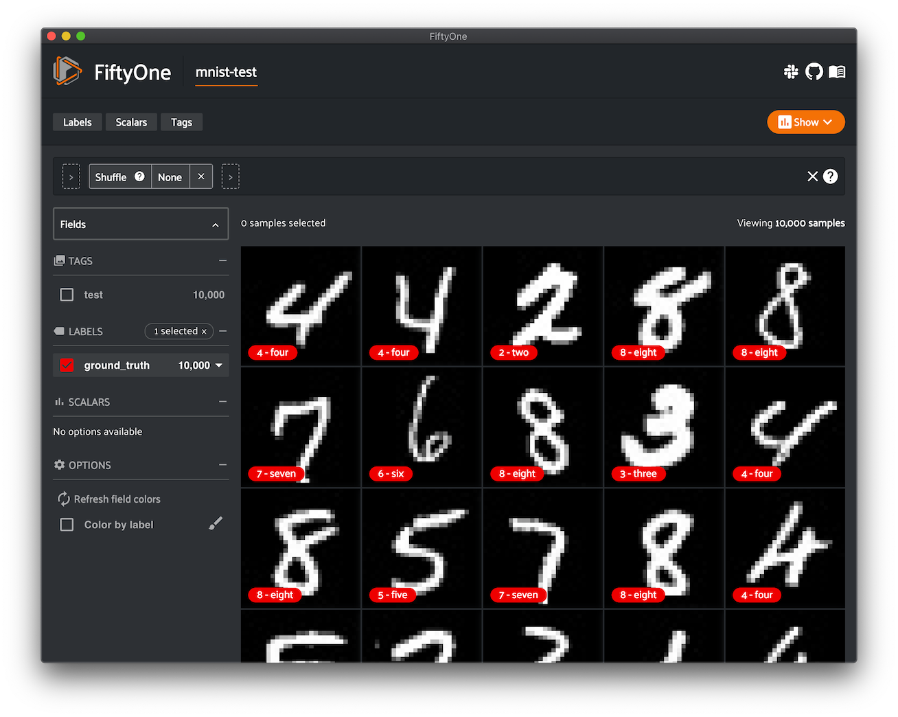

.. _dataset-zoo-quickstart:

Quickstart
----------

A small dataset with ground truth bounding boxes and predictions.

The dataset consists of 200 images from the validation split of COCO-2017,
with model predictions generated by an out-of-the-box Faster R-CNN model
from
`torchvision.models <https://pytorch.org/docs/stable/torchvision/models.html>`_.

**Details**

-   Dataset name: ``quickstart``
-   Dataset size: 23.40 MB
-   Tags: ``image, quickstart``
-   Supported splits: ``N/A``
-   ZooDataset class:
    :class:`QuickstartDataset <fiftyone.zoo.datasets.base.QuickstartDataset>`

**Example usage**

.. tabs::

  .. group-tab:: Python

    .. code-block:: python
        :linenos:

        import fiftyone as fo
        import fiftyone.zoo as foz

        dataset = foz.load_zoo_dataset("quickstart")

        session = fo.launch_app(dataset)

  .. group-tab:: CLI

    .. code-block:: shell

        fiftyone zoo datasets load quickstart

        fiftyone app launch quickstart

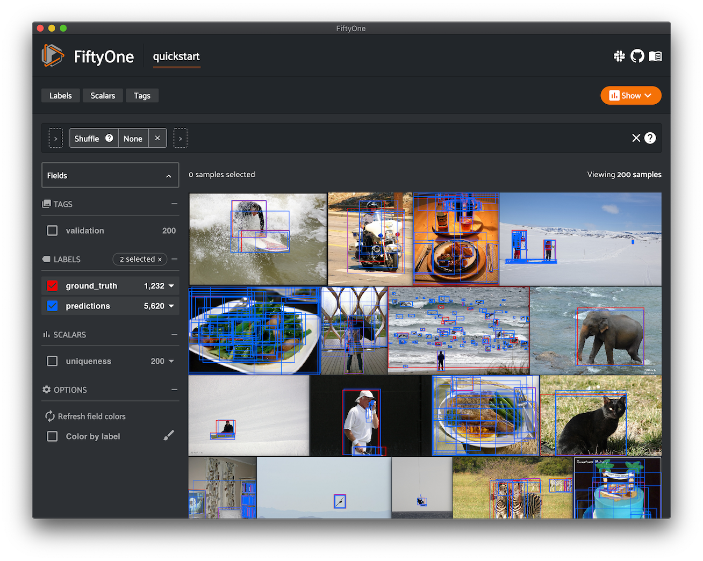

.. _dataset-zoo-quickstart-geo:

Quickstart Geo
--------------

A small dataset with geolocation data.

The dataset consists of 500 images from the validation split of the BDD100K
dataset in the New York City area with object detections and GPS timestamps.

**Details**

-   Dataset name: ``quickstart-geo``
-   Dataset size: 33.50 MB
-   Tags: ``image, location, quickstart``
-   Supported splits: ``N/A``
-   ZooDataset class:
    :class:`QuickstartGeoDataset <fiftyone.zoo.datasets.base.QuickstartGeoDataset>`

**Example usage**

.. tabs::

  .. group-tab:: Python

    .. code-block:: python
        :linenos:

        import fiftyone as fo
        import fiftyone.zoo as foz

        dataset = foz.load_zoo_dataset("quickstart-geo")

        session = fo.launch_app(dataset)

  .. group-tab:: CLI

    .. code-block:: shell

        fiftyone zoo datasets load quickstart-geo

        fiftyone app launch quickstart-geo

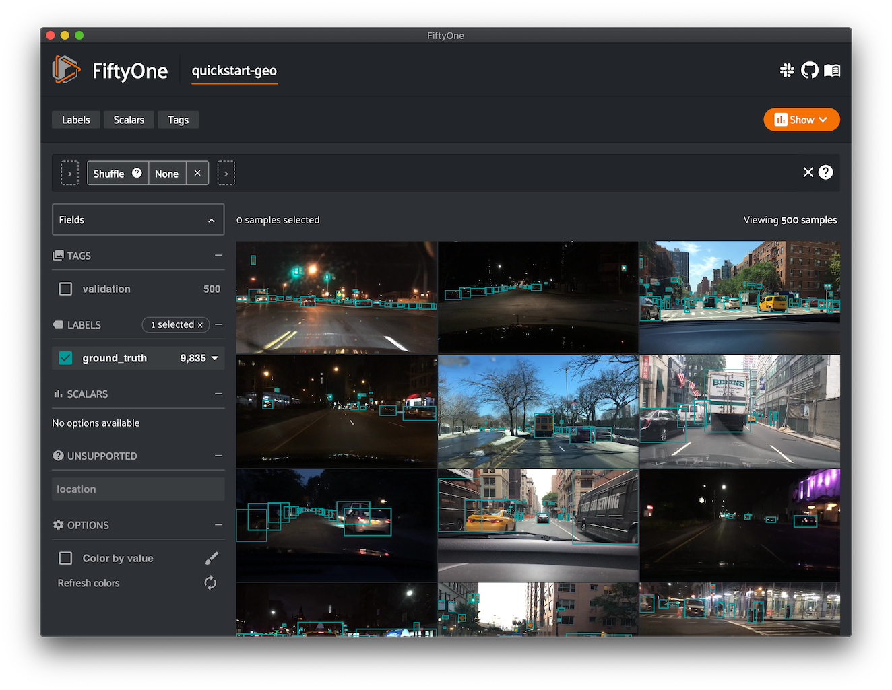

.. _dataset-zoo-quickstart-video:

Quickstart Video
----------------

A small video dataset with dense annotations.

The dataset consists of 10 video segments with dense object detections
generated by human annotators.

**Details**

-   Dataset name: ``quickstart-video``
-   Dataset size: 35.20 MB
-   Tags: ``video, quickstart``
-   Supported splits: ``N/A``
-   ZooDataset class:
    :class:`QuickstartVideoDataset <fiftyone.zoo.datasets.base.QuickstartVideoDataset>`

**Example usage**

.. tabs::

  .. group-tab:: Python

    .. code-block:: python
        :linenos:

        import fiftyone as fo
        import fiftyone.zoo as foz

        dataset = foz.load_zoo_dataset("quickstart-video")

        session = fo.launch_app(dataset)

  .. group-tab:: CLI

    .. code-block:: shell

        fiftyone zoo datasets load quickstart-video

        fiftyone app launch quickstart-video

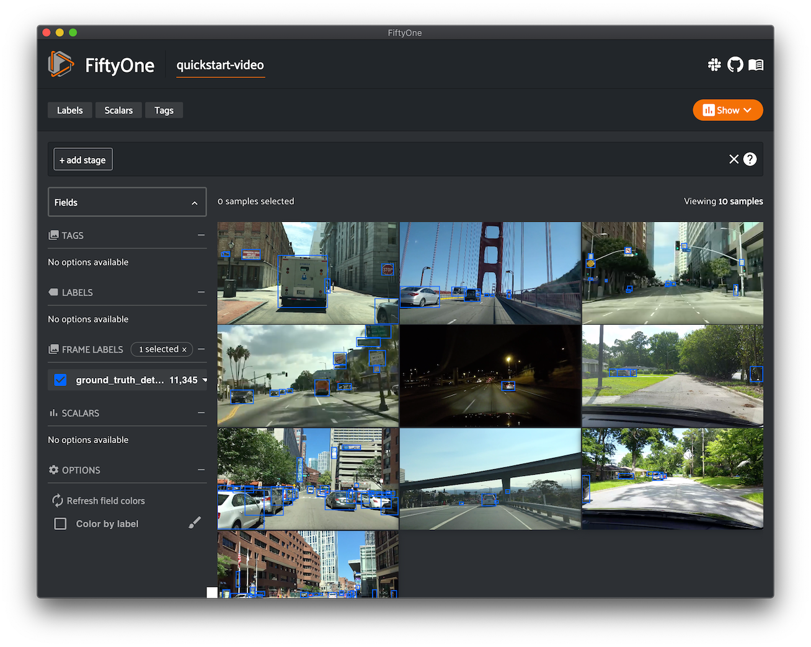

.. _dataset-zoo-ucf101:

UCF101
------

UCF101 is an action recognition data set of realistic action videos,
collected from YouTube, having 101 action categories. This data set is an
extension of UCF50 data set which has 50 action categories.

With 13,320 videos from 101 action categories, UCF101 gives the largest
diversity in terms of actions and with the presence of large variations in
camera motion, object appearance and pose, object scale, viewpoint,
cluttered background, illumination conditions, etc, it is the most
challenging data set to date. As most of the available action recognition
data sets are not realistic and are staged by actors, UCF101 aims to
encourage further research into action recognition by learning and
exploring new realistic action categories.

The videos in 101 action categories are grouped into 25 groups, where each
group can consist of 4-7 videos of an action. The videos from the same
group may share some common features, such as similar background, similar
viewpoint, etc.

**Details**

-   Dataset name: ``ucf101``
-   Dataset source: https://www.crcv.ucf.edu/research/data-sets/ucf101
-   Dataset size: 6.48 GB
-   Tags: ``video, action-recognition``
-   Supported splits: ``train, test``
-   ZooDataset class:
    :class:`UCF101Dataset <fiftyone.zoo.datasets.base.UCF101Dataset>`

**Example usage**

.. tabs::

  .. group-tab:: Python

    .. code-block:: python
        :linenos:

        import fiftyone as fo
        import fiftyone.zoo as foz
        import fiftyone.utils.video as fouv

        dataset = foz.load_zoo_dataset("ucf101", split="test")

        # Re-encode source videos as H.264 MP4s so they can be viewed in the App
        fouv.reencode_videos(dataset)

        session = fo.launch_app(dataset)

  .. group-tab:: CLI

    .. code-block:: shell

        fiftyone zoo datasets load ucf101 --split test

        # Re-encode source videos as H.264 MP4s so they can be viewed in the App
        fiftyone utils transform-videos ucf101-test --reencode

        fiftyone app launch ucf101-test

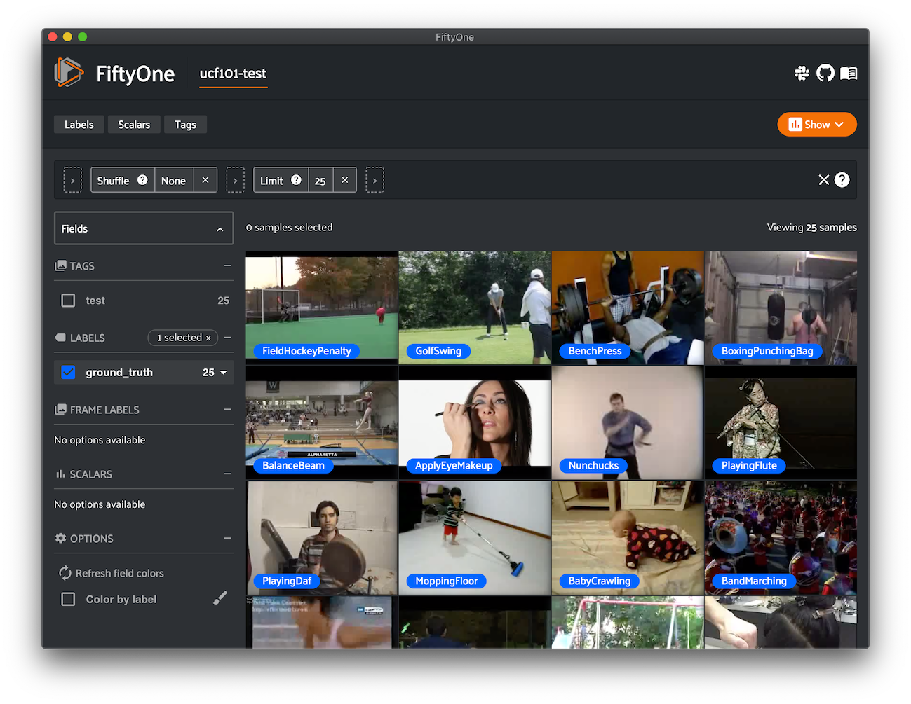

.. _dataset-zoo-voc-2007:

VOC-2007
--------

The dataset for the PASCAL Visual Object Classes Challenge 2007
(VOC2007) for the detection competition.

A total of 9,963 images are included in this dataset, where each image
contains a set of objects, out of 20 different classes, making a total of
24,640 annotated objects.

Note that, as per the official dataset, the test set of VOC2007 does not
contain annotations.

**Details**

-   Dataset name: ``voc-2007``
-   Dataset source: http://host.robots.ox.ac.uk/pascal/VOC/voc2007
-   Dataset size: 868.85 MB
-   Tags: ``image, detection``
-   Supported splits: ``train, validation, test``
-   ZooDataset classes:

    -   :class:`VOC2007Dataset <fiftyone.zoo.datasets.tf.VOC2007Dataset>` (TF backend)
    -   :class:`VOC2007Dataset <fiftyone.zoo.datasets.torch.VOC2007Dataset>` (Torch backend)

.. note::

    The ``test`` split is only available via the
    :ref:`TensorFlow backend <dataset-zoo-ml-backend>`.

.. note::

    You must have the
    :ref:`Torch or TensorFlow backend(s) <dataset-zoo-ml-backend>` installed to
    load this dataset.

**Example usage**

.. tabs::

  .. group-tab:: Python

    .. code-block:: python
        :linenos:

        import fiftyone as fo
        import fiftyone.zoo as foz

        dataset = foz.load_zoo_dataset("voc-2007", split="validation")

        session = fo.launch_app(dataset)

  .. group-tab:: CLI

    .. code-block:: shell

        fiftyone zoo datasets load voc-2007 --split validation

        fiftyone app launch voc-2007-validation

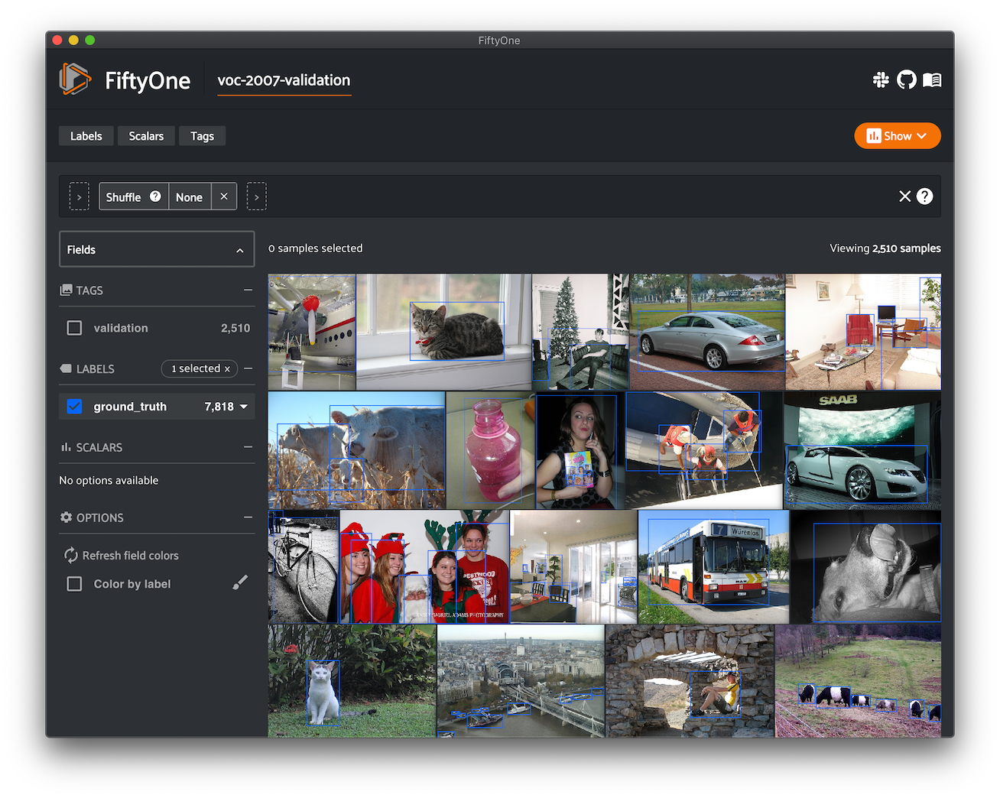

.. _dataset-zoo-voc-2012:

VOC-2012
--------

The dataset for the PASCAL Visual Object Classes Challenge 2012
(VOC2012) for the detection competition.

A total of 11540 images are included in this dataset, where each image
contains a set of objects, out of 20 different classes, making a total of
27450 annotated objects.

Note that, as per the official dataset, the test set of VOC2012 does not
contain annotations.

**Details**

-   Dataset name: ``voc-2012``
-   Dataset source: http://host.robots.ox.ac.uk/pascal/VOC/voc2012
-   Dataset size: 3.59 GB
-   Tags: ``image, detection``
-   Supported splits: ``train, validation, test``
-   ZooDataset classes
    -   :class:`VOC2012Dataset <fiftyone.zoo.datasets.tf.VOC2012Dataset>` (TF backend)
    -   :class:`VOC2012Dataset <fiftyone.zoo.datasets.torch.VOC2012Dataset>` (Torch backend)

.. note::

    The ``test`` split is only available via the
    :ref:`TensorFlow backend <dataset-zoo-ml-backend>`.

.. note::

    You must have the
    :ref:`Torch or TensorFlow backend(s) <dataset-zoo-ml-backend>` installed to
    load this dataset.

**Example usage**

.. tabs::

  .. group-tab:: Python

    .. code-block:: python
        :linenos:

        import fiftyone as fo
        import fiftyone.zoo as foz

        dataset = foz.load_zoo_dataset("voc-2012", split="validation")

        session = fo.launch_app(dataset)

  .. group-tab:: CLI

    .. code-block:: shell

        fiftyone zoo datasets load voc-2012 --split validation

        fiftyone app launch voc-2012-validation

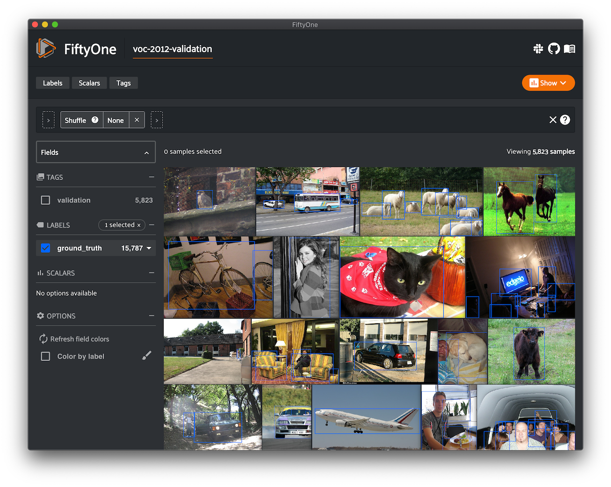
