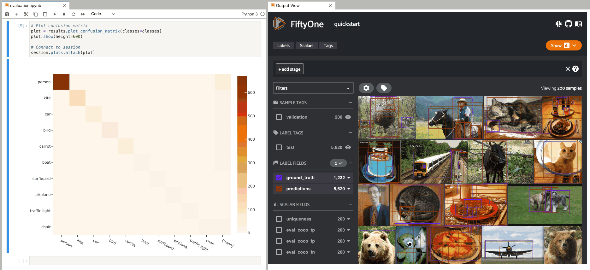
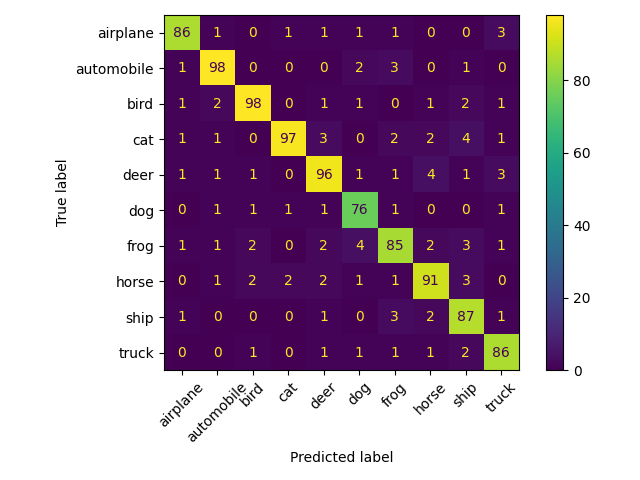
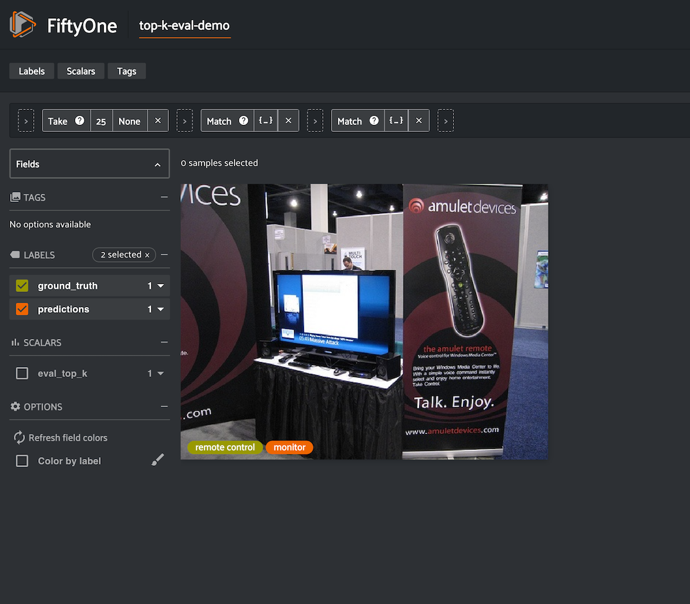
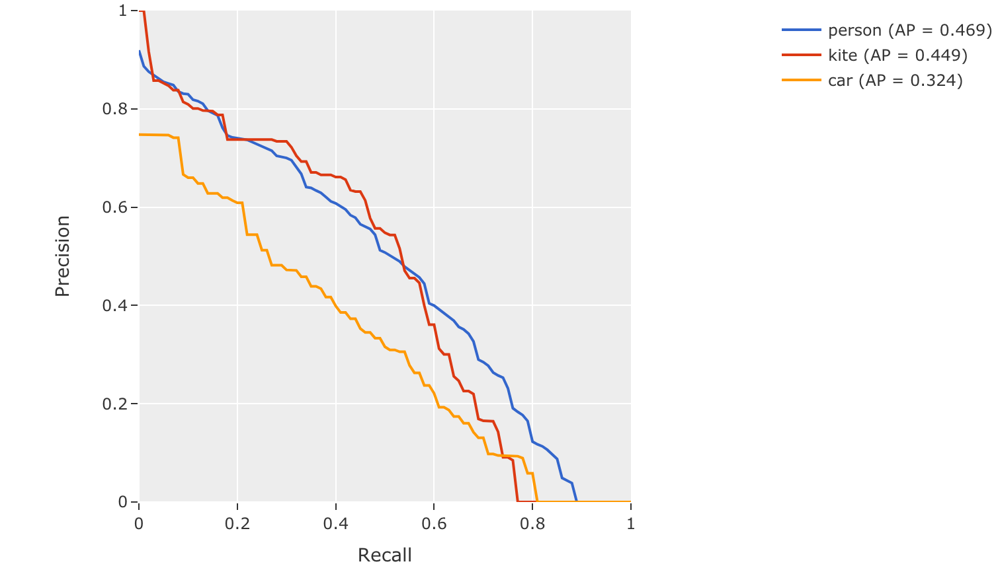

.. _evaluating-models:

Evaluating Models
=================

.. default-role:: code

FiftyOne provides a variety of builtin methods for evaluating your model
predictions, including classifications, detections, and semantic segmentations,
on both image and video datasets.

When you evaluate a model in FiftyOne, you get access to the standard aggregate
metrics such as classification reports, confusion matrices, and PR curves
for your model. In addition, FiftyOne can also record fine-grained statistics
like accuracy and false positive counts at the sample-level, which you can
leverage via :ref:`dataset views <using-views>` and the
:ref:`FiftyOne App <fiftyone-app>` to interactively explore the strengths and
weaknesses of your models on individual data samples.

Sample-level analysis often leads to critical insights that will help you
improve your datasets and models. For example, viewing the samples with the
most false positive predictions can reveal errors in your annotation schema.
Or, viewing the cluster of samples with the lowest accuracy can reveal gaps in
your training dataset that you need to address in order to improve your model's
performance. A key goal of FiftyOne is to help you uncover these insights on
your data!

.. note::

     Check out the :ref:`tutorials page <tutorials>` for in-depth walkthroughs
     of evaluating various types of models with FiftyOne.

Overview
________

FiftyOne's evaluation methods are conveniently exposed as methods on all
|Dataset| and |DatasetView| objects, which means that you can evaluate entire
datasets or specific views into them via the same syntax.

Let's illustrate the basic workflow by loading the
:ref:`quickstart dataset <dataset-zoo-quickstart>` from the Dataset Zoo and
analyzing the object detections in its `predictions` field using the
:meth:`evaluate_detections() <fiftyone.core.collections.SampleCollection.evaluate_detections>`
method:

.. code-block:: python
    :linenos:

    import fiftyone.zoo as foz

    dataset = foz.load_zoo_dataset("quickstart")
    print(dataset)

    # Evaluate the detections in the `predictions` field with respect to the
    # objects in the `ground_truth` field
    results = dataset.evaluate_detections(
        "predictions",
        gt_field="ground_truth",
        eval_key="eval_predictions",
    )

Aggregate metrics
-----------------

Running an evaluation returns an instance of a task-specific subclass of
|EvaluationResults| that provides a handful of methods for generating aggregate
statistics about your dataset.

.. code-block:: python
    :linenos:

    # Get the 10 most common classes in the dataset
    counts = dataset.count_values("ground_truth.detections.label")
    classes = sorted(counts, key=counts.get, reverse=True)[:10]

    # Print a classification report for the top-10 classes
    results.print_report(classes=classes)

.. code-block:: text

                   precision    recall  f1-score   support

           person       0.45      0.74      0.56       783
             kite       0.55      0.72      0.62       156
              car       0.12      0.54      0.20        61
             bird       0.63      0.67      0.65       126
           carrot       0.06      0.49      0.11        47
             boat       0.05      0.24      0.08        37
        surfboard       0.10      0.43      0.17        30
    traffic light       0.22      0.54      0.31        24
         airplane       0.29      0.67      0.40        24
          giraffe       0.26      0.65      0.37        23

        micro avg       0.32      0.68      0.44      1311
        macro avg       0.27      0.57      0.35      1311
     weighted avg       0.42      0.68      0.51      1311

Sample metrics
--------------

In addition to standard aggregate metrics, when you pass an ``eval_key``
parameter to the evaluation routine, FiftyOne will populate helpful
task-specific information about your model's predictions on each sample, such
as false negative/positive counts and per-sample accuracies.

Continuing with our example, let's use :ref:`dataset views <using-views>` and
the :ref:`FiftyOne App <fiftyone-app>` to leverage these sample metrics to
investigate the samples with the most false positive predictions in the
dataset:

.. code-block:: python
    :linenos:

    import fiftyone as fo
    from fiftyone import ViewField as F

    # Create a view that has samples with the most false positives first, and
    # only includes false positive boxes in the `predictions` field
    view = (
        dataset
        .sort_by("eval_predictions_fp", reverse=True)
        .filter_labels("predictions", F("eval_predictions") == "fp")
    )

    # Visualize results in the App
    session = fo.launch_app(view=view)

Notice anything wrong? The sample with the most false positives is a plate of
carrots where the entire plate has been boxed as a single example in the ground
truth while the model is generating predictions for individual carrots!

If you're familiar with `COCO format <https://cocodataset.org/#format-data>`_
(which is recognized by
:meth:`evaluate_detections() <fiftyone.core.collections.SampleCollection.evaluate_detections>`
by default), you'll notice that the issue here is that the ``iscrowd``
attribute of this ground truth annotation has been incorrectly set to ``0``.
Resolving mistakes like these will provide a much more accurate picture of the
real performance of a model.

.. _confusion-matrices:

Confusion matrices
------------------

When you use evaluation methods such as
:meth:`evaluate_classifications() <fiftyone.core.collections.SampleCollection.evaluate_classifications>`
and
:meth:`evaluate_detections() <fiftyone.core.collections.SampleCollection.evaluate_detections>`
to evaluate model predictions, the confusion matrices that you can generate
by calling the
:meth:`plot_confusion_matrix() <fiftyone.utils.eval.classification.ClassificationResults.plot_confusion_matrix>`
method are responsive plots that can be attached to App instances to
interactively explore specific cases of your model's performance.

.. note::

    See :ref:`this page <interactive-plots>` for more information about
    interactive plots in FiftyOne.

Continuing with our example, the code block below generates a confusion matrix
for our evaluation results and :ref:`attaches it to the App <attaching-plots>`.

In this setup, you can click on individual cells of the confusion matrix to
select the corresponding ground truth and/or predicted objects in the App. For
example, if you click on a diagonal cell of the confusion matrix, you will
see the true positive examples of that class in the App.

Likewise, whenever you modify the Session's view, either in the App or by
programmatically setting
:meth:`session.view <fiftyone.core.session.Session.view>`, the confusion matrix
is automatically updated to show the cell counts for only those detections that
are included in the current view.

.. code-block:: python
    :linenos:

    # Plot confusion matrix
    plot = results.plot_confusion_matrix(classes=classes)
    plot.show()

    # Connect to session
    session.plots.attach(plot)

Managing evaluations
--------------------

When you run an evaluation with an ``eval_key`` argument, the evaluation is
recorded on the dataset and you can retrieve information about it later, delete
it, or even :ref:`retrieve the view <load-evaluation-view>` that you evaluated
on:

.. code-block:: python
    :linenos:

    # List evaluations you've run on a dataset
    dataset.list_evaluations()
    # ['eval_predictions']

    # Print information about an evaluation
    print(dataset.get_evaluation_info("eval_predictions"))

    # Delete the evaluation
    # This will remove any evaluation data that was populated on your dataset
    dataset.delete_evaluation("eval_predictions")

The sections below discuss evaluating various types of predictions in more
detail.

.. _evaluating-classifications:

Classifications
_______________

You can use the
:meth:`evaluate_classifications() <fiftyone.core.collections.SampleCollection.evaluate_classifications>`
method to evaluate the predictions of a classifier stored in a
|Classification| field of your dataset.

By default, the classifications will be treated as a generic multiclass
classification task, but you can specify other evaluation strategies such as
top-k accuracy or binary evaluation via the ``method`` parameter.

Invoking
:meth:`evaluate_classifications() <fiftyone.core.collections.SampleCollection.evaluate_classifications>`
returns a |ClassificationResults| instance that provides a variety of methods
for generating various aggregate evaluation reports about your model.

In addition, when you specify an ``eval_key`` parameter, a number of helpful
fields will be populated on each sample that you can leverage via the
:ref:`FiftyOne App <fiftyone-app>` to interactively explore the strengths and
weaknesses of your model on individual samples.

Simple evaluation (default)
---------------------------

By default,
:meth:`evaluate_classifications() <fiftyone.core.collections.SampleCollection.evaluate_classifications>`
will treat your classifications as generic multiclass predictions, and it will
evaluate each prediction by directly comparing its ``label`` to the associated
ground truth prediction.

You can explicitly request that simple evaluation be used by setting the
``method`` parameter to ``"simple"``.

When you specify an ``eval_key`` parameter, a boolean ``eval_key`` field will
be populated on each sample that records whether that sample's prediction is
correct.

The example below demonstrates simple evaluation on the
:ref:`CIFAR-10 dataset <dataset-zoo-cifar10>` from the Dataset Zoo with some
fake predictions added to it to demonstrate the workflow:

.. code-block:: python
    :linenos:

    import random

    import fiftyone as fo
    import fiftyone.zoo as foz
    from fiftyone import ViewField as F

    dataset = foz.load_zoo_dataset(
        "cifar10",
        split="test",
        max_samples=1000,
        shuffle=True,
    )

    #
    # Create some test predictions by copying the ground truth labels into a
    # new `predictions` field and then perturbing 10% of the labels at random
    #

    classes = dataset.distinct("ground_truth.label")

    def jitter(val):
        if random.random() < 0.10:
            return random.choice(classes)

        return val

    dataset.clone_sample_field("ground_truth", "predictions")

    gt_labels = dataset.values("ground_truth.label")
    pred_labels = [jitter(label) for label in gt_labels]

    dataset.set_values("predictions.label", pred_labels)

    print(dataset)

    # Evaluate the predictions in the `predictions` field with respect to the
    # labels in the `ground_truth` field
    results = dataset.evaluate_classifications(
        "predictions",
        gt_field="ground_truth",
        eval_key="eval_simple",
    )

    # Print a classification report
    results.print_report()

    # Plot a confusion matrix
    plot = results.plot_confusion_matrix()
    plot.show()

    # Launch the App to explore
    session = fo.launch_app(dataset)

    # View only the incorrect predictions in the App
    session.view = dataset.match(F("eval_simple") == False)

.. code-block:: text

                  precision    recall  f1-score   support

        airplane       0.91      0.90      0.91       118
      automobile       0.93      0.90      0.91       101
            bird       0.93      0.87      0.90       103
             cat       0.92      0.91      0.92        94
            deer       0.88      0.92      0.90       116
             dog       0.85      0.84      0.84        86
            frog       0.85      0.92      0.88        84
           horse       0.88      0.91      0.89        96
            ship       0.93      0.95      0.94        97
           truck       0.92      0.89      0.90       105

        accuracy                           0.90      1000
       macro avg       0.90      0.90      0.90      1000
    weighted avg       0.90      0.90      0.90      1000

.. note::

    Did you know? You can
    :ref:`attach confusion matrices to the App <confusion-matrices>` and
    interactively explore them by clicking on their cells and/or modifying your
    view in the App.

Top-k evaluation
----------------

Set the ``method`` parameter of
:meth:`evaluate_classifications() <fiftyone.core.collections.SampleCollection.evaluate_classifications>`
to ``top-k`` in order to use top-k matching to evaluate your classifications.

Under this strategy, predictions are deemed to be correct if the corresponding
ground truth label is within the top ``k`` predictions.

When you specify an ``eval_key`` parameter, a boolean ``eval_key`` field will
be populated on each sample that records whether that sample's prediction is
correct.

.. note::

    In order to use top-k evaluation, you must populate the ``logits`` field
    of your predictions, and you must provide the list of corresponding class
    labels via the ``classes`` parameter of
    :meth:`evaluate_classifications() <fiftyone.core.collections.SampleCollection.evaluate_classifications>`.

    Did you know? Many models from the :ref:`Model Zoo <model-zoo>`
    provide support for storing logits for their predictions!

The example below demonstrates top-k evaluation on a
:ref:`small ImageNet sample <dataset-zoo-imagenet-sample>` with predictions
from a pre-trained model from the :ref:`Model Zoo <model-zoo>`:

.. code-block:: python
    :linenos:

    import fiftyone as fo
    import fiftyone.zoo as foz
    from fiftyone import ViewField as F

    dataset = foz.load_zoo_dataset(
        "imagenet-sample", dataset_name="top-k-eval-demo"
    )

    # We need the list of class labels corresponding to the logits
    logits_classes = dataset.default_classes

    # Add predictions (with logits) to 25 random samples
    predictions_view = dataset.take(25, seed=51)
    model = foz.load_zoo_model("resnet50-imagenet-torch")
    predictions_view.apply_model(model, "predictions", store_logits=True)

    print(predictions_view)

    # Evaluate the predictions in the `predictions` field with respect to the
    # labels in the `ground_truth` field using top-5 accuracy
    results = predictions_view.evaluate_classifications(
        "predictions",
        gt_field="ground_truth",
        eval_key="eval_top_k",
        method="top-k",
        classes=logits_classes,
        k=5,
    )

    # Get the 10 most common classes in the view
    counts = predictions_view.count_values("ground_truth.label")
    classes = sorted(counts, key=counts.get, reverse=True)[:10]

    # Print a classification report for the top-10 classes
    results.print_report(classes=classes)

    # Launch the App to explore
    session = fo.launch_app(dataset)

    # View only the incorrect predictions for the 10 most common classes
    session.view = (
        predictions_view
        .match(F("ground_truth.label").is_in(classes))
        .match(F("eval_top_k") == False)
    )

Binary evaluation
-----------------

If your classifier is binary, set the ``method`` parameter of
:meth:`evaluate_classifications() <fiftyone.core.collections.SampleCollection.evaluate_classifications>`
to ``binary`` in order to access binary-specific evaluation information such
as precision-recall curves for your model.

When you specify an ``eval_key`` parameter, a string ``eval_key`` field will
be populated on each sample that records whether the sample is a true positive,
false positive, true negative, or false negative.

.. note::

    In order to use binary evaluation, you must provide the
    ``(neg_label, pos_label)`` for your model via the ``classes`` parameter of
    :meth:`evaluate_classifications() <fiftyone.core.collections.SampleCollection.evaluate_classifications>`.

The example below demonstrates binary evaluation on the
:ref:`CIFAR-10 dataset <dataset-zoo-cifar10>` from the Dataset Zoo with some
fake binary predictions added to it to demonstrate the workflow:

.. code-block:: python
    :linenos:

    import random

    import fiftyone as fo
    import fiftyone.zoo as foz

    # Load a small sample from the ImageNet dataset
    dataset = foz.load_zoo_dataset(
        "cifar10",
        split="test",
        max_samples=1000,
        shuffle=True,
    )

    #
    # Binarize the ground truth labels to `cat` and `other`, and add
    # predictions that are correct proportionally to their confidence
    #

    classes = ["other", "cat"]

    for sample in dataset:
        gt_label = "cat" if sample.ground_truth.label == "cat" else "other"

        confidence = random.random()
        if random.random() > confidence:
            pred_label = "cat" if gt_label == "other" else "other"
        else:
            pred_label = gt_label

        sample.ground_truth.label = gt_label
        sample["predictions"] = fo.Classification(
            label=pred_label, confidence=confidence
        )

        sample.save()

    print(dataset)

    # Evaluate the predictions in the `predictions` field with respect to the
    # labels in the `ground_truth` field
    results = dataset.evaluate_classifications(
        "predictions",
        gt_field="ground_truth",
        eval_key="eval_binary",
        method="binary",
        classes=classes,
    )

    # Print a classification report
    results.print_report()

    # Plot a PR curve
    plot = results.plot_pr_curve()
    plot.show()

.. code-block:: text

                  precision    recall  f1-score   support

           other       0.90      0.48      0.63       906
             cat       0.09      0.50      0.15        94

        accuracy                           0.48      1000
       macro avg       0.50      0.49      0.39      1000
    weighted avg       0.83      0.48      0.59      1000

.. image:: ../images/evaluation/cifar10_binary_pr_curve.png
   :alt: cifar10-binary-pr-curve
   :align: center

.. _evaluating-detections:

Detections
__________

You can use the
:meth:`evaluate_detections() <fiftyone.core.collections.SampleCollection.evaluate_detections>`
method to evaluate the predictions of an object detection model stored in a
|Detections| field of your dataset.

Invoking
:meth:`evaluate_detections() <fiftyone.core.collections.SampleCollection.evaluate_detections>`
returns a |DetectionResults| instance that provides a variety of methods for
generating various aggregate evaluation reports about your model.

In addition, when you specify an ``eval_key`` parameter, a number of helpful
fields will be populated on each sample and its predicted/ground truth
objects that you can leverage via the :ref:`FiftyOne App <fiftyone-app>` to
interactively explore the strengths and weaknesses of your model on individual
samples.

.. note::

    Currently, COCO-style evaluation is the only option, but additional methods
    are coming soon!

COCO-style evaluation (default)
-------------------------------

By default,
:meth:`evaluate_detections() <fiftyone.core.collections.SampleCollection.evaluate_detections>`
will use `COCO-style evaluation <https://cocodataset.org/#detection-eval>`_ to
analyze predictions. This means that:

-   Predicted and ground truth objects are matched using a specified IoU
    threshold (default = 0.50). This threshold can be customized via the
    ``iou`` parameter.
-   Predictions are matched in descending order of confidence.
-   By default, only objects with the same ``label`` will be matched. Classwise
    matching can be disabled via the ``classwise`` parameter.
-   Ground truth objects can have an `iscrowd` attribute that indicates whether
    the annotation contains a crowd of objects. Multiple predictions can be
    matched to crowd ground truth objects. The name of this attribute can be
    customized via the ``iscrowd`` attribute.

You can explicitly request that COCO-style evaluation be used by setting the
``method`` parameter to ``"coco"``.

When you specify an ``eval_key`` parameter, a number of helpful fields will be
populated on each sample and its predicted/ground truth objects:

-   True positive (TP), false positive (FP), and false negative (FN) counts
    for the each sample are saved in top-level fields of each sample::

        TP: sample.<eval_key>_tp
        FP: sample.<eval_key>_fp
        FN: sample.<eval_key>_fn

-   The fields listed below are populated on each individual |Detection|
    instance; these fields tabulate the TP/FP/FN status of the object, the ID
    of the matching object (if any), and the matching IoU::

        TP/FP/FN: detection.<eval_key>
              ID: detection.<eval_key>_id
             IoU: detection.<eval_key>_iou

The example below demonstrates COCO-style detection evaluation on the
:ref:`quickstart dataset <dataset-zoo-quickstart>` from the Dataset Zoo:

.. code-block:: python
    :linenos:

    import fiftyone as fo
    import fiftyone.zoo as foz
    from fiftyone import ViewField as F

    dataset = foz.load_zoo_dataset("quickstart")
    print(dataset)

    # Evaluate the detections in the `predictions` field with respect to the
    # objects in the `ground_truth` field
    results = dataset.evaluate_detections(
        "predictions",
        gt_field="ground_truth",
        eval_key="eval_coco",
    )

    # Get the 10 most common classes in the dataset
    counts = dataset.count_values("ground_truth.detections.label")
    classes = sorted(counts, key=counts.get, reverse=True)[:10]

    # Print a classification report for the top-10 classes
    results.print_report(classes=classes)

    # Print some statistics about the total TP/FP/FN counts
    print("TP: %d" % dataset.sum("eval_coco_tp"))
    print("FP: %d" % dataset.sum("eval_coco_fp"))
    print("FN: %d" % dataset.sum("eval_coco_fn"))

    # Create a view that has samples with the most false positives first, and
    # only includes false positive boxes in the `predictions` field
    view = (
        dataset
        .sort_by("eval_coco_fp", reverse=True)
        .filter_labels("predictions", F("eval_coco") == "fp")
    )

    # Visualize results in the App
    session = fo.launch_app(view=view)

.. code-block:: text

                   precision    recall  f1-score   support

           person       0.45      0.74      0.56       783
             kite       0.55      0.72      0.62       156
              car       0.12      0.54      0.20        61
             bird       0.63      0.67      0.65       126
           carrot       0.06      0.49      0.11        47
             boat       0.05      0.24      0.08        37
        surfboard       0.10      0.43      0.17        30
         airplane       0.29      0.67      0.40        24
    traffic light       0.22      0.54      0.31        24
            bench       0.10      0.30      0.15        23

        micro avg       0.32      0.68      0.43      1311
        macro avg       0.26      0.54      0.32      1311
     weighted avg       0.42      0.68      0.50      1311

Computing mAP and PR curves
~~~~~~~~~~~~~~~~~~~~~~~~~~~

You can also compute mean average precision (mAP) and precision-recall (PR)
curves for your detections by passing the ``compute_mAP=True`` flag to
:meth:`evaluate_detections() <fiftyone.core.collections.SampleCollection.evaluate_detections>`:

.. note::

    All mAP calculations are performed according to the
    `COCO evaluation protocol <https://cocodataset.org/#detection-eval>`_
    (same IoU thesholds, PR samplings, and so on).

    You can customize this behavior by passing additional keyword arguments for
    |COCOEvaluationConfig| to
    :meth:`evaluate_detections() <fiftyone.core.collections.SampleCollection.evaluate_detections>`.

.. code-block:: python
    :linenos:

    import fiftyone as fo
    import fiftyone.zoo as foz

    dataset = foz.load_zoo_dataset("quickstart")
    print(dataset)

    # Performs an IoU sweep so that mAP and PR curves can be computed
    results = dataset.evaluate_detections(
        "predictions",
        gt_field="ground_truth",
        compute_mAP=True,
    )

    print(results.mAP())
    # 0.3957

    plot = results.plot_pr_curves(classes=["person", "kite", "car"])
    plot.show()

.. _evaluating-segmentations:

Semantic segmentations
______________________

You can use the
:meth:`evaluate_segmentations() <fiftyone.core.collections.SampleCollection.evaluate_segmentations>`
method to evaluate the predictions of a semantic segmentation model stored in a
|Segmentation| field of your dataset.

By default, the full segmentation masks will be evaluated at a pixel level, but
you can specify other evaluation strategies such as evaluating only boundary
pixels (see below for details).

Invoking
:meth:`evaluate_segmentations() <fiftyone.core.collections.SampleCollection.evaluate_segmentations>`
returns a |SegmentationResults| instance that provides a variety of methods for
generating various aggregate evaluation reports about your model.

In addition, when you specify an ``eval_key`` parameter, a number of helpful
fields will be populated on each sample that you can leverage via the
:ref:`FiftyOne App <fiftyone-app>` to interactively explore the strengths and
weaknesses of your model on individual samples.

.. note::

    You can :ref:`store mask targets <storing-mask-targets>` for your
    |Segmentation| fields on your dataset so that you can view semantic labels
    in the App and avoid having to manually specify the set of mask targets
    each time you run
    :meth:`evaluate_segmentations() <fiftyone.core.collections.SampleCollection.evaluate_segmentations>`
    on a dataset.

Simple evaluation (default)
---------------------------

By default,
:meth:`evaluate_segmentations() <fiftyone.core.collections.SampleCollection.evaluate_detections>`
will perform pixelwise evaluation of the segmentation masks, treating each
pixel as a multiclass classification.

Here are some things to keep in mind:

-   If the size of a predicted mask does not match the ground truth mask, it is
    resized to match the ground truth.
-   You can specify the optional ``bandwidth`` parameter to evaluate only along
    the contours of the ground truth masks. By default, the entire masks are
    evaluated.

You can explicitly request that this strategy be used by setting the ``method``
parameter to ``"simple"``.

When you specify an ``eval_key`` parameter, the accuracy, precision, and recall
of each sample is recorded in top-level fields of each sample:

.. code-block:: text

     Accuracy: sample.<eval_key>_accuracy
    Precision: sample.<eval_key>_precision
       Recall: sample.<eval_key>_recall

.. note::

    The mask value ``0`` is treated as a background class for the purposes of
    computing evaluation metrics like precision and recall.

The example below demonstrates segmentation evaluation by comparing the
masks generated by two DeepLabv3 models (with
:ref:`ResNet50 <model-zoo-deeplabv3-resnet50-coco-torch>` and
:ref:`ResNet101 <model-zoo-deeplabv3-resnet101-coco-torch>` backbones):

.. code-block:: python
    :linenos:

    import fiftyone as fo
    import fiftyone.zoo as foz

    # Load a few samples from COCO-2017
    dataset = foz.load_zoo_dataset(
        "quickstart",
        dataset_name="segmentation-eval-demo",
        max_samples=10,
        shuffle=True,
    )

    # The models are trained on the VOC classes
    CLASSES = (
        "background,aeroplane,bicycle,bird,boat,bottle,bus,car,cat,chair,cow," +
        "diningtable,dog,horse,motorbike,person,pottedplant,sheep,sofa,train," +
        "tvmonitor"
    )
    dataset.default_mask_targets = {
        idx: label for idx, label in enumerate(CLASSES.split(","))
    }

    # Add DeepLabv3-ResNet101 predictions to dataset
    model = foz.load_zoo_model("deeplabv3-resnet101-coco-torch")
    dataset.apply_model(model, "resnet101")

    # Add DeepLabv3-ResNet50 predictions to dataset
    model = foz.load_zoo_model("deeplabv3-resnet50-coco-torch")
    dataset.apply_model(model, "resnet50")

    print(dataset)

    # Evaluate the masks w/ ResNet50 backbone, treating the masks w/ ResNet101
    # backbone as "ground truth"
    results = dataset.evaluate_segmentations(
        "resnet50",
        gt_field="resnet101",
        eval_key="eval_simple",
    )

    # Get a sense for the per-sample variation in likeness
    print("Accuracy range: (%f, %f)" % dataset.bounds("eval_simple_accuracy"))
    print("Precision range: (%f, %f)" % dataset.bounds("eval_simple_precision"))
    print("Recall range: (%f, %f)" % dataset.bounds("eval_simple_recall"))

    # Print a classification report
    results.print_report()

    # Visualize results in the App
    session = fo.launch_app(dataset)

.. _evaluation-advanced:

Advanced usage
______________

.. _evaluating-views:

Evaluating views into your dataset
----------------------------------

All evaluation methods are exposed on |DatasetView| objects, which means that
you can define arbitrarily complex views into your datasets and run evaluation
on those.

For example, the snippet below evaluates only the medium-sized objects in a
dataset:

.. code-block:: python
    :linenos:

    import fiftyone as fo
    import fiftyone.zoo as foz
    from fiftyone import ViewField as F

    dataset = foz.load_zoo_dataset("quickstart", dataset_name="eval-demo")
    dataset.compute_metadata()

    # Create an expression that will match objects whose bounding boxes have
    # areas between 32^2 and 96^2 pixels
    bbox_area = (
        F("$metadata.width") * F("bounding_box")[2] *
        F("$metadata.height") * F("bounding_box")[3]
    )
    medium_boxes = (32 ** 2 < bbox_area) & (bbox_area < 96 ** 2)

    # Create a view that contains only medium-sized objects
    medium_view = (
        dataset
        .filter_labels("ground_truth", medium_boxes)
        .filter_labels("predictions", medium_boxes)
    )

    print(medium_view)

    # Evaluate the medium-sized objects
    results = medium_view.evaluate_detections(
        "predictions",
        gt_field="ground_truth",
        eval_key="eval_medium",
    )

    # Print some aggregate metrics
    print(results.metrics())

    # View results in the App
    session = fo.launch_app(view=medium_view)

.. note::

    If you run evaluation on a complex view, don't worry, you can always
    :ref:`load the view later <load-evaluation-view>`!

.. _load-evaluation-view:

Loading a previous evaluation result
------------------------------------

You can view a list of evaluation keys for evaluations that you have previously
run on a dataset via
:meth:`list_evaluations() <fiftyone.core.collections.SampleCollection.list_evaluations>`.

Evaluation keys are stored at the dataset-level, but if a particular evaluation
was run on a view into your dataset, you can use
:meth:`load_evaluation_view() <fiftyone.core.collections.SampleCollection.load_evaluation_view>`
to retrieve the exact view on which you evaluated:

.. code-block:: python
    :linenos:

    import fiftyone as fo

    dataset = fo.load_dataset(...)

    # List available evaluations
    dataset.list_evaluations()
    # ["my_eval1", "my_eval2", ...]

    # Load the view into the dataset on which `my_eval1` was run
    eval1_view = dataset.load_evaluation_view("my_eval1")

.. note::

    If you have run multiple evaluations on a dataset, you can use the
    `select_fields` parameter of the
    :meth:`load_evaluation_view() <fiftyone.core.collections.SampleCollection.load_evaluation_view>`
    method to hide any fields that were populated by other evaluation runs,
    allowing you to, for example, focus on a specific set of evaluation results
    in the App:

    .. code-block:: python

        import fiftyone as fo

        dataset = fo.load_dataset(...)

        # Load a view that contains the results of evaluation `my_eval1` and
        # hides all other evaluation data
        eval1_view = dataset.load_evaluation_view("my_eval1", select_fields=True)

        session = fo.launch_app(view=eval1_view)

.. _evaluating-videos:

Evaluating videos
-----------------

All evaluation methods can be applied to frame-level labels in addition to
sample-level labels.

You can evaluate frame-level labels of a video dataset by adding the ``frames``
prefix to the relevant prediction and ground truth frame fields.

.. note::

    When evaluating frame-level labels, helpful statistics are tabulated at
    both the sample- and frame-levels of your dataset. Refer to the
    documentation of the relevant evaluation method for more details.

The example below demonstrates evaluating (mocked) frame-level detections on
the :ref:`quickstart-video dataset <dataset-zoo-quickstart-video>` from the
Dataset Zoo:

.. code-block:: python
    :linenos:

    import random

    import fiftyone as fo
    import fiftyone.zoo as foz

    dataset = foz.load_zoo_dataset(
        "quickstart-video", dataset_name="video-eval-demo"
    )

    dataset.rename_frame_field("ground_truth_detections", "ground_truth")

    #
    # Create some test predictions by copying the ground truth objects into a
    # new `predictions` field of the frames and then perturbing 10% of the
    # labels at random
    #

    classes = dataset.distinct("frames.ground_truth.detections.label")

    def jitter(val):
        if isinstance(val, list):
            return [jitter(v) for v in val]

        if random.random() < 0.10:
            return random.choice(classes)

        return val

    dataset.clone_frame_field("ground_truth", "predictions")

    gt_labels = dataset.values("frames.ground_truth.detections.label")
    pred_labels = jitter(gt_labels)

    dataset.set_values("frames.predictions.detections.label", pred_labels)

    print(dataset)

    # Evaluate the frame-level `predictions` against the frame-level
    # `ground_truth` objects
    results = dataset.evaluate_detections(
        "frames.predictions",
        gt_field="frames.ground_truth",
        eval_key="eval_frames",
    )

    # Print a classification report
    results.print_report()

.. code-block:: text

                  precision    recall  f1-score   support

          person       0.76      0.93      0.84      1108
       road sign       0.90      0.94      0.92      2726
         vehicle       0.98      0.94      0.96      7511

       micro avg       0.94      0.94      0.94     11345
       macro avg       0.88      0.94      0.91     11345
    weighted avg       0.94      0.94      0.94     11345
