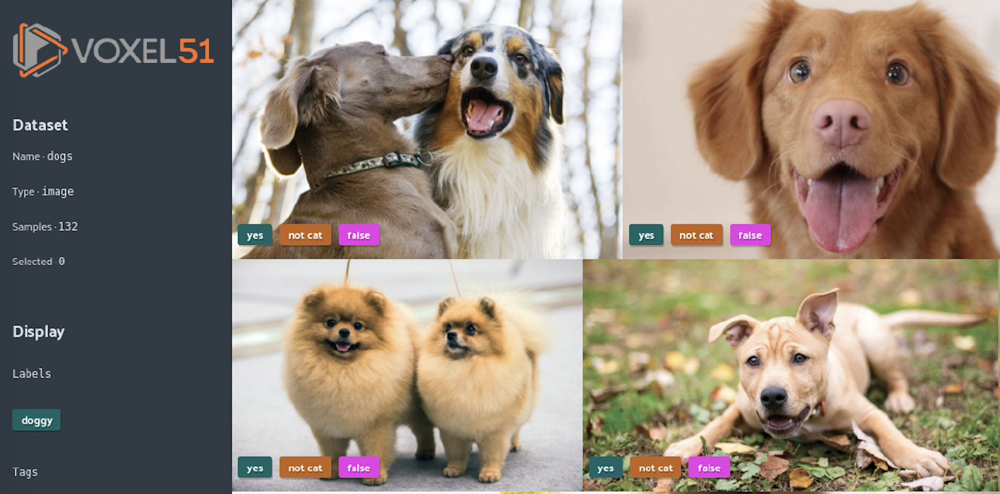

FiftyOne User Guide
===================

.. include:: ../substitutions.rst

Welcome to the FiftyOne User Guide!

Each section in this guide provides an example-centric deep dive into a core
feature of FiftyOne, with the goal of getting you up-and-running with FiftyOne
on your data quickly and easily.

:doc:`FiftyOne Dataset basics <basics>`

Learn about FiftyOne the |Dataset| class and its relation to |Sample|, |Field|,
tags and |DatasetView|.

.. code-block:: python
    :linenos:

    import fiftyone as fo

    dataset = fo.Dataset(name="my_dataset")
    sample = fo.Sample(filepath="path/to/img.png")
    dataset.add_sample(sample)
    sample.tags += ["train"]
    sample["custom_field"] = 51
    view = (
        dataset.view()
        .match_tag("test")
        .sort_by("custom_field", reverse=True)
        .limit(1)
    )
    for sample in view:
        print(sample)

:doc:`Creating FiftyOne Datasets <dataset_creation/index>`

Get your data into a FiftyOne |Dataset| using standard formats, custom formats,
or load an open-source dataset via the Dataset Zoo.

.. code-block:: python
   :linenos:

   dataset = fo.Dataset.from_dir(
       dataset_dir="/path/to/dataset",
       dataset_type=fo.types.COCODetectionDataset,
       name="my-coco-format-dataset",
   )

:doc:`Using datasets <using_datasets>`

Use a FiftyOne Dataset to search, sort, and modify your data:

.. code-block:: python
   :linenos:

   view = (
       dataset.view()
       .match({"tags": "test"})
       .exists("metadata")
       .sort_by("filepath")
       .limit(5)
   )

:doc:`Exporting datasets <export_datasets>`

Export your dataset to disk in any number of formats.

.. code-block:: python
   :linenos:

   dataset.export(export_dir, dataset_type=fo.types.COCODetectionDataset)

:doc:`Visualizing datasets in the App <app>`

Visualize your dataset in the FiftyOne App and visualize your changes to it in
real-time.

:doc:`FiftyOne Brain <brain>`

Use the FiftyOne Brain to automatically get insights into your |Dataset|

.. code-block:: python
   :linenos:

   import fiftyone.brain as fob

   fob.compute_uniqueness(dataset)
   rank_view = dataset.view().sort_by("uniqueness")

.. toctree::
    :maxdepth: 1
    :hidden:

    Dataset basics<basics>
    Creating datasets<dataset_creation/index>
    Using datasets<using_datasets>
    Exporting datasets<export_datasets>
    Viewing datasets in the App<app>
    FiftyOne Brain<brain>
