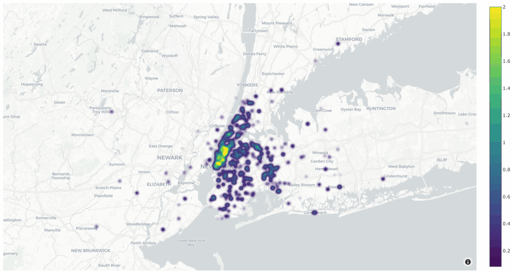
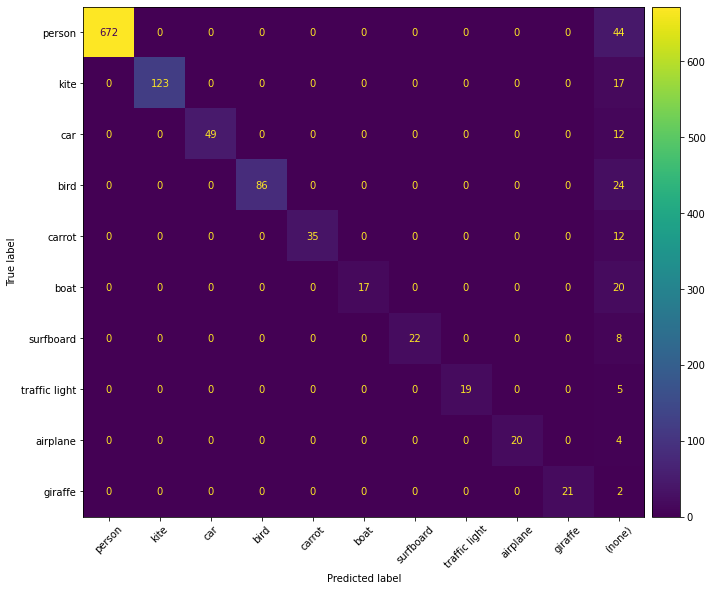

.. _interactive-plots:

Interactive Plots
=================

.. default-role:: code

FiftyOne provides a powerful
:mod:`fiftyone.core.plots <fiftyone.core.plots.base>` framework that contains
a variety of interactive plotting methods that enable you to visualize your
datasets and uncover patterns that are not apparent from inspecting either the
:ref:`raw media files <fiftyone-app>` or
:ref:`aggregate statistics <using-aggregations>`.

With FiftyOne, you can visualize geolocated data on maps, generate interactive
evaluation reports such as confusion matrices and PR curves, create dashboards
of custom statistics, and even generate low-dimensional representations of your
data that you can use to identify data clusters corresponding to model failure
modes, annotation gaps, and more.

What do we mean by **interactive plots**? First, FiftyOne plots are
`powered by Plotly <https://plotly.com/python>`_, which means they are
responsive JavaScript-based plots that can be zommed, panned, and lasso-ed.
Second, FiftyOne plots can be linked to the :ref:`FiftyOne App <fiftyone-app>`,
so that selecting points in a plot will automatically load the corresponding
samples/labels in the App (and vice versa) for you to visualize! Linking plots
to their source media is a powerful paradigm that it is a critical part of any
visual dataset analysis pipeline.

The builtin plots provided by FiftyOne are chosen to help you analyze and
improve the quality of your datasets and models, with minimal customization
required on your part to get started. At the same time, data/model
interpretability is not a narrowly-defined space that can be fully automated.
That's why FiftyOne's plotting framework is
**highly customizable and extensible**, all by writing pure Python (no
JavaScript knowledge required).

.. note::

    Check out the :ref:`tutorials page <tutorials>` for in-depth walkthroughs
    that apply the available interactive plotting methods to perform
    evaluation, identify model failure modes, recommend new samples for
    annotation, and more!

.. _working-in-notebooks:

Working in notebooks
____________________

The recommended way to work with FiftyOne's interactive plots is in
`Jupyter notebooks <https://jupyter.org>`_ or
`JupyterLab <https://jupyterlab.readthedocs.io/en/stable>`_. In these
environments, you can leverage the full power of plots by
:ref:`attaching them to the FiftyOne App <attaching-plots>` and bidirectionally
interacting with the plots and the App to identify interesting subsets of your
data.

.. note::

    Support for interactive plots in non-notebook contexts and in
    `Google Colab <https://colab.research.google.com>`_ is coming soon! In the
    meantime, you can still use FiftyOne's plotting features in these
    environments, but you must manually call
    :meth:`plot.show() <fiftyone.core.plots.base.Plot.show>` to update the
    state of a plot to match the state of a connected |Session|, and any
    callbacks that would normally be triggered in response to interacting with
    a plot will not be triggered.

You can get setup to work in a Jupyter environment by running the commands
below for your environment:

.. tabs::

  .. group-tab:: Jupyter notebooks

    To use interactive plots in Jupyter notebooks, ensure that you have the
    ``notebook`` and ``ipywidgets`` packages installed:

    .. code-block:: shell

        pip install "notebook>=5.3" "ipywidgets>=7.5"

  .. group-tab:: JupyterLab

    To use interactive plots in JupyterLab, ensure that you have the
    ``jupyterlab`` and ``ipywidgets`` packages installed:

    .. code-block:: shell

        pip install jupyterlab "ipywidgets>=7.5"

    In additional, you'll need to run the following commands to install the
    required JupyterLab extensions:

    .. code-block:: shell

        jupyter labextension install jupyterlab-plotly@4.14.3
        jupyter labextension install @jupyter-widgets/jupyterlab-manager plotlywidget@4.14.3
        jupyter lab build

    The above instructions assume that you have ``plotly==4.14.3`` installed.
    If you have a different version (``pip show plotly``), substitute the
    appropriate version number in the commands above.

    If you run into any issues in JupyterLab, refer to
    `this troubleshooting guide <https://plotly.com/python/troubleshooting>`_.

If you are use the `matplotlib` backend for any plots,
.. _geolocation-plots:

Geolocation plots
_________________

You can use
:meth:`location_scatterplot() <fiftyone.core.plots.base.location_scatterplot>`
to generate interactive plots of datasets with geolocation data.

Standalone plots
----------------

In the simplest case, you can use this method to generate a location
scatterplot for a list of ``[longitude, latitude]`` coordinates, using the
optional ``labels`` and ``sizes`` parameters to control the color and sizes
of each point, respectively.

The example below demonstrates this usage using the
:ref:`quickstart-geo dataset <dataset-zoo-quickstart-geo>` from the zoo:

.. code-block:: python
    :linenos:

    import fiftyone as fo
    import fiftyone.brain as fob
    import fiftyone.zoo as foz
    from fiftyone import ViewField as F

    dataset = foz.load_zoo_dataset("quickstart-geo")

    # A list of ``[longitude, latitute]`` coordinates
    locations = dataset.values("location.point.coordinates")

    # Scalar `uniqueness` values for each sample
    uniqueness = dataset.values("uniqueness")

    # The number of ground truth objects in each sample
    num_objects = dataset.values("ground_truth", F("detections").length())

    # Create scatterplot
    plot = fo.location_scatterplot(
        locations=locations,
        labels=uniqueness,      # color points by their `uniqueness` values
        sizes=num_objects,      # scale point sizes by number of objects
    )
    plot.show()

.. image:: ../images/plots/location-scatterplot.gif
   :alt: location-scatterplot
   :align: center

You can also change the style to ``style="density"`` in order to view the data

.. code-block:: python
    :linenos:

    # Create density plot
    plot = fo.location_scatterplot(
        locations=locations,
        labels=uniqueness,      # color points by their `uniqueness` values
        sizes=num_objects,      # scale influence by number of objects
        style="density",
        radius=10,
    )
    plot.show()

Interactive plots
-----------------

The real power of
:meth:`location_scatterplot() <fiftyone.core.plots.base.location_scatterplot>`
comes when you associate the location coordinates with the samples in a
|Dataset| and then attach it to a |Session|.

The example below demonstrates setting up an interactive location scatterplot
for the :ref:`quickstart-geo dataset <dataset-zoo-quickstart-geo>` that is
:ref:`attached to the App <attaching-plots>`. In this setup, when points are
lasso-ed in the plot, the corresponding samples are automatically selected in
the Session's current :meth:`view <fiftyone.core.session.Session.view>`.
Likewise

Each block in the example code below denotes a separate cell in a Jupyter
notebook:

.. code-block:: python
    :linenos:

    import fiftyone as fo
    import fiftyone.brain as fob
    import fiftyone.zoo as foz

    dataset = foz.load_zoo_dataset("quickstart-geo")

    # Index the dataset by visual uniqueness
    fob.compute_uniqueness(dataset)

    # Launch the App
    session = fo.launch_app(dataset, height=1000)

.. code-block:: python
    :linenos:

    from fiftyone import ViewField as F

    # The number of ground truth objects in each sample
    num_objects = dataset.values("ground_truth", F("detections").length())

    # Create the scatterplot
    plot = fo.location_scatterplot(
        samples=dataset,
        labels="uniqueness",    # color points by their `uniqueness` values
        sizes=num_objects,      # scale point sizes by number of objects
    )
    plot.show(height=720)

    # Connect to session
    session.plots.attach(plot)

.. image:: ../images/plots/location-scatterplot-interactive.gif
   :alt: location-scatterplot-interactive
   :align: center

.. note::

    Interactive plots are currently only supported in Jupyter notebooks. In the
    meantime, you can still use FiftyOne's plotting features in other
    environments but you must manually call
    :meth:`plot.show() <fiftyone.core.plots.base.Plot.show>` to update the
    state of a plot to match the state of a connected |Session|, and any
    callbacks that would normally be triggered in response to interacting with
    a plot will not be triggered. See
    :ref:`this section <working-in-notebooks>` for more information.

.. _attaching-plots:

Attaching plots to the App
__________________________

All |Session| instances provide a
:meth:`plots attribute <fiftyone.core.session.Session.plots>` attribute that
you can use to attach |ResponsivePlot| instances to the FiftyOne App.

Plot types
----------

There are two basic |ResponsivePlot| types:

-   |ViewPlot|: Plots whose state is automatically updated whenever the current
    :meth:`session.view <fiftyone.core.session.Session.view>` changes.
-   |InteractivePlot|: Plots that are bidirectionally linked to a |Session| via
    the IDs of either samples or individual labels in the dataset. When the
    user performs a selection in the plot, the
    :meth:`session.view <fiftyone.core.session.Session.view>` is automatically
    updated to select the corresponding samples/labels, and, conversely, when
    :meth:`session.view <fiftyone.core.session.Session.view>` changes, the
    contents of the current view is automatically selected in the plot.

Examples of |ViewPlot| types include |CategoricalHistogram|,
|NumericalHistogram|, and |ViewGrid|. See :ref:`this section <>` for example
usages.

Examples of |InteractivePlot| types include |InteractiveScatter| and
|InteractiveHeatmap|, which are discussed in detail in the rest of this page.

.. note::

    When |ResponsivePlot| instances are attached to a |Session|, they are
    automatically updated whenever
    :meth:`session.view <fiftyone.core.session.Session.view>` changes for any
    reason, whether you modify your view in the App, or programmatically change
    it by setting :meth:`session.view <fiftyone.core.session.Session.view>`,
    or if multiple plots are connected and another plot triggers a |Session|
    update!

Attaching a plot
----------------

The code below demonstrates the basic pattern of connnecting a |ResponsivePlot|
to a |Session|:

.. code-block:: python
    :linenos:

    import fiftyone as fo
    import fiftyone.zoo as foz

    dataset = foz.load_zoo_dataset("quickstart-geo")

    # Launch an App instance
    session = fo.launch_app(dataset)

    # Create a responsive location plot
    plot = fo.location_scatterplot(samples=dataset)
    plot.show()  # show the plot

    # Attach the plot to the Session
    # Updates will now automatically occur
    session.plots.attach(plot)

You can view details about the plots attached to a |Session| by printing it:

.. code-block:: python
    :linenos:

    print(session)

.. code-block:: text

    Dataset:          quickstart-geo
    Media type:       image
    Num samples:      500
    Selected samples: 0
    Selected labels:  0
    Session URL:      http://localhost:5151/
    Connected plots:
        plot1: fiftyone.core.plots.plotly.InteractiveScatter

By default, plots are given sequential names ``plot%d``, but you can customize
their names via the optional ``name`` parameter of
:meth:`session.plots.attach() <fiftyone.core.plots.manager.PlotManager.attach>`.

You can retrieve a |ResponsivePlot| instance from its connected session by its
name:

.. code-block:: python
    :linenos:

    same_plot = session.plots["plot1"]

Connecting and disconnecting plots
----------------------------------

By default, when plots are attached to a |Session|, they are *connected*, which
means that any necessary state updates will happen automatically. If you wish
to temporarily suspend updates for an individual plot, you can use
:meth:`plot.disconnect() <fiftyone.core.plots.base.ResponsivePlot.disconnect>`:

.. code-block:: python
    :linenos:

    # Disconnect an individual plot
    # Plot updates will no longer update the session, and vice versa
    plot.disconnnect()

    # Note that `plot1` is now disconnected
    print(session)

.. code-block:: text

    Dataset:          quickstart-geo
    Media type:       image
    Num samples:      500
    Selected samples: 0
    Selected labels:  0
    Session URL:      http://localhost:5151/
    Disconnected plots:
        plot1: fiftyone.core.plots.plotly.InteractiveScatter

You can reconnect a plot by calling
:meth:`plot.connect() <fiftyone.core.plots.base.ResponsivePlot.connect>`:

.. code-block:: python
    :linenos:

    # Reconnect an individual plot
    plot.connnect()

    # Note that `plot1` is now connected
    print(session)

.. code-block:: text

    Dataset:          quickstart-geo
    Media type:       image
    Num samples:      500
    Selected samples: 0
    Selected labels:  0
    Session URL:      http://localhost:5151/
    Connected plots:
        plot1: fiftyone.core.plots.plotly.InteractiveScatter

You can disconnect and reconnect all plots currently attached to a |Session|
via
:meth:`session.plots.disconnect() <fiftyone.core.plots.manager.PlotManager.disconnect>`
and
:meth:`session.plots.connect() <fiftyone.core.plots.manager.PlotManager.connect>`,
respectively.

Detaching plots
---------------

If you would like to permanently detach a plot from a |Session|, use
:meth:`session.plots.pop() <fiftyone.core.plots.manager.PlotManager.pop>` or
:meth:`session.plots.remove() <fiftyone.core.plots.manager.PlotManager.remove>`:

.. code-block:: python
    :linenos:

    # Detach plot from its session
    plot = session.plots.pop("plot1")

    # Note that `plot1` no longer appears
    print(session)

.. code-block:: text

    Dataset:          quickstart-geo
    Media type:       image
    Num samples:      500
    Selected samples: 0
    Selected labels:  0
    Session URL:      http://localhost:5151/

Freezing plots
--------------

Working with interactive plots in notebooks is an amazingly productive
experience. However, when you find something particularly interesting that you
want to save, or you want to share a notebook with a collague without requiring
them to rerun all of the cells to reproduce your results, you may want to
*freeze* your responsive plots.

You can conveniently freeze your currently active App instance and any attached
plots by calling
:meth:`session.freeze() <fiftyone.core.session.Session.freeze>`:

.. code-block:: python
    :linenos:

    # Replace current App instance and all attached plots with static images
    session.freeze()

After calling this method, your current App instance and all connected plots
will be replaced by static images that will be visible when you save + reopen
your notebook later.

You can also freeze an individual plot by calling
:meth:`plot.freeze() <fiftyone.core.plots.base.ResponsivePlot.freeze>`:

.. code-block:: python
    :linenos:

    # Replace a plot with a static image
    plot.freeze()

You can "revive" frozen App and plot instances by simply rerunning the notebook
cells in which they were defined and shown.

.. note::

    :meth:`session.freeze() <fiftyone.core.session.Session.freeze>` and
    :meth:`plot.freeze() <fiftyone.core.plots.base.ResponsivePlot.freeze>` are
    only appliclable when working in notebook contexts.

.. _plots-advanced:

Advanced usage
______________

.. _custom-plot-layouts:

Customizing plot layouts
------------------------

The :meth:`plot.show() <fiftyone.core.plots.base.Plot.show>` method used to
display plots in FiftyOne supports optional keyword arguments that you can use
to customize the look-and-feel of plots.

In general, consult the documentation of the relevant
:meth:`plot.show() <fiftyone.core.plots.base.Plot.show>` method for details on
the supported parameters.

Assuming you are using the default :ref:`plotly backend <plotting-backend>`,
:meth:`plot.show() <fiftyone.core.plots.base.Plot.show>` will accept any valid
keyword arguments for ``plotly.graph_objects.Figure.update_layout(**kwargs)``.

The examples below demonstrate some common layout customizations that you may
wish to perform:

.. code-block:: python
    :linenos:

    # Increase the default height of the figure, in pixels
    plot.show(height=720)

    # Equivalent of `axis("equal")` in matplotlib
    plot.show(yaxis_scaleanchor="x")

.. note::

    Refer to the
    `plotly layout documentation <https://plotly.com/python/reference/layout>`_
    for a full list of the supported options.

.. _plotting-backend:

Plotting backend
----------------

Most plotting methods in the
:meth:`fiftyone.core.plots <fiftyone.core.plots.base>` module provide an
optional ``backend`` parameter that you can use to control the plotting backend
used to render plots.

The default plotting backend is ``plotly``, which is highly recommended due to
its better performance, look-and-feel, and greater support for interactivity.

However, most plot types also support the ``matplotlib`` backend. If you chose
this backend, plots will be rendered as matplotlib figures. Many
matplotlib-powered plot types support interactivity, but you must
:ref:`enable this behavior <matplotlib-in-notebooks>`:

.. code-block:: python
    :linenos:

    import fiftyone as fo
    import fiftyone.zoo as foz
    from fiftyone import ViewField as F

    dataset = foz.load_zoo_dataset("quickstart")
    results = dataset.evaluate_detections("predictions", gt_field="ground_truth")

    # Get the 10 most common classes in the dataset
    counts = dataset.count_values("ground_truth.detections.label")
    classes = sorted(counts, key=counts.get, reverse=True)[:10]

.. code-block:: python
    :linenos:

    # Use the default plotly backend
    plot = results.plot_confusion_matrix(classes=classes)
    plot.show(height=512)

.. image:: ../images/plots/plotly-backend.png
   :alt: plotly-backend
   :align: center

.. code-block:: python
    :linenos:

    import matplotlib.pyplot as plt

    # Use the matplotlib backend instead
    figure = results.plot_confusion_matrix(
        classes=classes, backend="matplotlib", figsize=(10, 10)
    )
    plt.show(block=False)

.. _matplotlib-in-notebooks:

Interactive matplotlib plots
----------------------------

If you are using the :ref:`matplotlib backend <plotting-backend>`, many
FiftyOne plots still support interactivity in notebooks, but you must enable
this behavior by running the appropriate magic command in your notebook
*before* you generate your first plot.

If you forget or choose not to run a magic command, the plots will still
display, but they will not be interactive.

Follow the instructions for your environment below to enable interactive
matplotlib plots:

.. tabs::

  .. group-tab:: Jupyter notebooks

    The recommended way to enable interactive matplotlib plots in Jupyter
    notebooks is to use the ``%matplotlib notebook`` magic command, which
    enables the ``nbagg backend`` that was
    :ref:`introduced in matplotlib v1.4 <https://matplotlib.org/stable/users/prev_whats_new/whats_new_1.4.html#the-nbagg-backend>`_:

    .. code-block:: shell

        %matplotlib notebook

    Alternatively, you can install the
    `ipympl package <https://github.com/matplotlib/ipympl>`_, which uses the
    Jupyter widgets framework to make matplotlib plots interactive:

    .. code-block:: shell

        pip install ipympl

    Then you can enable interactive matplotlib plots in a notebook by including
    the following magic command:

    .. code-block:: shell

        %matplotlib widget

  .. group-tab:: JupyterLab

    You can use interactive matplotlib plots in JupyterLab by installing the
    `ipympl package <https://github.com/matplotlib/ipympl>`_:

    .. code-block:: shell

        pip install ipympl

    Then you can enable interactive matplotlib plots in a notebook by including
    the following magic command:

    .. code-block:: shell

        %matplotlib widget

    If you run into any issues in JupyterLab, refer to
    `these instructions <https://github.com/matplotlib/ipympl#installation>`_.
