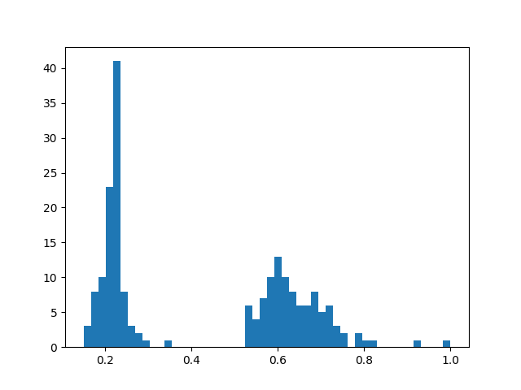

Using Aggregations
==================

.. default-role:: code

The :ref:`FiftyOne Dataset <using-datasets>` is the core data structure in
FiftyOne, allowing you to represent your raw data, labels, and associated
metadata. When you query and manipulate a |Dataset| object using
:ref:`dataset views <using-views>`, a |DatasetView| object is returned, which
represents a filtered view into a subset of the underlying dataset's contents.

Complementary to this data model, one is often interested in computing
aggregate statistics about datasets, such as label counts, distributions, and
ranges, where each |Sample| is reduced to a single quantity in the aggregate
results.

The :mod:`fiftyone.core.aggregations` module offers a declaritive and
highly-efficient approach to computing summary statistics about your datasets
and views.

.. _using-aggregations:

Overview
________

All builtin aggregations are subclasses of the |Aggregation| class, each
encapsulating the computation of a different statistic about your data.

Aggregations are conveniently exposed as methods on all |Dataset| and
|DatasetView| objects:

.. code-block:: python
    :linenos:

    import fiftyone.zoo as foz

    dataset = foz.load_zoo_dataset("quickstart")

    # List available aggregations
    print(dataset.list_aggregations())
    # ['bounds', 'count', 'count_values', 'distinct', ..., 'sum']

Think of aggregations as more efficient, concise alternatives to writing
explict loops over your dataset to compute a statistic:

.. code-block:: python
    :linenos:

    from collections import defaultdict
    import fiftyone.zoo as foz

    dataset = foz.load_zoo_dataset("quickstart")

    # Compute label histogram manually
    counts = defaultdict(int)
    for sample in dataset:
        for detection in sample.ground_truth.detections:
            counts[detection.label] += 1

    # Compute via aggregation
    counts = dataset.count_values("ground_truth.detections.label")
    print(counts)  # same as `counts` above

The sections below discuss the available aggregations in more detail. You can
also refer to the :mod:`fiftyone.core.aggregations` module documentation for
detailed examples of using each aggregation.

.. note::

    All aggregations can operate on embedded sample fields using the
    ``embedded.field.name`` syntax.

    In addition, you can aggregate the elements of array fields using the
    ``embedded.array[].field`` syntax. See
    :ref:`this section <aggregations-list-fields>` for more details.

.. _aggregations-bounds:

Compute bounds
______________

You can use the
:meth:`bounds() <fiftyone.core.collections.SampleCollection.bounds>`
aggregation to compute the ``[min, max]`` range of a numeric field of a
dataset:

.. code-block:: python
    :linenos:

    import fiftyone.zoo as foz

    dataset = foz.load_zoo_dataset("quickstart")

    # Compute the bounds of the `uniqueness` field
    bounds = dataset.bounds("uniqueness")
    print(bounds)
    # (0.15001302256126986, 1.0)

    # Compute the bounds of the detection confidences in the `predictions` field
    bounds = dataset.bounds("predictions.detections.confidence")
    print(bounds)
    # (0.05003104358911514, 0.9999035596847534)

.. _aggregations-count:

Count items
___________

You can use the
:meth:`count() <fiftyone.core.collections.SampleCollection.count>` aggregation
to compute the number of non-``None`` field values in a collection:

.. code-block:: python
    :linenos:

    import fiftyone.zoo as foz

    dataset = foz.load_zoo_dataset("quickstart")

    # Compute the number of samples in the dataset
    count = dataset.count()
    print(count)
    # 200

    # Compute the number of samples with `predictions`
    count = dataset.count("predictions")
    print(count)
    # 200

    # Compute the number of detections in the `ground_truth` field
    count = dataset.count("predictions.detections")
    print(count)
    # 5620

.. _aggregations-count-values:

Count values
____________

You can use the
:meth:`count_values() <fiftyone.core.collections.SampleCollection.count_values>`
aggregation to compute the occurrences of field values in a collection:

.. code-block:: python
    :linenos:

    import fiftyone.zoo as foz

    dataset = foz.load_zoo_dataset("quickstart")

    # Compute the number of samples in the dataset
    counts = dataset.count_values("tags")
    print(counts)
    # {'validation': 200}

    # Compute a histogram of the predicted labels in the `predictions` field
    counts = dataset.count_values("predictions.detections.label")
    print(counts)
    # {'bicycle': 13, 'hot dog': 8, ..., 'skis': 52}

.. _aggregations-distinct:

Distinct values
_______________

You can use the
:meth:`distinct() <fiftyone.core.collections.SampleCollection.distinct>`
aggregation to compute the distinct values of a field in a collection:

.. code-block:: python
    :linenos:

    import fiftyone.zoo as foz

    dataset = foz.load_zoo_dataset("quickstart")

    # Get the distinct tags on the dataset
    values = dataset.distinct("tags")
    print(values)
    # ['validation']

    # Get the distinct labels in the `predictions` field
    values = dataset.distinct("predictions.detections.label")
    print(values)
    # ['airplane', 'apple', 'backpack', ..., 'wine glass', 'zebra']

.. _aggregations-histogram-values:

Histogram values
________________

You can use the
:meth:`histogram_values() <fiftyone.core.collections.SampleCollection.histogram_values>`
aggregation to compute the histograms of numeric fields of a collection:

.. code-block:: python
    :linenos:

    import numpy as np
    import matplotlib.pyplot as plt

    import fiftyone.zoo as foz

    def plot_hist(counts, edges):
        counts = np.asarray(counts)
        edges = np.asarray(edges)
        left_edges = edges[:-1]
        widths = edges[1:] - edges[:-1]
        plt.bar(left_edges, counts, width=widths, align="edge")

    dataset = foz.load_zoo_dataset("quickstart")

    #
    # Compute a histogram of the `uniqueness` field
    #

    # Compute bounds automatically
    bounds = dataset.bounds("uniqueness")
    limits = (bounds[0], bounds[1] + 1e-6)  # right interval is open

    counts, edges, other = dataset.histogram_values(
        "uniqueness", bins=50, range=limits
    )

    plot_hist(counts, edges)
    plt.show(block=False)

.. _aggregations-sum:

Sum values
__________

You can use the
:meth:`sum() <fiftyone.core.collections.SampleCollection.sum>` aggregation to
compute the sum of the (non-``None``) values of a field in a collection:

.. code-block:: python
    :linenos:

    import fiftyone.zoo as foz

    dataset = foz.load_zoo_dataset("quickstart")

    # Compute average confidence of detections in the `predictions` field
    print(
        dataset.sum("predictions.detections.confidence").sum /
        dataset.count("predictions.detections").count
    )
    # 0.34994137249820706

.. _aggregations-advanced:

Advanced usage
______________

.. _aggregations-list-fields:

Aggregating list fields
-----------------------

Aggregations that operate on scalar fields can also be applied to the elements
of list fields by appending ``[]`` to the list component of the field path.

The example below demonstrates this capability:

.. code-block:: python
    :linenos:

    import fiftyone as fo

    dataset = fo.Dataset()
    dataset.add_samples(
        [
            fo.Sample(
                filepath="/path/to/image1.png",
                keypoints=fo.Keypoint(points=[(0, 0), (1, 1)]),
                classes=fo.Classification(
                    label="cat", confidence=0.9, friends=["dog", "squirrel"]
                ),
            ),
            fo.Sample(
                filepath="/path/to/image2.png",
                keypoints=fo.Keypoint(points=[(0, 0), (0.5, 0.5), (1, 1)]),
                classes=fo.Classification(
                    label="dog", confidence=0.8, friends=["rabbit", "squirrel"],
                ),
            ),
        ]
    )

    # Count the number of keypoints in the dataset
    count = dataset.count("keypoints.points[]")
    print(count)
    # 5

    # Compute the values in the custom `friends` field of the predictions
    counts = dataset.count_values("classes.friends[]")
    print(counts)
    # {'dog': 1, 'squirrel': 2, 'rabbit': 1}

.. note::

    There are two cases where FiftyOne will automatically unwind array fields
    without requiring you to explicitly specify this via the ``[]`` syntax:

    **Top-level lists:** when you write an aggregation that refers to a
    top-level list field of a dataset; i.e., ``list_field`` is automatically
    coerced to ``list_field[]``, if necessary.

    **List fields:** When you write an aggregation that refers to the list
    field of a |Label| class, such as the
    :attr:`Detections.detections <fiftyone.core.labels.Detections.detections>`
    attribute; i.e., ``ground_truth.detections.label`` is automatically
    coerced to ``ground_truth.detections[].label``, if necessary.

.. _aggregations-batching:

Batching aggregations
---------------------

Rather than computing a single aggregation by invoking methods on a |Dataset|
or |DatasetView| object, you can also instantiate an |Aggregation| object
directly. In this case, the aggregation is not tied to any dataset or view,
only to the parameters such as field name that define it.

.. code-block:: python
    :linenos:

    import fiftyone as fo

    # will count the number of samples in a dataset
    sample_count = fo.Count()

    # will count the labels in a `ground_truth` detections field
    count_values = fo.CountValues("ground_truth.detections.label")

    # will compute a histogram of the `uniqueness` field
    histogram_values = fo.HistogramValues(
        "uniqueness", bins=50, range=(0, 1)
    )

Instantiating aggregations in this way allows you to execute multiple
aggregations on a dataset or view efficiently in a batch via
:meth:`aggregate() <fiftyone.core.collections.SampleCollection.aggregate>`:

.. code-block:: python
    :linenos:

    import fiftyone.zoo as foz

    dataset = foz.load_zoo_dataset("quickstart")

    results = dataset.aggregate([sample_count, count_values, histogram_values])

    print(results[0])
    # 200

    print(results[1])
    # {'bowl': 15, 'scissors': 1, 'cup': 21, ..., 'vase': 1, 'sports ball': 3}

    print(results[2][0])  # counts
    # [0, 0, 0, ..., 15, 12, ..., 0, 0]

    print(results[2][1])  # edges
    # [0.0, 0.02, 0.04, ..., 0.98, 1.0]

.. _aggregations-transforming-data:

Transforming data before aggregating
------------------------------------

You can use view stages like
:meth:`map_labels() <fiftyone.core.collections.SampleCollection.map_labels>`
in concert with aggregations to efficiently compute statistics on your
datasets.

For example, suppose you would like to compute the histogram of the labels in
a dataset with certain labels grouped into a single category. You can use
:meth:`map_labels() <fiftyone.core.collections.SampleCollection.map_labels>` +
:meth:`count_values() <fiftyone.core.collections.SampleCollection.count_values>`
to succinctly express this:

.. code-block:: python
    :linenos:

    import fiftyone as fo
    import fiftyone.zoo as foz

    dataset = foz.load_zoo_dataset("quickstart")

    # Map `cat` and `dog` to `pet`
    labels_map = {"cat": "pet", "dog": "pet"}

    counts = (
        dataset
        .map_labels("ground_truth", labels_map)
        .count_values("ground_truth.detections.label")
    )

    print(counts)
    # {'toothbrush': 2, 'train': 5, ..., 'pet': 31, ..., 'cow': 22}

Or, suppose you would like to compute the average confidence of a model's
predictions, ignoring any values less than 0.5. You can use
:meth:`filter_labels() <fiftyone.core.collections.SampleCollection.filter_labels>` +
:meth:`sum() <fiftyone.core.collections.SampleCollection.sum>` +
:meth:`count() <fiftyone.core.collections.SampleCollection.count>`
to succinctly express this:

.. code-block:: python
    :linenos:

    import fiftyone as fo
    import fiftyone.zoo as foz
    from fiftyone import ViewField as F

    dataset = foz.load_zoo_dataset("quickstart")

    high_conf_view = dataset.filter_labels(
        "predictions", F("confidence") >= 0.5
    )

    print(
        high_conf_view.sum("predictions.detections.confidence").sum /
        high_conf_view.count("predictions.detections.confidence").count
    )
    # 0.8170506501060617

.. _aggregations-frame-labels:

Aggregating frame labels
------------------------

You can compute aggregations on the frame labels of a video dataset by adding
the ``frames`` prefix to the relevant frame field name:

.. code-block:: python
    :linenos:

    import fiftyone as fo
    import fiftyone.zoo as foz

    dataset = foz.load_zoo_dataset("quickstart-video")

    # Count the number of video frames
    count = dataset.count("frames")
    print(count)
    # 1279

    # Compute a histogram of per-frame object labels
    counts = dataset.count_values(
        "frames.ground_truth_detections.detections.label"
    )
    print(counts)
    # {'person': 1108, 'vehicle': 7511, 'road sign': 2726}
