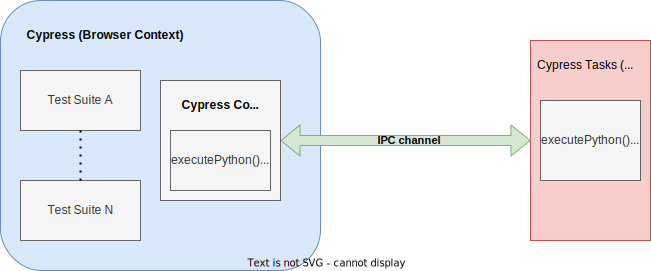

# Fiftyone Integration Test Suite

This directory contains a suite of black box UI tests that use BDD
(Behavior-Driven Development) style assertions. The goal is to ensure that the
system meets the desired _busines requirements_ and provides value to the end
user. No mocks or stubs are to be used.

## Running Locally

-   Make sure `python` is available in path. If you have a virtual environment
    you use, make sure to activate that.
-   e2e tests run against the built app. In the [App monorepo](../app/), run
    `yarn build`
-   Run `yarn start-test-server` to start the background server in a separate
    shell
-   Run `yarn start` to execute the tests
-   To run in watch mode, run `yarn start:watch`.
-   You might find it useful that all command line options are forwarded to
    Cypress. For example, to run a single spec run
    `yarn start:watch --spec cypress/e2e/hello-world.cy.ts`. For more options,
    visit
    [cypress command line](https://docs.cypress.io/guides/guides/command-line)
    page.

**Note: E2E tests communicate to the app via port 8787 and use `cypress` as the
database name.**

### Relevant Cypress environment variables

These are Cypress environment variables, as opposed to node environment
variables. You can set these by specifying the `--env` flag. For example, to
collect baseline screenshots for your specs that use screenshot testing and to
pause between tests, you can run:

```
yarn start --env type=base,pause_between_tests=true
```

| Cypress environment variables         | Possible Values                                                              |
| ------------------------------------- | ---------------------------------------------------------------------------- |
| type (default = actual)               | base: to collect base snapshots, actual: to run tests against base snapshots |
| pause_between_tests (default = false) | true: pause between test suites when in dev mode, false: do not pause        |

### Patterns and Tips

1. DO NOT USE `cy.wait()`. This is the main source of flaky tests. If there's a
   special use case that warrants it, abstract it into a dedicated command,
   like `cy.waitForLookerToRender()`.
2. Use screenshot testing only for elements that are not controlled by the DOM,
   like `canvas`.
3. Refrain from using `id` or `class` to select elements. Use `data-cy`
   attribute.
4. Document all usages of `cy.wait()`s in this document.

#### Usage of `cy.wait()`s

Below is a list of commands that use `cy.wait()`.

1. `cy.waitForLookerToRender()`

## Architecture


